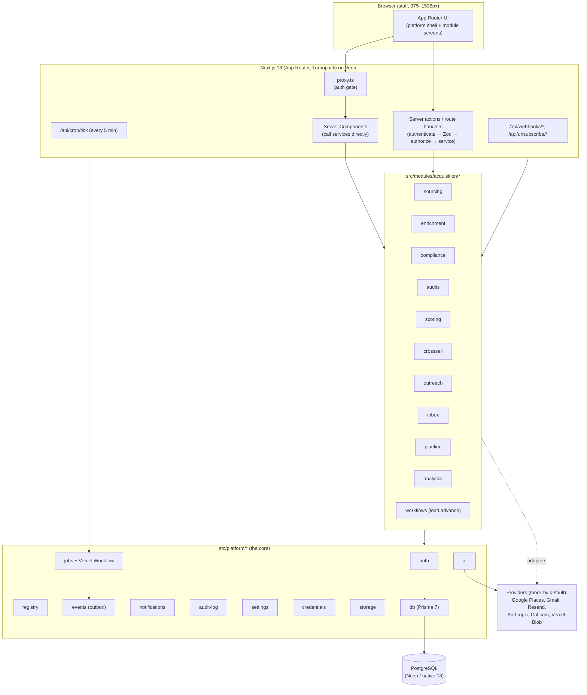
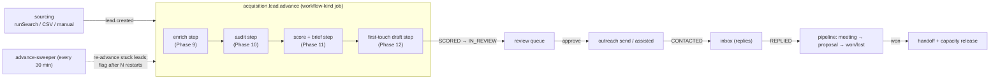

# FUTUREUNI Internal Platform — architecture

How the platform fits together after Phase 19: one Next.js app, one Postgres database, one login, one Vercel deployment, holding internal tools as **modules**. The first module is **Client Acquisition**. This document is the map; the rules live in `.claude/project-rules.md`, the data model in `docs/specs/data-model.md`, the interfaces in `docs/contracts/`, and the schedules in `docs/schedules.md`.

## 1. System overview

Everything a module needs — navigation, permissions, jobs, schedules, settings, home widgets, notification types, AI tasks, commands, event subscribers and badge resolvers — is declared in one **manifest** (`src/modules/acquisition/manifest.ts`) and discovered at build time by `pnpm registry:gen`. Adding a module never edits the core (ADR-002).

## 2. The module system

- **Discovery.** `pnpm registry:gen` globs `src/modules/*/manifest.ts`, validates each (duplicate ids, prefix overlap, duplicate perms/jobs/schedule-ids/setting-keys/notif-ids/widget-ids, invalid cron/timezone, schedule→undeclared job, nav href outside prefix, unknown icon, unregistered referenced permission) and writes the committed `src/platform/registry/generated.ts`.
- **Registry API** (`@/platform/registry`, server-only): `getEnabledModules`, `getNavigation`, `getAllPermissions`, `getAllJobs`, `getCronSchedules`, `getDynamicScheduleProviders`, `getSettingDefinitions`, `getSettingsPanels`, `getHomeWidgets`, `getNotificationTypes`, `getCommands`, `getAllAiTasks`, `getAllSubscribers`, `resolveBadge`. The schedule/widget/command/subscriber getters are scoped to `getEnabledModules()` at their call sites, so a disabled module contributes nothing (rule 4, CR-02-21).
- **Boundaries** (lint-enforced): a module never imports another module; the platform never imports a module (except the generated registry). Modules talk to each other only through `@/platform/*`, `@/contracts/*`, `@/components/*`, `@/lib/*` and domain events.
- **Manifest hygiene.** `manifest.ts` imports the areas' *leaf* files (`./scoring/jobs`, …), never their barrels, so booting the registry at codegen never pulls the AI task registry (which would form a manifest ↔ registry cycle). Badge resolvers and subscriber handlers lazy-import their services at run time for the same reason.

## 3. Platform services (`src/platform/*`)

| Service | Responsibility | Key invariants |
|---|---|---|
| `auth` | Better Auth sessions, the permission matrix (`can`/`assertCan`/`assertActorCan`), `loadSubjectFromUserId`, 2FA, invites, team profiles | scope from the session never from input; 404 vs 403 rules |
| `registry` | the module registry (above) | — |
| `jobs` | durable background work: `enqueueJob` → one Vercel Workflow (`platform.run-job`) runs each job's handler in a step; single + **workflow-kind** handlers (steps via `inlineStep`); `JobRun` per idempotency key | INV-22 (one JobRun per key; idempotent sends) |
| `events` | domain events: `publishAfterCommit(tx, …)` writes a `DomainEvent` outbox row dispatched after commit; `publish()` immediate; inline + job-mode subscribers | after-commit publish; at-least-once delivery |
| `ai` | the only path to Anthropic; `runTask`/`streamTask`; prompt versions, budgets, `AiCall` logging | INV-13, INV-24 (untrusted data delimited), model names in config (ADR-018) |
| `notifications` | `notify()` + the event→notification router; in-app + platform email (Resend) | preferences; critical types can't be muted |
| `audit-log` | append-only audit entries | INV-20 |
| `settings` | typed settings store (`getSetting`), PLATFORM/MODULE/USER scope | secrets never here (INV-21) |
| `credentials` | AES-256-GCM credential vault | INV-21 |
| `storage` | Vercel Blob (private) / local driver | — |
| `db` | Prisma 7 + `@prisma/adapter-pg`; `withTransaction`, `dbOr(tx)`, `createOrOnConflict` | DB access only here / `prisma/**` / `*.repo.ts` |

The single Vercel Cron entry (`GET /api/cron/tick`, every 5 minutes, ADR-003) drives every schedule through `runDispatch` (`src/platform/jobs/dispatcher.ts`): it computes which schedules are due in the current 5-minute slot and enqueues each idempotently. See `docs/schedules.md`.

## 4. The acquisition pipeline and lead lifecycle

A lead is discovered, enriched, audited, scored, contacted and tracked to won or lost. The per-lead **advance workflow** (`src/modules/acquisition/workflows/lead-advance.job.ts`, `acquisition.lead.advance`) drives the pre-contact path automatically.

- **Each step is idempotent** (it checks the lead's current status first and skips if already done), respects per-lead cost caps, and is retried by Workflow on transient failure; because the steps are status-guarded, a whole-run retry resumes from where it stalled. The run's idempotency key is `leadId + advanceVersion`, so a duplicate `lead.created` collapses to one run and a deliberate re-queue starts a fresh one.
- **The draft step** only fires when the lead is `SCORED`, is the leading lead of its cross-sell group (enforced inside `createDraft`, INV-9) and the line's throttle isn't `PAUSED`.
- **Concurrency & fairness.** `tryStartAdvance` enforces per-line and global caps (`acquisition.advance.maxConcurrent*`) before enqueuing, so one big search can't starve other lines; the sweeper recovers deferred and stuck leads in score order (then FIFO).
- **Sweeper.** `acquisition.lead.advance-sweeper` (every 30 min) re-queues leads idle in a pre-contact status past `acquisition.advance.stuckThresholdMinutes`; after `acquisition.advance.maxRestarts` it flags the lead (`needsAttentionAt`) and publishes `lead.needsAttention`. The Wave 2–3 batch jobs remain for manual bulk runs.

The allowed status transitions are the single source of truth in `docs/specs/module-acquisition.md` §5.2; every change goes through `transitionLead()` and writes a `LeadEvent` in the same transaction (INV-1, INV-15).

## 5. Events → subscribers → jobs

Events are published after commit (outbox) and dispatched to subscribers registered on manifests. `inline` subscribers run in the dispatch; `job` subscribers are delivered via `platform.deliver-event`. Full registry in `docs/contracts/events.md` §3/§3a.

| Event | Published by | Subscriber (mode) → effect |
|---|---|---|
| `lead.created` | 8 sourcing (runner, CSV, manual) | `acquisition.advance.on-lead-created` (job) → `tryStartAdvance` → `acquisition.lead.advance`; 17 analytics cache |
| `lead.statusChanged` | any caller of `transitionLead()` (after commit) | `platform.audit-bridge` (inline) → audit; 17 cache |
| `lead.scored` | 11 scoring | `acquisition.scoring.crosssell-on-scored` (job) → `acquisition.crosssell.detect`; 17 cache |
| `audit.completed` | 10 audits | `acquisition.scoring.rescore-on-audit` (job) → `acquisition.scoring.lead` |
| `compliance.verdict.changed` | 9 compliance | `acquisition.scoring.rescore-on-compliance` (job) → `acquisition.scoring.lead` |
| `signal.recorded` | 8/9/10 | `acquisition.scoring.rescore-on-signal` (job) → `acquisition.scoring.lead` |
| `settings.changed` | 6 settings | `acquisition.compliance.settings-changed` (job) → `acquisition.compliance.reevaluate` |
| `message.drafted` | 12 outreach | `acquisition.outreach.review-waiting` (job) → review notification |
| `reply.classified` | 13 inbox | `platform.notification-router` (job) → `reply.interested` / `reply.needs-action` |
| `meeting.booked` | 14 pipeline (Cal.com webhook / manual) | notification-router → `meeting.booked` |
| `deal.won` / `deal.lost` | 14 pipeline | notification-router → owner + managers + the line's service leads (CR-14-07) |
| `capacity.mode.changed` | 11 scoring (`refreshLineCapacity`) | notification-router → `capacity.line-full`; releases held leads on return to NORMAL |
| `mailbox.paused` | 12 outreach | `acquisition.outreach.mailbox-paused` + notification-router |
| `crosssell.detected` | 11 | notification-router → `crosssell.detected` |
| `handoff.created` | 14 | notification-router → `handoff.assigned` |
| `lead.assigned` | 11/13 | notification-router → `lead.assigned` |
| `lead.needsAttention` | 19 sweeper | notification-router → `lead.needs-attention` (owner + line leads + admins) |
| `ai.budget.warning` / `.exceeded` | 5 ai | notification-router → ADMIN |
| `job.failed`, `integration.failing` | 6 | notification-router → ADMIN |
| `user.roleChanged`, `user.twoFactorReset`, `user.deactivated` | 3 auth | audit-bridge; notification-router (security notices) |

**Downstream triggers checked end to end:** reply received → inbox poll/process; booking webhook → `meeting.booked`; meeting −2 h → `acquisition.pipeline.precall-brief`; won → handoff created + capacity re-evaluated/released. Leads released from capacity/cross-sell reach the draft step via the advance-sweeper net.

Scheduled jobs are listed in full in `docs/schedules.md`.

## 6. AI usage points

Every AI call goes through `@/platform/ai` only (ban on direct `@anthropic-ai/sdk` imports elsewhere), writes an `AiCall` (INV-13), and wraps untrusted content in a delimited `<untrusted_data>` block treated as data, never instructions (INV-24). AI tasks (skill folder `runtime-skills/<module>/<task>/`, evals `evals/<module>/<task>/`):

- enrichment: `enrich-extract-people`, `enrich-pick-contact`
- sourcing: `source-classify-job-post`, `source-extract-company`
- audits: `audit-web-first-impression`, `audit-uiux-review-analysis`, `audit-uiux-heuristics`, `audit-graphic-consistency`, `audit-video-thumbnails`, `audit-video-titles`
- scoring: `score-borderline-review`, `score-lead-brief`
- outreach: `outreach-draft`, `outreach-draft-edit`
- inbox: `inbox-classify`, `inbox-draft-reply`
- pipeline: `pipeline-precall-brief`, `pipeline-meeting-summary`, `pipeline-proposal-draft`
- analytics: `analytics-weekly-insight`
- profiles: `profile-sanity` (eval only)

Pricing figures in proposals come only from the deterministic pricing function; AI may only restate supplied numbers (INV-17). Every personalised claim in an AI-drafted outbound message cites a stored finding/signal (INV-5).

## 7. Compliance data flows

- **Contactability** is decided at enrichment (Phase 9): the country-rules table (ADR-034) sets the email verdict; `complianceReview` holds UK `UNKNOWN`/`OTHER` legal forms and Nigerian leads until the legal basis is recorded (INV-6, INV-25). Cold email is sent only when the verdict is `ALLOWED` (INV-25). Held leads wait in `NURTURE` (reason `COMPLIANCE`) and are released when the verdict changes.
- **Suppression** is checked in the same code path that sends, for email, phone and domain (INV-2). A reply, bounce or unsubscribe stops every active/paused enrolment at the contact's company (INV-3); an unsubscribe takes effect before any further send and is never answered (INV-23). Every outbound email carries a working one-click unsubscribe and the postal address (INV-4).
- **Personal data** on `DISQUALIFIED`/`LOST` leads is anonymised after the retention period by `acquisition.compliance.retention-purge` (daily 03:30, INV-10, ADR-015); it runs as its own staggered job rather than inside `platform.retention-purge`, because the platform core must not import a module. DSR export/delete is in the admin UI.
- **Sources** are used only as their terms allow; every crawl checks `robots.txt` for `FUTUREUNI-Bot/1.0`; no login-gated pages, no stored third-party credentials, no persisted Google Places content beyond `place_id` (INV-14).

## 8. Where each invariant is enforced

| INV | Enforced in | Covered by |
|---|---|---|
| INV-1 (LeadEvent per status change) | `transitionLead()` (`M/core`) | lifecycle tests |
| INV-2 (suppression on the send path) | `M/outreach/email/send`, `assisted` | outreach tests |
| INV-3 (reply/bounce/unsub stops company enrolments) | `M/outreach/sequences/stop` (`stopEnrollments`) | inbox/outreach tests |
| INV-4 (one-click unsubscribe + postal address) | `M/outreach/email` (headers + footer) | outreach tests |
| INV-5 (AI claims cite a finding/signal) | `M/outreach/draft` (citations), send-path strip | draft tests |
| INV-6 / INV-25 (UK PECR / contactability) | `M/compliance` (verdicts), gate in `M/outreach/review` | compliance tests |
| INV-7 (auto-send email only) | `M/outreach` (WhatsApp/LinkedIn prepared only) | assisted tests |
| INV-8 (send window + caps) | `M/outreach/email/send-window`, mailbox caps | send-window tests |
| INV-9 (one active thread per company) | DB partial unique index (ADR-032) + cross-sell hold in `createDraft` | crosssell tests |
| INV-10 (retention/anonymisation) | `M/compliance/retention` | compliance tests |
| INV-11 (money minor units, per currency) | `@/contracts` Money helpers; pipeline totals/widget | pipeline tests |
| INV-12 (UTC; viewer tz; injectable now) | services take `Clock`; UI formats in tz | throughout |
| INV-13 (AiCall per call) | `@/platform/ai` | ai tests |
| INV-14 (source terms / robots) | `M/sourcing` adapters, `M/platform/http` safe-fetch | sourcing tests |
| INV-15 (transitions via `transitionLead`) | `M/core` transition table | lifecycle tests |
| INV-16 (one active profile version) | `M/profiles` | profile tests |
| INV-17 (deterministic pricing) | `M/pipeline/proposals/pricing` | pricing tests |
| INV-18 (findings have evidence; dismissed can't be cited) | `M/audits`, `M/outreach/draft` | audit/draft tests |
| INV-19 (no placeholder portfolio to prospects) | `M/outreach`, `M/pipeline/proposals` | tests |
| INV-20 (append-only audit) | `@/platform/audit-log` | audit tests |
| INV-21 (credential ciphertext only) | `@/platform/credentials` | credential tests |
| INV-22 (idempotent jobs/sends) | `@/platform/jobs` (JobRun key), advance key `leadId+advanceVersion` | jobs tests |
| INV-23 (unsubscribe before any send) | `M/outreach` send path | unsubscribe tests |
| INV-24 (untrusted data delimited) | `@/platform/ai` prompt builder | ai safety tests |

Phase 20's `docs/hardening-report.md` maps each invariant to its enforcing code and tests in full.
