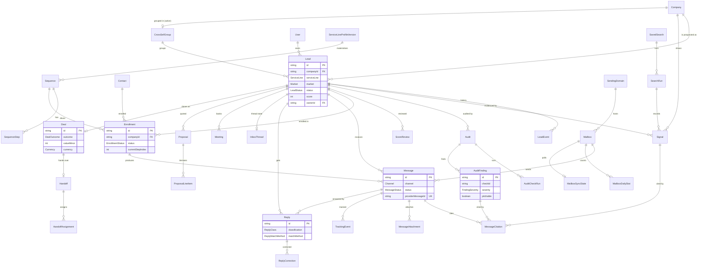

# FUTUREUNI Internal Platform: data model

| | |
|---|---|
| Status | Agreed (Phase 0) |
| Owner | Phase 0 writes it; changed only when a wave is merged (see `CLAUDE.md` ownership map) |
| Last updated | 2026-09-25 |
| Implemented by | Phase 2 (`prisma/schema/*.prisma`, init migration, seed, factories) |
| Related | `.claude/project-rules.md` (invariants INV-1…INV-25), `docs/contracts/`, `docs/specs/platform.md`, `docs/specs/module-acquisition.md`, `docs/decisions.md` |

## Changelog

| Date | Change |
|---|---|
| 2026-09-25 | First version (Phase 0) |

---

## 1. Purpose

This is the complete data model for the platform core and the Client Acquisition module. Phase 2 translates it **field by field** into Prisma. Every table, enum, relation, index and database constraint that Phases 3–21 need is here, so parallel phases never have to wait for a schema change.

Rules live in `.claude/project-rules.md` and are referenced here as **INV-n** (domain invariant n). Interfaces live in `docs/contracts/`. This document says how data is stored; it doesn't restate the rules.

If a library's required schema disagrees with this document (for example the auth tables), **the library wins for its own tables**. Phase 2 records the difference in `phases/02/REQUESTS.md` so this document is updated at merge.

---

## 2. Conventions

| Topic | Decision |
|---|---|
| Schema layout | Prisma multi-file schema in `prisma/schema/`: `_base.prisma` (generator, datasource, extensions), `enums.prisma` (every enum in §3), `auth.prisma` (auth library tables), `core.prisma` (platform core), `acquisition.prisma` (Client Acquisition). A future module adds `prisma/schema/<module-id>.prisma` with its own table prefix (`mkt_` for Marketing). |
| IDs | `String @id @default(cuid())` on every model. Better Auth is configured (Phase 3) to let Prisma generate IDs, so auth tables use the same default. IDs never auto-increment. |
| Timestamps | Every model has `createdAt DateTime @default(now())` and `updatedAt DateTime @updatedAt`. Every `DateTime` column is `@db.Timestamptz(3)` and stored in UTC (INV-12). Columns typed **Date** below are date-only values (`DateTime @db.Date`), never midnight timestamps. |
| Table names | Every model gets an explicit `@@map` to a snake_case plural table name: core tables are unprefixed (`users`, `companies`), acquisition tables are prefixed `acq_` (`acq_leads`, `acq_messages`). Columns keep Prisma's default camelCase names (no `@map` on fields). This is decided once for the whole project. |
| Money | `Int` minor units (kobo, cents, pence) plus a `Currency` column, never floats (INV-11). Columns are named `…Minor`. Amounts in different currencies are never summed in SQL or code. `Int` is PostgreSQL int4: at most 2,147,483,647 per stored amount (₦21,474,836.47, $21,474,836.47 or £21,474,836.47). A larger amount can't be stored, so Phase 14 validates proposal and deal amounts against this ceiling before saving (`toMinor` only guarantees a safe integer). If a single naira amount could exceed it, change the money columns to `BigInt` in one migration. |
| Internal cost | AI calls, provider calls, captures and audits record cost as `costMicros Int`: integer micro-USD (1 USD = 1,000,000), because per-call costs are below one cent (ADR-027). Money shown to clients never uses micro-units. |
| Rates and ratios | Percentages for money maths are basis points (`…Bps Int`, 10000 = 100%). `Float` is used only for model confidence, similarity and scores that aren't money. |
| Enums | Every finite state is a Prisma enum (§3). Open vocabularies defined by configuration (signal types, adapter IDs, task IDs, notification types, setting keys, permission actions) are `String`, validated by the contract schemas. |
| Soft delete | `deletedAt DateTime?` only on **Company**, **Contact** and **FileObject**. Every other model is either append-only, closed by status, or deleted physically by an explicit purge. Default query scoping hides soft-deleted rows (Phase 2's `src/platform/db` helpers). |
| Personal data removal | Personal data is removed by **anonymising** rows in place (§8), not by deleting them, so analytics and audit history stay intact (INV-10). |
| Case-insensitive text | Emails and domains use `String @db.Citext` (Postgres `citext` extension). |
| Fuzzy matching | `pg_trgm` extension, with a trigram GIN index on `Company.normalizedName` for name-plus-city matching in `@/platform/directory`. |
| Indexes | Every foreign key has an index. So does every column the specs filter or sort by. Composite indexes put equality columns first, then range or sort columns. |
| Foreign keys and `onDelete` | Operational data is never hard-deleted in normal operation. So foreign keys default to **Restrict**, and an accidental delete fails loudly. **Cascade** is used only for detail rows that belong to exactly one parent and mean nothing without it (for example `LeadEvent`, `SequenceStep`, `MessageCitation`, auth sessions). **SetNull** is used for optional back-references (for example `Lead.ownerId`, `Reply.leadId`). |
| Cross-module references | Core tables never hold a foreign key to an `acq_` table. Where core needs to point at module data (`AiCall.leadId`, `Note.targetId`), it stores a plain `String` ID without a foreign key. Acquisition tables may reference core tables. |
| JSON columns | Every `Json` column names the contract type whose Zod schema validates it on write (§7). A write that fails the schema is rejected in code. |
| Arrays | Postgres arrays (`String[]`, `ServiceLine[]`) hold small value lists that are read with their parent. Anything that needs its own relation or constraint gets a table (for example `MessageCitation`). |
| Raw SQL | Constraints that Prisma can't express (partial unique indexes, CHECKs, trigram indexes) are hand-added to the init migration, each with a comment naming the invariant it enforces (§6). |

---

## 3. Enums

All enums live in `prisma/schema/enums.prisma`. `src/contracts/common.ts` re-exports them from the generated Prisma client, so there is one source of truth.

| Enum | Values | Used by |
|---|---|---|
| `Role` | ADMIN, MANAGER, SERVICE_LEAD, MEMBER | User, Invite |
| `UserStatus` | ACTIVE, DEACTIVATED | User |
| `ServiceLine` | WEB_DEVELOPMENT, UI_UX_DESIGN, GRAPHIC_DESIGN, VIDEO_EDITING | TeamProfile, Invite, Lead and most acquisition tables |
| `Market` | NIGERIA, INTERNATIONAL | Company, Lead, SearchRun, Sequence, Deal |
| `Currency` | NGN, USD, GBP, EUR | Proposal, Deal |
| `ActorType` | USER, SYSTEM | AuditLog, AiCall, JobRun, DomainEvent, SearchRun, LeadEvent |
| `LawfulBasis` | LEGITIMATE_INTEREST_B2B, CONSENT | Company, Contact |
| `LegalForm` | LIMITED, PLC, LLP, SOLE_TRADER, PARTNERSHIP, NG_REGISTERED_COMPANY, NG_BUSINESS_NAME, CORPORATION, LLC, NON_PROFIT, PUBLIC_BODY, OTHER, UNKNOWN | Company |
| `CompanySizeRange` | SOLO, SIZE_2_10, SIZE_11_50, SIZE_51_200, SIZE_201_1000, SIZE_1000_PLUS, UNKNOWN | Company |
| `EmailStatus` | UNVERIFIED, VALID, RISKY, INVALID, UNKNOWN | Contact |
| `EmailType` | PERSONAL, ROLE | Contact |
| `ContactSeniority` | OWNER, EXEC, MANAGER, STAFF, UNKNOWN | Contact |
| `WhatsAppStatus` | CONFIRMED, LIKELY, NONE, UNKNOWN | Contact |
| `CrawlStatus` | NOT_STARTED, OK, PARTIAL, FAILED, NO_WEBSITE, BLOCKED_ROBOTS | Company |
| `WebsiteKind` | UNKNOWN, NONE, OWN_SITE, SOCIAL_ONLY, MARKETPLACE_ONLY | Company |
| `SettingScope` | PLATFORM, MODULE, USER | Setting |
| `CredentialStatus` | NOT_TESTED, OK, FAILING | IntegrationCredential |
| `NotificationChannel` | IN_APP, EMAIL | Notification, NotificationPreference |
| `EmailDeliveryStatus` | QUEUED, SENT, FAILED, SUPPRESSED | EmailDelivery |
| `JobStatus` | QUEUED, RUNNING, SUCCEEDED, FAILED, CANCELLED | JobRun |
| `WebhookEventStatus` | RECEIVED, PROCESSED, FAILED, IGNORED | WebhookEvent |
| `AiOutcome` | OK, REPAIRED, INVALID, TIMEOUT, ERROR, QUOTA_BLOCKED | AiCall |
| `AiLogContent` | NONE, REDACTED, FULL | AiCall |
| `FilePurpose` | AUDIT_SCREENSHOT, PROPOSAL_PDF, HANDOFF_PDF, CSV_IMPORT, PORTFOLIO, DSR_EXPORT, AVATAR, OTHER | FileObject |
| `FileAccess` | PRIVATE, PUBLIC | FileObject |
| `LeadStatus` | NEW, ENRICHING, ENRICHED, AUDITING, AUDITED, SCORED, IN_REVIEW, APPROVED, CONTACTED, REPLIED, MEETING_BOOKED, PROPOSAL_SENT, WON, LOST, NURTURE, DISQUALIFIED, SUPPRESSED | Lead, LeadEvent |
| `LeadEventKind` | STATUS_CHANGE, OWNER_CHANGE, SCORE_CHANGE, SIGNAL_ATTACHED, NOTE, FLAG | LeadEvent |
| `NurtureReason` | CAPACITY, COMPLIANCE, NOT_NOW, LOW_SCORE, REENGAGE, MANUAL | Lead |
| `ScoreBand` | QUALIFIED, BORDERLINE, BELOW | Lead |
| `ReviewRecommendation` | QUALIFY, DISQUALIFY, NEEDS_HUMAN | ScoreReview |
| `ReviewDecisionType` | ACCEPTED, OVERRIDDEN | ScoreReview |
| `ProfileVersionStatus` | DRAFT, PUBLISHED, ARCHIVED | ServiceLineProfileVersion |
| `ApprovalMode` | ALWAYS_REVIEW, AUTO_SEND_ABOVE_SCORE | inside the `ServiceLineProfile` JSON; enum kept for contract re-export |
| `SearchRunStatus` | QUEUED, RUNNING, SUCCEEDED, PARTIAL, FAILED, CANCELLED, SKIPPED | SearchRun |
| `SearchRunTrigger` | MANUAL, SCHEDULED, CSV_IMPORT, MANUAL_ADD | SearchRun |
| `AuditStatus` | QUEUED, RUNNING, SUCCEEDED, PARTIAL, FAILED, NOT_APPLICABLE | Audit |
| `CheckRunStatus` | OK, NOT_APPLICABLE, NOT_ASSESSED, CHECK_FAILED, SKIPPED_COST_CAP | AuditCheckRun |
| `FindingSeverity` | CRITICAL, HIGH, MEDIUM, LOW, INFO | AuditFinding |
| `FindingMethod` | MEASURED, OBSERVED, AI_JUDGED | AuditFinding |
| `CrossSellStatus` | ACTIVE, SPLIT, CLOSED | CrossSellGroup |
| `CapacityMode` | NORMAL, SLOW, PAUSED | LineCapacityState |
| `Channel` | EMAIL, WHATSAPP_ASSISTED, LINKEDIN_ASSISTED, CALL_TASK | SequenceStep, Message |
| `MessageKind` | SEQUENCE, ONE_OFF | Message |
| `MessageStatus` | DRAFT, NEEDS_EDIT, APPROVED, SCHEDULED, SENDING, SENT, SENT_MOCK, PREPARED, SENT_ASSISTED, REJECTED, CANCELLED, FAILED, BLOCKED | Message |
| `RejectReason` | WRONG_FACTS, TONE, NOT_A_FIT, WRONG_CONTACT, COMPLIANCE, DUPLICATE, OTHER | Message |
| `EnrollmentStatus` | ACTIVE, PAUSED, STOPPED, COMPLETED | Enrollment |
| `EnrollmentStopReason` | REPLY, UNSUBSCRIBE, BOUNCE, MEETING_BOOKED, WON, LOST, MANUAL, SUPPRESSED | Enrollment (values equal the SEAM-STOP-SEQUENCE reasons) |
| `EnrollmentPauseReason` | OUT_OF_OFFICE, NOT_NOW, MANUAL | Enrollment |
| `MailboxStatus` | WARMING, ACTIVE, PAUSED, DISABLED | Mailbox |
| `DnsCheckStatus` | PASS, FAIL, UNKNOWN | SendingDomain |
| `TrackingEventType` | DELIVERED, BOUNCED_HARD, BOUNCED_SOFT, COMPLAINED, CLICKED, OPENED, UNSUBSCRIBED | TrackingEvent |
| `ReplyChannel` | EMAIL, WHATSAPP, LINKEDIN, PHONE | Reply |
| `ReplyClass` | INTERESTED, NOT_NOW, WRONG_PERSON, OBJECTION_PRICE, OBJECTION_OTHER, QUESTION, UNSUBSCRIBE, OUT_OF_OFFICE, BOUNCE, OTHER | Reply, ReplyCorrection |
| `ReplyMatchMethod` | IN_REPLY_TO, THREAD_ID, SENDER_CONTACT, SENDER_DOMAIN, MANUAL, UNMATCHED | Reply |
| `ClassificationSource` | RULE, AI, HUMAN | Reply |
| `SlaStatus` | NONE, ON_TRACK, WARNING, BREACHED, MET | Reply |
| `SuppressionType` | EMAIL, PHONE, DOMAIN | Suppression |
| `SuppressionReason` | UNSUBSCRIBE, BOUNCE, COMPLAINT, OBJECTION, MANUAL, DSR_DELETE, IMPORT | Suppression |
| `SuppressionSource` | ONE_CLICK, UNSUBSCRIBE_PAGE, REPLY, BOUNCE, PROVIDER_SIGNAL, MANUAL, CSV_IMPORT, DSR | Suppression |
| `ConsentScope` | EMAIL_OUTREACH, ALL_CHANNELS | ConsentRecord |
| `ConsentMethod` | WRITTEN, EMAIL_REPLY, FORM, VERBAL | ConsentRecord |
| `DsrType` | EXPORT, DELETE | DataSubjectRequest |
| `DsrStatus` | OPEN, IN_PROGRESS, COMPLETED, REJECTED | DataSubjectRequest |
| `MeetingSource` | CAL_COM, GOOGLE_CALENDAR, MANUAL | Meeting |
| `MeetingStatus` | SCHEDULED, CANCELLED, HELD, NO_SHOW, UNMATCHED | Meeting |
| `ProposalStatus` | DRAFT, PENDING_APPROVAL, APPROVED, SENT, ACCEPTED, DECLINED, EXPIRED, SUPERSEDED | Proposal |
| `DiscountType` | NONE, PERCENT, AMOUNT | Proposal |
| `DealOutcome` | WON, LOST | Deal |
| `LostReason` | PRICE, TIMING, NO_RESPONSE, CHOSE_COMPETITOR, IN_HOUSE, NOT_A_FIT, SCOPE_CHANGED, OTHER | Deal |
| `HandoffStatus` | NEW, ACKNOWLEDGED | Handoff |

---

## 4. Entity-relationship diagrams

Only key fields are shown. The tables in §5 are authoritative.

### 4.1 Platform core

```mermaid
erDiagram
  User ||--o| TeamProfile : "has"
  User ||--o{ Session : "signs in with"
  User ||--o{ Account : "authenticates via"
  User ||--o| TwoFactor : "secures with"
  User ||--o{ Invite : "sends (invitedById)"
  User ||--o{ Notification : "receives"
  User ||--o{ NotificationPreference : "sets"
  User ||--o{ Setting : "user-scoped"
  User ||--o{ SavedView : "saves"
  User ||--o{ Note : "authors"
  User ||--o{ PromptVersion : "publishes"
  User ||--o{ IntegrationCredential : "creates"
  User ||--o{ FileObject : "uploads"
  Company ||--o{ Contact : "employs"
  Company ||--o{ CompanySourceRef : "found at"
  Company ||--o{ Note : "annotated by"
  JobRun ||--o{ JobRun : "retried as (parentRunId)"
  JobRun ||--o{ EmailDelivery : "sends"

  User {
    string id PK
    string email UK
    Role role
    UserStatus status
    boolean twoFactorEnabled
  }
  TeamProfile {
    string userId FK
    ServiceLine[] serviceLines
    int weeklyCapacity
    int currentLoad
    boolean canApprove
  }
  Company {
    string id PK
    string normalizedDomain UK
    Market market
    string country
    LegalForm legalForm
  }
  Contact {
    string id PK
    string companyId FK
    string email
    EmailStatus emailStatus
    WhatsAppStatus whatsappStatus
  }
  JobRun {
    string id PK
    string name
    string idempotencyKey UK
    JobStatus status
  }
  AiCall {
    string id PK
    string task
    string model
    int costMicros
    AiOutcome outcome
  }
  AuditLog {
    string id PK
    string action
    string targetType
    string targetId
  }
```

`Verification`, `RateLimit`, `AuditLog`, `AiCall`, `DomainEvent`, `WebhookEvent`, `IdempotencyKey` and `ProviderUsage` have no foreign keys to other tables (by design: they must survive changes to the rows they describe).

### 4.2 Client Acquisition

`Suppression`, `ConsentRecord`, `DataSubjectRequest`, `AuditCacheEntry` and `LineCapacityState` stand alone or reference core tables only (see §5.2).

---

## 5. Entities

Column legend: **Null** = nullable. **Default** "—" means none. `(citext)` = `@db.Citext`. **Date** = date-only. Every model also has `createdAt` and `updatedAt` (§2). They're listed only where the library defines them differently.

### 5.1 Platform core (`core.prisma`, `auth.prisma`)

#### User → `users` (auth.prisma)

Better Auth's `user` model plus our fields. The admin plugin's `role` field is our `Role` enum. Phase 3 configures the plugin with `defaultRole: "MEMBER"` and admin role `ADMIN` so its string values match the enum.

| Field | Type | Null | Default | Notes |
|---|---|---|---|---|
| id | String | no | cuid() | PK |
| name | String | no | — | Display name |
| email | String (citext) | no | — | Unique. Sign-in identifier |
| emailVerified | Boolean | no | false | Better Auth core |
| image | String | yes | — | Avatar URL (a storage-served URL; the file is a FileObject with purpose AVATAR) |
| role | Role | no | MEMBER | Admin plugin field, typed with our enum |
| status | UserStatus | no | ACTIVE | DEACTIVATED users can't sign in |
| twoFactorEnabled | Boolean | no | false | 2FA plugin |
| mustSetUp2fa | Boolean | no | false | True for ADMIN until 2FA is set up (Phase 3 forces setup) |
| banned | Boolean | yes | false | Admin plugin. Phase 3 sets it when deactivating, so the library blocks new sessions |
| banReason | String | yes | — | Admin plugin |
| banExpires | DateTime | yes | — | Admin plugin |
| lastActiveAt | DateTime | yes | — | Updated at most once per 5 minutes per user |
| deactivatedAt | DateTime | yes | — | Set with status DEACTIVATED |

- **Indexes:** unique(`email`); (`role`, `status`).
- **Relations:** has one TeamProfile; has many Session, Account, Notification, NotificationPreference, SavedView; has at most one TwoFactor. Users are never hard-deleted (deactivated instead). Child auth rows cascade as the library requires. Every other foreign key to User is Restrict or SetNull as stated on that table.
- **Owned by:** Phase 3 (`@/platform/auth`). **Used by:** every phase; `docs/contracts/permissions.md` (`CurrentUser`, `Actor`).

#### Session → `sessions` (auth.prisma)

| Field | Type | Null | Default | Notes |
|---|---|---|---|---|
| id | String | no | cuid() | PK |
| expiresAt | DateTime | no | — | Sliding 30 days (setting `auth.sessionDays`) |
| token | String | no | — | Unique. Stored as the library stores it |
| ipAddress | String | yes | — | Personal data (§8) |
| userAgent | String | yes | — | |
| userId | String | no | — | FK → User, **Cascade** (library) |
| impersonatedBy | String | yes | — | Admin plugin. Impersonation isn't a feature, so this is always null |

- **Indexes:** unique(`token`); (`userId`); (`expiresAt`).
- **Owned by:** Phase 3. **Used by:** Phase 3 (rotation, "sign out everywhere"), Phase 18 (security screen).

#### Account → `accounts` (auth.prisma)

| Field | Type | Null | Default | Notes |
|---|---|---|---|---|
| id | String | no | cuid() | PK |
| accountId | String | no | — | Provider's account ID (the user ID for email/password) |
| providerId | String | no | — | `credential` or `google` |
| userId | String | no | — | FK → User, **Cascade** |
| accessToken | String | yes | — | OAuth only. Phase 3 enables the library's OAuth token encryption |
| refreshToken | String | yes | — | |
| idToken | String | yes | — | |
| accessTokenExpiresAt | DateTime | yes | — | |
| refreshTokenExpiresAt | DateTime | yes | — | |
| scope | String | yes | — | |
| password | String | yes | — | Password **hash** for `credential` accounts. Never selected outside `@/platform/auth` |

- **Indexes:** (`userId`); unique(`providerId`, `accountId`).
- **Library note:** Better Auth's main branch (checked through Context7 on 2026-09-25) adds `issuer String` with unique(`issuer`, `accountId`) in place of the provider/account unique. Phase 2 uses whatever the **installed** version's Prisma schema requires and reports the difference.
- **Owned by:** Phase 3.

#### Verification → `verifications` (auth.prisma)

| Field | Type | Null | Default | Notes |
|---|---|---|---|---|
| id | String | no | cuid() | PK |
| identifier | String | no | — | Email or token purpose |
| value | String | no | — | Token value (stored as the library stores it) |
| expiresAt | DateTime | no | — | Reset links expire within 1 hour (saas-auth) |

- **Indexes:** (`identifier`); (`expiresAt`).
- **Owned by:** Phase 3.

#### TwoFactor → `two_factors` (auth.prisma)

| Field | Type | Null | Default | Notes |
|---|---|---|---|---|
| id | String | no | cuid() | PK |
| secret | String | no | — | TOTP secret, encrypted by the plugin. Never returned |
| backupCodes | String | no | — | Encrypted or hashed backup codes (plugin format) |
| userId | String | no | — | FK → User, **Cascade** |
| verified | Boolean | yes | true | Plugin field |
| failedVerificationCount | Int | yes | 0 | Plugin field (lockout) |
| lockedUntil | DateTime | yes | — | Plugin field |

- **Indexes:** (`userId`); (`secret`) (library index).
- **Library note:** the plugin defines no timestamps. We add `createdAt`/`updatedAt` with defaults, which the library ignores.
- **Owned by:** Phase 3.

#### RateLimit → `rate_limits` (auth.prisma)

Present because Phase 3 sets Better Auth's `rateLimit.storage = "database"` (an in-memory limiter doesn't work on serverless).

| Field | Type | Null | Default | Notes |
|---|---|---|---|---|
| id | String | no | cuid() | PK |
| key | String | no | — | Unique. Library key (IP or account plus path) |
| count | Int | no | — | Requests in the current window |
| lastRequest | BigInt | no | — | Milliseconds since epoch (library type) |

- **Indexes:** unique(`key`).
- **Owned by:** Phase 3. Other rate limits (saas-api) may reuse this table only through Phase 3's limiter interface.

**Better Auth tables, checked against the installed better-auth 1.7.6** (`@better-auth/core` get-tables, and the twoFactor and admin plugin schemas) on 2026-09-26. Model names are the library defaults, so the Prisma adapter needs no mapping.

- `account` has no unique on (`providerId`, `accountId`) in the library; ours is compatible (the library never writes a duplicate pair) and stays.
- `rateLimit` has no timestamps in the library, and `session.updatedAt` has no default there. Our `createdAt` defaults and `@updatedAt` fields are filled by Prisma, which the library ignores.
- `user.role` is our `Role` enum. Configure the admin plugin with `defaultRole: "MEMBER"` and `adminRoles: ["ADMIN"]`.
- Phase 3 re-checks these when better-auth is upgraded (for example if `account` gains an `issuer` column).

#### Invite → `invites`

| Field | Type | Null | Default | Notes |
|---|---|---|---|---|
| id | String | no | cuid() | PK |
| email | String (citext) | no | — | Invitee address |
| role | Role | no | — | Role granted on acceptance. Role ceiling rule in `docs/contracts/permissions.md` |
| serviceLines | ServiceLine[] | no | [] | Copied into TeamProfile on acceptance |
| tokenHash | String | no | — | Unique. SHA-256 of the random token. The token itself is never stored |
| expiresAt | DateTime | no | — | Default now + 7 days (setting `auth.inviteExpiryDays`) |
| usedAt | DateTime | yes | — | Set on acceptance (single use) |
| revokedAt | DateTime | yes | — | |
| invitedById | String | no | — | FK → User, **Restrict** |
| acceptedUserId | String | yes | — | FK → User, **SetNull** |
| lastSentAt | DateTime | no | now() | Updated by `resendInvite` |
| sendCount | Int | no | 1 | |

- **Indexes:** unique(`tokenHash`); (`email`); (`invitedById`); (`expiresAt`); partial unique (`email`) WHERE `usedAt IS NULL AND revokedAt IS NULL` (one pending invite per address, §6); (`acceptedUserId`).
- **Owned by:** Phase 3. **Used by:** Phase 18 (users screen), `docs/specs/platform.md` (authentication and invites).

#### TeamProfile → `team_profiles`

| Field | Type | Null | Default | Notes |
|---|---|---|---|---|
| id | String | no | cuid() | PK |
| userId | String | no | — | Unique FK → User, **Cascade** |
| serviceLines | ServiceLine[] | no | [] | Lines the user works in (permission scope `LINES`) |
| weeklyCapacity | Int | no | 3 | Active projects the user can take. CHECK ≥ 0 |
| currentLoad | Int | no | 0 | Maintained by `recalculateLoad` from active `HandoffAssignment`s. CHECK ≥ 0 |
| timezone | String | no | "Africa/Lagos" | IANA name. Used for display, SLAs and reminders |
| canApprove | Boolean | no | false | Lets a MEMBER approve outreach (`OWN+A` scope) |
| workingDays | Int[] | no | [1,2,3,4,5] | ISO weekdays (1 = Monday) the person works; SLA business hours (Phase 13) count only these days |
| workingHoursStart | String | no | "09:00" | Local start of working hours (HH:MM, in `timezone`) for SLA maths and reminders |
| workingHoursEnd | String | no | "17:00" | Local end of working hours |
| title | String | yes | — | Job title for email signatures |

- **Indexes:** unique(`userId`); GIN (`serviceLines`) for "owners of line X" queries.
- **Booking URL:** not stored here. It's the user-scope setting `acquisition.bookingUrl`, falling back to `acquisition.defaultBookingUrl` (Phase 14).
- **Owned by:** Phase 3 (`@/platform/team`). **Used by:** Phases 8, 11, 13, 14 (capacity, routing, handoff), 17 (overview), 18 (team screen).

#### Company → `companies` (the shared directory; soft-deletable)

| Field | Type | Null | Default | Notes |
|---|---|---|---|---|
| id | String | no | cuid() | PK |
| name | String | no | — | Display name from a non-Google source (own website, social profile, job post, CSV, manual). A company known only from Google Places holds the neutral placeholder `Place <last 6 chars of place_id>` until enrichment finds its name; the UI shows the live Places name. Google Maps content is never stored (module spec §3.5.1) |
| normalizedName | String | no | — | Lowercase, legal suffixes and punctuation stripped (`normalizeCompanyName`). Used for matching only |
| normalizedDomain | String (citext) | yes | — | Registrable domain without `www.`, path or port. Null when the business only has social or marketplace URLs |
| website | String | yes | — | As found (may be a social URL; see `websiteKind`) |
| websiteKind | WebsiteKind | no | UNKNOWN | NONE / OWN_SITE / SOCIAL_ONLY / MARKETPLACE_ONLY drives the `no_website` signal |
| phones | String[] | no | [] | E.164 |
| primaryPhone | String | yes | — | E.164 |
| country | String | yes | — | ISO 3166-1 alpha-2, uppercase. CHECK `country ~ '^[A-Z]{2}$'`. Required for INTERNATIONAL companies once enriched |
| city | String | yes | — | |
| region | String | yes | — | State or county |
| addressLine | String | yes | — | Personal data for sole traders (§8) |
| postcode | String | yes | — | |
| market | Market | no | — | NG → NIGERIA, anything else → INTERNATIONAL (ADR-009) |
| timezone | String | yes | — | IANA. Derived from country and city; drives send windows (INV-8, INV-12) |
| legalForm | LegalForm | no | UNKNOWN | Drives INV-6 |
| legalFormSource | String | yes | — | `companies-house`, `footer-hint`, `cac-hint`, `manual`, `csv` |
| legalFormConfidence | Float | yes | — | 0–1 |
| companyNumber | String | yes | — | UK company number or NG RC/BN number |
| industry | String | yes | — | Free text or category (for example Places primary type) |
| sizeRange | CompanySizeRange | no | UNKNOWN | |
| socials | Json | no | {} | `CompanySocials` |
| techHints | Json | yes | — | `TechHints` (generator, CMS, jQuery version and similar) |
| copyrightYear | Int | yes | — | From the footer |
| crawlStatus | CrawlStatus | no | NOT_STARTED | |
| lastCrawledAt | DateTime | yes | — | |
| lastEnrichedAt | DateTime | yes | — | |
| firstSource | String | no | — | Adapter ID, `csv-import` or `manual:<userId>` (INV-10) |
| firstSourceUrl | String | yes | — | |
| collectedAt | DateTime | no | now() | When first collected (INV-10) |
| lawfulBasis | LawfulBasis | no | LEGITIMATE_INTEREST_B2B | INV-10 |
| fieldSources | Json | no | {} | `FieldSources`: per-field source and collected-at, so verified data is never overwritten by unverified data |
| isActiveClient | Boolean | no | false | Active clients are never re-prospected (Phase 8) |
| deletedAt | DateTime | yes | — | Soft delete |

- **Indexes:** partial unique (`normalizedDomain`) WHERE `normalizedDomain IS NOT NULL AND deletedAt IS NULL`; GIN trigram (`normalizedName gin_trgm_ops`); GIN (`phones`); (`market`, `country`); (`city`); (`legalForm`); (`isActiveClient`); (`deletedAt`).
- **Relations:** has many Contact (Restrict), CompanySourceRef (Cascade), Lead (Restrict), Signal (Restrict); Note.companyId (SetNull).
- **Owned by:** Phase 2 (`@/platform/directory`: `upsertCompany`, `findMatchingCompany`); written through it by Phases 8 and 9. **Used by:** `docs/contracts/source-adapter.md` (dedupe), `docs/contracts/enrichment.md`, every acquisition screen.

#### CompanySourceRef → `company_source_refs`

External IDs that providers allow us to keep indefinitely (for example a Google `place_id`), so data can be refreshed by ID rather than re-searched.

| Field | Type | Null | Default | Notes |
|---|---|---|---|---|
| id | String | no | cuid() | PK |
| companyId | String | no | — | FK → Company, **Cascade** |
| adapterId | String | no | — | Source adapter ID (`google-places`, `youtube-channels`, `apple-app-store`, …) |
| externalId | String | no | — | Provider ID (place_id, channel ID, app ID) |
| url | String | yes | — | Canonical provider URL (for example the Maps URL) |
| lastRefreshedAt | DateTime | yes | — | |

- **Indexes:** unique(`adapterId`, `externalId`); (`companyId`).
- **Owned by:** Phase 8. **Used by:** Phase 2 matching (an exact external-ID match wins before domain), Phase 10 (YouTube channel ID).

#### Contact → `contacts` (soft-deletable)

| Field | Type | Null | Default | Notes |
|---|---|---|---|---|
| id | String | no | cuid() | PK |
| companyId | String | no | — | FK → Company, **Restrict** |
| name | String | yes | — | Full name |
| firstName | String | yes | — | |
| lastName | String | yes | — | |
| role | String | yes | — | Job title as found |
| seniority | ContactSeniority | no | UNKNOWN | From `acquisition.enrich-extract-people` |
| email | String (citext) | yes | — | |
| emailStatus | EmailStatus | no | UNVERIFIED | Verifier result |
| emailType | EmailType | yes | — | PERSONAL (named person) or ROLE (info@, hello@) |
| emailVerifiedAt | DateTime | yes | — | Re-verify after 30 days (Phase 9 setting) |
| verifierFlags | Json | yes | — | `VerifierFlags` (catchAll, disposable, roleBased, webmail) |
| phone | String | yes | — | E.164 |
| whatsappStatus | WhatsAppStatus | no | UNKNOWN | CONFIRMED only from `wa.me` / `api.whatsapp.com` links. LIKELY for Nigerian mobile prefixes |
| linkedinUrl | String | yes | — | Public URL only, never scraped (INV-14) |
| source | String | no | — | Adapter ID, `crawl`, `hunter`, `referral`, `manual:<userId>`, `csv-import` (INV-10) |
| sourceUrl | String | yes | — | Page where it was found |
| collectedAt | DateTime | no | now() | INV-10 |
| lawfulBasis | LawfulBasis | no | LEGITIMATE_INTEREST_B2B | CONSENT once a ConsentRecord exists |
| fieldSources | Json | no | {} | `FieldSources` |
| isAnonymized | Boolean | no | false | Set by DSR delete or the retention purge (§8) |
| anonymizedAt | DateTime | yes | — | |
| deletedAt | DateTime | yes | — | Soft delete (manual removal of a wrong contact) |

- **Indexes:** (`companyId`); (`email`); (`phone`); (`emailStatus`); partial unique (`companyId`, `email`) WHERE `email IS NOT NULL AND deletedAt IS NULL`.
- **Relations:** referenced by Lead.primaryContactId (SetNull), Enrollment (Restrict), Message (Restrict), Reply (SetNull), Meeting (SetNull), ConsentRecord (SetNull).
- **Owned by:** Phase 2 (`@/platform/directory.upsertContact`); written by Phases 8, 9, 13 (referrals). **Used by:** `docs/contracts/enrichment.md`, `docs/contracts/outreach-channel.md`, lead detail, inbox.

#### Note → `notes`

A generic note that any module can attach to any record. There's no foreign key to module tables.

| Field | Type | Null | Default | Notes |
|---|---|---|---|---|
| id | String | no | cuid() | PK |
| authorId | String | no | — | FK → User, **Restrict** |
| module | String | no | — | For example `acquisition` |
| targetType | String | no | — | For example `acquisition.lead` |
| targetId | String | no | — | The target's ID (no FK) |
| companyId | String | yes | — | FK → Company, **SetNull**, so directory views can show notes |
| body | String | no | — | Markdown-lite, max 10,000 characters. May contain personal data (§8) |
| mentions | String[] | no | [] | User IDs mentioned; the notes service notifies them |

- **Indexes:** (`targetType`, `targetId`, `createdAt`); (`authorId`); (`companyId`).
- **Owned by:** Phase 2 (table) and the calling module's service (Phase 16 UI, Phase 12's SEAM-PROPOSE-ENROLLMENT stand-in). **Used by:** lead detail (Notes tab).

#### AuditLog → `audit_logs` (append-only, INV-20)

| Field | Type | Null | Default | Notes |
|---|---|---|---|---|
| id | String | no | cuid() | PK |
| actorType | ActorType | no | — | |
| actorId | String | yes | — | User ID (no FK, so history survives) |
| actorLabel | String | yes | — | Job name for SYSTEM actors (for example `acquisition.outreach.tick`) |
| action | String | no | — | `module.resource.verb` (`docs/contracts/permissions.md`) |
| targetType | String | no | — | For example `platform.user`, `acquisition.lead` |
| targetId | String | no | — | |
| before | Json | yes | — | Redacted by `audit.record` (keys like password, token, secret, apiKey, ciphertext) |
| after | Json | yes | — | Same redaction |
| ip | String | yes | — | |
| userAgent | String | yes | — | |
| requestId | String | yes | — | Correlates with logs |

- **Indexes:** (`actorId`, `createdAt`); (`action`, `createdAt`); (`targetType`, `targetId`, `createdAt`); (`createdAt`).
- **Rules:** no update or delete service exists. The retention purge may delete rows older than `platform.retention.auditLogMonths` only if that setting is set (default: keep forever). Phase 20 may add a DB trigger that blocks UPDATE.
- **Owned by:** Phase 6 (`@/platform/audit-log`). **Used by:** every mutation in every phase, Phase 18 (audit viewer), platform home (recent activity).

#### Notification → `notifications`

| Field | Type | Null | Default | Notes |
|---|---|---|---|---|
| id | String | no | cuid() | PK |
| userId | String | no | — | FK → User, **Cascade** |
| type | String | no | — | Notification type ID (registry in `docs/contracts/events.md`) |
| title | String | no | — | |
| body | String | yes | — | No secrets and no unnecessary personal data (saas-notify) |
| link | String | yes | — | Same-origin relative path |
| data | Json | yes | — | `NotificationData` |
| readAt | DateTime | yes | — | |
| dedupeKey | String | yes | — | Includes a time bucket where repeats are legitimate |
| channelsSent | NotificationChannel[] | no | [] | |

- **Indexes:** (`userId`, `readAt`, `createdAt` DESC); partial unique (`userId`, `dedupeKey`) WHERE `dedupeKey IS NOT NULL`.
- **Owned by:** Phase 6 (`@/platform/notifications`). **Used by:** Phase 4 (bell), Phase 18 (preferences), every phase that calls `notify()`.

#### NotificationPreference → `notification_preferences`

| Field | Type | Null | Default | Notes |
|---|---|---|---|---|
| id | String | no | cuid() | PK |
| userId | String | no | — | FK → User, **Cascade** |
| type | String | no | — | Notification type ID |
| channel | NotificationChannel | no | — | |
| enabled | Boolean | no | — | Critical types ignore `false` (the registry enforces it) |

- **Indexes:** unique(`userId`, `type`, `channel`).
- **Owned by:** Phase 6. **Used by:** Phase 18 (notification matrix).

#### EmailDelivery → `email_deliveries`

A log of platform (transactional) emails: invites, resets, digests. Outreach email is **not** here; it lives in `Message`.

| Field | Type | Null | Default | Notes |
|---|---|---|---|---|
| id | String | no | cuid() | PK |
| to | String (citext) | no | — | Recipient address |
| userId | String | yes | — | FK → User, **SetNull** (when the recipient is a user) |
| template | String | no | — | React Email template ID (`invite`, `password-reset`, …) |
| subject | String | no | — | |
| status | EmailDeliveryStatus | no | QUEUED | |
| provider | String | no | — | `resend` or `mock` |
| providerMessageId | String | yes | — | |
| dedupeKey | String | no | — | Unique. Stops double sends when jobs retry |
| error | String | yes | — | Sanitised provider error |
| jobRunId | String | yes | — | FK → JobRun, **SetNull** |
| sentAt | DateTime | yes | — | |

- **Indexes:** unique(`dedupeKey`); (`status`, `createdAt`); (`to`); (`userId`); (`jobRunId`).
- **Owned by:** Phase 6.

#### Setting → `settings`

| Field | Type | Null | Default | Notes |
|---|---|---|---|---|
| id | String | no | cuid() | PK |
| key | String | no | — | Registered key (for example `platform.postalAddress`, `jobs.acquisition.outreach.tick.enabled`) |
| scope | SettingScope | no | — | |
| module | String | yes | — | For MODULE scope |
| userId | String | yes | — | FK → User, **Cascade**. For USER scope |
| value | Json | no | — | Validated by the key's registered Zod schema |
| updatedById | String | yes | — | FK → User, **SetNull** |

- **Indexes:** unique on (`key`, `scope`) WHERE `userId` IS NULL; unique on (`key`, `scope`, `userId`) WHERE `userId` IS NOT NULL (both partial, declared in the schema); (`scope`, `module`); (`userId`); (`updatedById`).
- **CHECKs:** `("scope" = 'USER') = ("userId" IS NOT NULL)`.
- **Rules:** secrets never go here (INV-21). They belong in IntegrationCredential.
- **Owned by:** Phase 6 (`@/platform/settings`). **Used by:** every phase; Phase 18 (settings screens).

#### IntegrationCredential → `integration_credentials`

| Field | Type | Null | Default | Notes |
|---|---|---|---|---|
| id | String | no | cuid() | PK |
| provider | String | no | — | Unique. Provider ID from the credentials registry (`anthropic`, `google-places`, `youtube-data`, `serpapi`, `outreach-mailbox:<mailboxId>` and so on; the list and the adapter → provider mapping are in `docs/integrations.md` §3) |
| ciphertext | String | no | — | Base64 AES-256-GCM ciphertext of the JSON payload (INV-21) |
| iv | String | no | — | Base64 random 12-byte IV, unique per record and per write |
| authTag | String | no | — | Base64 GCM tag |
| keyVersion | Int | no | — | Which `CREDENTIALS_ENCRYPTION_KEY` version encrypted it |
| maskedHint | String | no | — | For example `sk-…a91f`. The only value the UI shows |
| status | CredentialStatus | no | NOT_TESTED | |
| lastTestedAt | DateTime | yes | — | |
| lastError | String | yes | — | Sanitised. Never contains the secret |
| createdById | String | no | — | FK → User, **Restrict** |
| updatedById | String | yes | — | FK → User, **SetNull** |

- **Indexes:** unique(`provider`); (`status`); (`createdById`); (`updatedById`).
- **Owned by:** Phase 6 (`@/platform/credentials`). **Used by:** every adapter through `resolveProviderKey`; Phase 18 (integrations screen).

#### AiCall → `ai_calls` (INV-13)

| Field | Type | Null | Default | Notes |
|---|---|---|---|---|
| id | String | no | cuid() | PK |
| task | String | no | — | Task ID (`acquisition.outreach-draft`) |
| promptVersion | Int | yes | — | Active PromptVersion.version used. Null only for eval-only runs before first publish |
| model | String | no | — | Resolved model ID |
| provider | String | no | — | `anthropic` or `mock` |
| actorType | ActorType | no | — | |
| actorId | String | yes | — | |
| module | String | yes | — | |
| leadId | String | yes | — | No FK (cross-module) |
| companyId | String | yes | — | No FK |
| jobRunId | String | yes | — | No FK |
| inputTokens | Int | no | 0 | |
| outputTokens | Int | no | 0 | |
| cacheReadTokens | Int | no | 0 | |
| cacheWriteTokens | Int | no | 0 | |
| costMicros | Int | no | 0 | USD micro-units (ADR-027). CHECK ≥ 0 |
| latencyMs | Int | no | 0 | |
| outcome | AiOutcome | no | — | |
| errorCode | String | yes | — | `AppError` code |
| stopReason | String | yes | — | Provider stop reason |
| logContent | AiLogContent | no | NONE | The per-task setting in force for this call |
| contentRedacted | Json | yes | — | `AiContentLog`. Present only when `logContent` isn't NONE; kept for `platform.retention.aiContentDays` |

- **Indexes:** (`createdAt`, `task`); (`task`, `createdAt`); (`module`, `createdAt`); (`actorId`, `createdAt`); (`leadId`); (`outcome`, `createdAt`).
- **Owned by:** Phase 5 (`@/platform/ai`). **Used by:** Phase 17 (AI cost per won deal), Phase 18 (AI usage screen), Phase 20 (cost model).

#### PromptVersion → `prompt_versions`

| Field | Type | Null | Default | Notes |
|---|---|---|---|---|
| id | String | no | cuid() | PK |
| task | String | no | — | Task ID |
| version | Int | no | — | Starts at 1 per task |
| contentHash | String | no | — | SHA-256 of the compiled prompt |
| compiledPrompt | String | no | — | Full compiled system prompt snapshot (no secrets, no personal data) |
| changelog | String | no | — | Required note |
| authorId | String | no | — | FK → User, **Restrict** |
| evalScore | Float | yes | — | Eval score at publish time |
| evalReportKey | String | yes | — | Storage key of the JSON eval report |
| isActive | Boolean | no | false | |
| publishedAt | DateTime | no | now() | |
| activatedAt | DateTime | yes | — | |

- **Indexes:** unique(`task`, `version`); partial unique (`task`) WHERE `isActive` (§6); (`task`, `publishedAt`); (`authorId`).
- **Owned by:** Phase 5. **Used by:** Phase 18 (prompts screen).

#### JobRun → `job_runs` (INV-22)

| Field | Type | Null | Default | Notes |
|---|---|---|---|---|
| id | String | no | cuid() | PK |
| name | String | no | — | Job name (`acquisition.sourcing.run`) |
| idempotencyKey | String | no | — | Unique. A duplicate key returns the existing run |
| status | JobStatus | no | QUEUED | |
| input | Json | no | {} | Validated by the job's input schema |
| actorType | ActorType | no | — | |
| actorId | String | yes | — | |
| workflowRunId | String | yes | — | Vercel Workflow run ID |
| parentRunId | String | yes | — | FK → JobRun, **SetNull** (a retry links to the run it retries) |
| attempt | Int | no | 0 | |
| queuedAt | DateTime | no | now() | |
| runAt | DateTime | yes | — | Delayed start |
| startedAt | DateTime | yes | — | |
| finishedAt | DateTime | yes | — | |
| errorSummary | String | yes | — | At most 500 characters, no personal data |
| counts | Json | yes | — | `JobCounts` (for example `{ found: 42, created: 17 }`) |
| progress | Json | yes | — | `JobProgress` |

- **Indexes:** unique(`idempotencyKey`); (`name`, `startedAt`); (`status`, `queuedAt`); (`parentRunId`); (`workflowRunId`).
- **Owned by:** Phase 6 (`@/platform/jobs`). **Used by:** every job, Phase 18 (jobs screen).

#### DomainEvent → `domain_events` (outbox)

Written by `publishAfterCommit(tx, event)` inside the business transaction. It's dispatched after commit, so a rolled-back transaction never emits.

| Field | Type | Null | Default | Notes |
|---|---|---|---|---|
| id | String | no | cuid() | PK. Equals the event envelope `id` |
| name | String | no | — | Event name (`lead.statusChanged`), matching the envelope field `name` |
| payload | Json | no | — | Validated by the event's schema in `docs/contracts/events.md`. IDs only, no raw personal data |
| actorType | ActorType | no | — | |
| actorId | String | yes | — | |
| occurredAt | DateTime | no | now() | |
| dispatchedAt | DateTime | yes | — | |
| attempts | Int | no | 0 | |
| lastError | String | yes | — | |

- **Indexes:** partial (`occurredAt`) WHERE `dispatchedAt IS NULL`; (`name`, `occurredAt`).
- **Owned by:** Phase 6 (`@/platform/events`). **Used by:** `docs/contracts/events.md`; Phase 19 (event → job map).

#### WebhookEvent → `webhook_events`

| Field | Type | Null | Default | Notes |
|---|---|---|---|---|
| id | String | no | cuid() | PK |
| provider | String | no | — | For example `gmail-api`, `cal-com`, `resend` |
| eventId | String | no | — | Provider event ID |
| status | WebhookEventStatus | no | RECEIVED | |
| payloadHash | String | no | — | SHA-256 of the raw body (the body itself isn't stored) |
| receivedAt | DateTime | no | now() | |
| processedAt | DateTime | yes | — | |
| error | String | yes | — | |

- **Indexes:** unique(`provider`, `eventId`) (dedupe, saas-api); (`status`, `receivedAt`).
- **Owned by:** Phase 6 (table helper). **Used by:** Phases 12, 13 and 14 (webhook receivers).

#### IdempotencyKey → `idempotency_keys`

| Field | Type | Null | Default | Notes |
|---|---|---|---|---|
| id | String | no | cuid() | PK |
| scope | String | no | — | For example `action:acquisition.search.run` |
| key | String | no | — | Client-supplied key |
| requestHash | String | no | — | The same key with a different payload returns 422 |
| response | Json | yes | — | First response, replayed on retry |
| expiresAt | DateTime | no | — | Default now + 24 hours |

- **Indexes:** unique(`scope`, `key`); (`expiresAt`).
- **Owned by:** Phase 6 (saas-api helper). **Used by:** retryable creates (search run, CSV import, send one-off).

#### ProviderUsage → `provider_usages`

Daily counters that stop parallel runs from exceeding provider quotas and paid caps.

| Field | Type | Null | Default | Notes |
|---|---|---|---|---|
| id | String | no | cuid() | PK |
| provider | String | no | — | Provider ID, not adapter ID (`google-places`, `serpapi`, `youtube-data`, `hunter`, `pagespeed`, `companies-house`, `browser`); several adapters can share one provider (`docs/integrations.md` §3) |
| day | Date | no | — | Day in the platform timezone |
| calls | Int | no | 0 | Atomic increment with a guard (saas-data). CHECK ≥ 0 |
| costMicros | Int | no | 0 | CHECK ≥ 0 |
| capHit | Boolean | no | false | |

- **Indexes:** unique(`provider`, `day`).
- **Owned by:** Phase 8 (limiter) as the first writer; shared by Phases 9 and 10 through the same helper. **Used by:** Phase 17 (cost per lead), Phase 20 (cost model).

#### FileObject → `file_objects` (soft-deletable)

| Field | Type | Null | Default | Notes |
|---|---|---|---|---|
| id | String | no | cuid() | PK |
| key | String | no | — | Unique storage key |
| purpose | FilePurpose | no | — | |
| access | FileAccess | no | PRIVATE | |
| contentType | String | no | — | Verified from magic bytes (saas-api uploads) |
| sizeBytes | Int | no | — | CHECK > 0 |
| checksum | String | yes | — | SHA-256 |
| originalFilename | String | yes | — | |
| uploadedById | String | yes | — | FK → User, **SetNull** (null for system captures) |
| module | String | yes | — | |
| retentionUntil | DateTime | yes | — | Screenshots default to +90 days; DSR exports to +30 days |
| deletedAt | DateTime | yes | — | |

- **Indexes:** unique(`key`); (`purpose`, `createdAt`); (`retentionUntil`); (`uploadedById`).
- **Owned by:** Phase 6 (`@/platform/storage`). **Used by:** audits (screenshots), proposals and handoffs (PDFs), CSV import, portfolio, DSR export, avatars.

#### SavedView → `saved_views`

| Field | Type | Null | Default | Notes |
|---|---|---|---|---|
| id | String | no | cuid() | PK |
| userId | String | no | — | FK → User, **Cascade** |
| scope | String | no | — | For example `acquisition.leads` |
| name | String | no | — | |
| query | Json | no | — | URL-state filter object (validated by the owning screen) |
| isDefault | Boolean | no | false | |

- **Indexes:** unique(`userId`, `scope`, `name`).
- **Owned by:** Phase 2 (table), written by Phase 16's leads list. **Used by:** leads list saved views.

### 5.2 Client Acquisition (`acquisition.prisma`, tables `acq_*`)

#### ServiceLineProfileVersion → `acq_service_line_profile_versions` (INV-16)

| Field | Type | Null | Default | Notes |
|---|---|---|---|---|
| id | String | no | cuid() | PK |
| serviceLine | ServiceLine | no | — | |
| version | Int | no | — | Increments per line |
| status | ProfileVersionStatus | no | DRAFT | |
| isActive | Boolean | no | false | Exactly one active per line |
| profile | Json | no | — | `ServiceLineProfile`, validated at write time |
| note | String | yes | — | Changelog note (required on publish). Seed placeholder rows use `seed:placeholder` |
| createdById | String | no | — | FK → User, **Restrict** |
| publishedById | String | yes | — | FK → User, **SetNull** |
| publishedAt | DateTime | yes | — | |

- **Indexes:** unique(`serviceLine`, `version`); partial unique (`serviceLine`) WHERE `isActive`; partial unique (`serviceLine`) WHERE `status = 'DRAFT'` (one open draft per line); (`serviceLine`, `status`); (`createdById`); (`publishedById`).
- **Owned by:** Phase 7 (`@/modules/acquisition/profiles`); Phase 2 seeds placeholders (§10). **Used by:** every acquisition phase through SEAM-PROFILE; Phase 18 (profile editor).

#### SavedSearch → `acq_saved_searches`

| Field | Type | Null | Default | Notes |
|---|---|---|---|---|
| id | String | no | cuid() | PK |
| name | String | no | — | |
| serviceLine | ServiceLine | no | — | |
| spec | Json | no | — | `SearchSpec` |
| cron | String | no | — | 5-field cron, validated |
| timezone | String | no | "Africa/Lagos" | IANA |
| enabled | Boolean | no | true | |
| ownerId | String | no | — | FK → User, **Restrict** |
| lastRunAt | DateTime | yes | — | |
| lastRunId | String | yes | — | FK → SearchRun, **SetNull** |
| nextRunAt | DateTime | yes | — | Cached for display |
| pausedReason | String | yes | — | |
| lastCapacitySkipNotifiedAt | DateTime | yes | — | Notify line owners at most once a day |

- **Indexes:** (`serviceLine`, `enabled`); (`ownerId`); (`lastRunId`).
- **Owned by:** Phase 8. **Used by:** Phase 6 dispatcher (dynamic schedules), Phase 15 (saved searches screen).

#### SearchRun → `acq_search_runs`

| Field | Type | Null | Default | Notes |
|---|---|---|---|---|
| id | String | no | cuid() | PK |
| serviceLine | ServiceLine | no | — | |
| markets | Market[] | no | — | |
| spec | Json | no | — | `SearchSpec` |
| trigger | SearchRunTrigger | no | — | |
| status | SearchRunStatus | no | QUEUED | |
| skipReason | String | yes | — | For example `capacity` |
| savedSearchId | String | yes | — | FK → SavedSearch, **SetNull** |
| actorType | ActorType | no | — | |
| actorId | String | yes | — | |
| jobRunId | String | yes | — | FK → JobRun, **SetNull** |
| counts | Json | no | {} | `SearchRunCounts` (fetched, outOfMarket, suppressed, companiesCreated, companiesMatched, leadsCreated, leadsUpdated, notReopened, errors) |
| perSource | Json | no | [] | `SearchRunSourceResult[]` |
| costMicros | Int | no | 0 | CHECK ≥ 0 |
| estimatedCostMicros | Int | yes | — | |
| attestation | Json | yes | — | `CsvAttestation` (required for CSV_IMPORT) |
| csvFileId | String | yes | — | FK → FileObject, **SetNull** |
| startedAt | DateTime | yes | — | |
| finishedAt | DateTime | yes | — | |
| durationMs | Int | yes | — | |
| error | String | yes | — | |

- **Indexes:** (`serviceLine`, `createdAt`); (`status`); (`savedSearchId`); (`jobRunId`); (`actorId`); (`csvFileId`).
- **Rules:** a CSV_IMPORT run without `attestation` is rejected (no purchased lists, see project-rules §Bans).
- **Owned by:** Phase 8. **Used by:** Phase 15 (live run, history), Phase 17 (source stats).

#### Signal → `acq_signals`

| Field | Type | Null | Default | Notes |
|---|---|---|---|---|
| id | String | no | cuid() | PK |
| companyId | String | no | — | FK → Company, **Restrict** |
| leadId | String | yes | — | FK → Lead, **SetNull** |
| serviceLine | ServiceLine | no | — | |
| signalType | String | no | — | Profile signal ID (for example `no_website`), or the reserved `manual_lead` for manual and CSV rows. Which adapter emits which ID is fixed in `docs/contracts/source-adapter.md` |
| evidenceText | String | no | — | Human-readable evidence |
| evidence | Json | yes | — | Structured evidence |
| sourceUrl | String | yes | — | Where the evidence was seen. Required except for `manual` and `csv-import` signals (CHECK, §6). Only signals with a `sourceUrl` can be cited (INV-5) |
| observedAt | DateTime | no | — | |
| adapterId | String | no | — | Source adapter ID, or `enrichment` / `audit` for signals derived later by Phases 9 and 10 |
| detectedBy | String | yes | — | For derived signals: `enrichment` or `audit:<checkId>`. Null for adapter signals |
| searchRunId | String | yes | — | FK → SearchRun, **SetNull** |
| externalRef | String | yes | — | Provider item ID (job posting ID, place_id) |
| rawPayload | Json | yes | — | Only what the provider's terms allow storing (INV-14). Always null for `google-places` (Maps Platform terms: only `place_id` may be stored, module spec §3.5.1); YouTube data is refreshed or dropped within 30 days |
| crossLineHint | Json | yes | — | `CrossLineHint` |

- **Indexes:** (`companyId`); (`leadId`); (`serviceLine`, `signalType`); (`searchRunId`); (`adapterId`, `createdAt`); partial unique (`companyId`, `serviceLine`, `signalType`, `adapterId`, `externalRef`) WHERE `externalRef IS NOT NULL`, so re-running a search attaches no duplicate signals.
- **Owned by:** Phase 8. **Used by:** Phase 11 (scoring), Phase 12 (citations, INV-5), Phase 16 (signals timeline), Phase 17 (conversion by signal).

#### Lead → `acq_leads`

A company × service line × market prospect.

| Field | Type | Null | Default | Notes |
|---|---|---|---|---|
| id | String | no | cuid() | PK |
| companyId | String | no | — | FK → Company, **Restrict** |
| serviceLine | ServiceLine | no | — | |
| market | Market | no | — | |
| country | String | yes | — | ISO2, copied from the company for fast filtering |
| status | LeadStatus | no | NEW | Changed only by `transitionLead` (INV-1, INV-15) |
| ownerId | String | yes | — | FK → User, **SetNull** |
| primaryContactId | String | yes | — | FK → Contact, **SetNull** |
| score | Int | yes | — | 0–100 (CHECK) |
| scoreBand | ScoreBand | yes | — | |
| scoreReasons | Json | no | [] | `ScoreReason[]` |
| scoredAt | DateTime | yes | — | |
| brief | String | yes | — | 2–3 sentence lead brief |
| keyFindingIds | String[] | no | [] | At most 3 AuditFinding IDs |
| suggestedAngleId | String | yes | — | Pitch angle ID from the profile |
| talkingPoints | String[] | no | [] | At most 3 |
| briefGeneratedAt | DateTime | yes | — | |
| needsHumanReview | Boolean | no | false | Borderline score |
| complianceReview | Boolean | no | false | Defined once in `.claude/project-rules.md` §"Domain invariants" (complianceReview); recomputed on every verdict change |
| contactability | Json | yes | — | `Contactability` verdict |
| contactabilityEvaluatedAt | DateTime | yes | — | |
| crossSellGroupId | String | yes | — | FK → CrossSellGroup, **SetNull** |
| heldByCrossSell | Boolean | no | false | Held leads get no drafts (INV-9) |
| nurtureReason | NurtureReason | yes | — | Set while status is NURTURE. `COMPLIANCE` = held because email needs consent or review and no assisted channel exists (released to SCORED when the verdict changes) |
| disqualifyReason | String | yes | — | `low_score`, `no_channel`, `disqualifier:<id>`, `compliance:<ruleId>`, `manual:<text>` |
| nextActionAt | DateTime | yes | — | |
| nextActionNote | String | yes | — | |
| snoozedUntil | DateTime | yes | — | Hidden from queues until then |
| firstContactedAt | DateTime | yes | — | Set on APPROVED → CONTACTED |
| lastActivityAt | DateTime | no | now() | Updated on events, messages and replies |
| closedAt | DateTime | yes | — | WON, LOST, DISQUALIFIED or SUPPRESSED |
| advanceVersion | Int | no | 0 | Workflow idempotency key part (Phase 19) |
| advanceRestarts | Int | no | 0 | Sweeper restarts |
| needsAttentionAt | DateTime | yes | — | Flagged for manual attention |
| auditFailureCount | Int | no | 0 | Phase 10 retry counter |
| staleFlaggedAt | DateTime | yes | — | Phase 14 stale check |

- **Indexes:** (`serviceLine`, `status`); (`market`); (`ownerId`); (`score`); (`companyId`); (`serviceLine`, `market`, `status`); (`status`, `updatedAt`); (`nextActionAt`); (`crossSellGroupId`); (`primaryContactId`); (`lastActivityAt`); partial unique (`companyId`, `serviceLine`, `market`) WHERE `status NOT IN ('WON','LOST','DISQUALIFIED','SUPPRESSED')` (one open lead per company × line × market, §6).
- **CHECKs:** `score BETWEEN 0 AND 100`.
- **Relations:** has many LeadEvent (Cascade), Signal (SetNull), Audit (Cascade), AuditFinding (Cascade), ScoreReview (Cascade), Enrollment (Restrict), Message (Restrict), Reply (SetNull), Meeting (Restrict), Proposal (Restrict); at most one Deal (Restrict) and one InboxThread (Cascade).
- **Owned by:** Phase 2 (`@/modules/acquisition/core.transitionLead`); created by Phase 8; fields written by the phase that owns each lifecycle step (`docs/specs/module-acquisition.md`, lead lifecycle). **Used by:** every acquisition phase and screen.

#### LeadEvent → `acq_lead_events` (INV-1)

| Field | Type | Null | Default | Notes |
|---|---|---|---|---|
| id | String | no | cuid() | PK |
| leadId | String | no | — | FK → Lead, **Cascade** |
| kind | LeadEventKind | no | — | STATUS_CHANGE rows are written by `transitionLead` in the same transaction |
| fromStatus | LeadStatus | yes | — | |
| toStatus | LeadStatus | yes | — | Required when kind = STATUS_CHANGE (CHECK) |
| actorType | ActorType | no | — | |
| actorId | String | yes | — | |
| actorLabel | String | yes | — | The job name for SYSTEM actors (for example "acquisition.scoring.lead"), mirroring AuditLog.actorLabel |
| reason | String | yes | — | |
| meta | Json | yes | — | Step summaries (enrichment verdict, score history, audit summary) |

- **Indexes:** (`leadId`, `createdAt`); (`toStatus`, `createdAt`) for period analytics; (`kind`).
- **CHECKs:** `kind <> 'STATUS_CHANGE' OR toStatus IS NOT NULL`.
- **Owned by:** Phase 2 (`transitionLead`). **Used by:** Phase 16 (activity tab), Phase 17 (funnel, time in stage).

#### Audit → `acq_audits`

One row per audit agent run for a lead.

| Field | Type | Null | Default | Notes |
|---|---|---|---|---|
| id | String | no | cuid() | PK |
| leadId | String | no | — | FK → Lead, **Cascade** |
| companyId | String | no | — | FK → Company, **Restrict** |
| agentId | String | no | — | `audit.web`, `audit.uiux`, `audit.graphic`, `audit.video` |
| serviceLine | ServiceLine | no | — | |
| status | AuditStatus | no | QUEUED | |
| attempt | Int | no | 0 | |
| startedAt | DateTime | yes | — | |
| finishedAt | DateTime | yes | — | |
| costMicros | Int | no | 0 | CHECK ≥ 0 |
| error | String | yes | — | |
| cacheHit | Boolean | no | false | Domain-level cache reused |
| jobRunId | String | yes | — | FK → JobRun, **SetNull** |

- **Indexes:** (`leadId`, `agentId`, `createdAt`); (`companyId`); (`status`); (`jobRunId`).
- **Owned by:** Phase 10. **Used by:** Phase 16 (evidence tab), Phase 17.

#### AuditCheckRun → `acq_audit_check_runs`

| Field | Type | Null | Default | Notes |
|---|---|---|---|---|
| id | String | no | cuid() | PK |
| auditId | String | no | — | FK → Audit, **Cascade** |
| checkId | String | no | — | For example `web.pagespeed_mobile` |
| status | CheckRunStatus | no | — | NOT_ASSESSED is recorded honestly when no compliant data source exists |
| reason | String | yes | — | For example "not assessed: no compliant data source" |
| durationMs | Int | yes | — | |
| costMicros | Int | no | 0 | |

- **Indexes:** unique(`auditId`, `checkId`); (`checkId`, `status`).
- **Owned by:** Phase 10. **Used by:** Phase 16 ("Not assessed" rows).

#### AuditFinding → `acq_audit_findings` (INV-5, INV-18)

| Field | Type | Null | Default | Notes |
|---|---|---|---|---|
| id | String | no | cuid() | PK |
| auditId | String | no | — | FK → Audit, **Cascade** |
| leadId | String | no | — | FK → Lead, **Cascade** (denormalised for queries) |
| companyId | String | no | — | FK → Company, **Restrict** |
| checkId | String | no | — | |
| severity | FindingSeverity | no | — | |
| claim | String | no | — | One precise sentence, templated from measured data for deterministic checks |
| evidence | Json | no | — | `FindingEvidence` |
| sourceUrl | String | yes | — | |
| artifactKey | String | yes | — | FileObject key (screenshot or report) |
| capturedAt | DateTime | no | — | |
| method | FindingMethod | no | — | |
| confidence | Float | no | 1 | 0–1 (CHECK) |
| pitchable | Boolean | no | false | |
| dismissedAt | DateTime | yes | — | Dismissed findings can never be cited |
| dismissedById | String | yes | — | FK → User, **SetNull** |
| dismissReason | String | yes | — | |

- **Indexes:** (`leadId`, `pitchable`, `severity`); (`auditId`); (`companyId`); (`checkId`); (`dismissedAt`); (`dismissedById`).
- **CHECKs:** `sourceUrl IS NOT NULL OR artifactKey IS NOT NULL`; `confidence BETWEEN 0 AND 1`.
- **Relations:** referenced by MessageCitation (**Restrict**: a cited finding can't be deleted).
- **Owned by:** Phase 10. **Used by:** Phases 11, 12, 13, 14 (briefs, drafts, proposals), Phase 16.

#### AuditCacheEntry → `acq_audit_cache_entries`

| Field | Type | Null | Default | Notes |
|---|---|---|---|---|
| id | String | no | cuid() | PK |
| cacheKey | String | no | — | Unique. `<normalizedDomain>:<checkId>` (or a channel or app ID for non-web checks) |
| domain | String | no | — | |
| checkId | String | no | — | |
| result | Json | no | — | Cached check output (measured data and artifact keys) |
| capturedAt | DateTime | no | — | |
| expiresAt | DateTime | no | — | Default capturedAt + 7 days |

- **Indexes:** unique(`cacheKey`); (`domain`); (`expiresAt`).
- **Owned by:** Phase 10.

#### ScoreReview → `acq_score_reviews`

| Field | Type | Null | Default | Notes |
|---|---|---|---|---|
| id | String | no | cuid() | PK |
| leadId | String | no | — | FK → Lead, **Cascade** |
| recommendation | ReviewRecommendation | no | — | Claude's borderline recommendation |
| confidence | Float | no | — | 0–1 |
| reasons | String[] | no | [] | |
| citedFindingIds | String[] | no | [] | |
| riskFlags | String[] | no | [] | |
| aiCallId | String | yes | — | AiCall ID (no FK) |
| humanDecision | ReviewRecommendation | yes | — | QUALIFY or DISQUALIFY only (CHECK) |
| decisionType | ReviewDecisionType | yes | — | ACCEPTED or OVERRIDDEN |
| decidedById | String | yes | — | FK → User, **SetNull** |
| decidedAt | DateTime | yes | — | |
| overrideNote | String | yes | — | Required when OVERRIDDEN (CHECK) |

- **Indexes:** (`leadId`, `createdAt`); (`decisionType`); (`decidedById`).
- **Owned by:** Phase 11. **Used by:** Phase 15 (borderline accept/override), Phase 17 (calibration).

#### CrossSellGroup → `acq_cross_sell_groups`

| Field | Type | Null | Default | Notes |
|---|---|---|---|---|
| id | String | no | cuid() | PK |
| companyId | String | no | — | FK → Company, **Restrict** |
| status | CrossSellStatus | no | ACTIVE | |
| leadingLeadId | String | yes | — | FK → Lead, **SetNull** |
| detectedAt | DateTime | no | now() | |
| splitAt | DateTime | yes | — | |
| splitById | String | yes | — | FK → User, **SetNull** |

- **Indexes:** partial unique (`companyId`) WHERE `status = 'ACTIVE'`; (`status`); (`leadingLeadId`); (`splitById`).
- **Owned by:** Phase 11 (`crosssell`). **Used by:** Phase 12 (SEAM-CROSSSELL), Phase 17 (overview opportunities).

#### LineCapacityState → `acq_line_capacity_states`

| Field | Type | Null | Default | Notes |
|---|---|---|---|---|
| id | String | no | cuid() | PK |
| serviceLine | ServiceLine | no | — | Unique |
| mode | CapacityMode | no | NORMAL | Last computed throttle mode |
| since | DateTime | no | now() | |
| lastNotifiedAt | DateTime | yes | — | |

- **Indexes:** unique(`serviceLine`).
- **Owned by:** Phase 11 (throttle; emits `capacity.mode.changed` on change). **Used by:** Phase 15 (capacity banner), Phase 17, Phase 18.

#### Sequence → `acq_sequences`

A snapshot of a profile's sequence definition for one market. It's materialised when a profile version is published, or lazily on first enrolment, so enrolments stay stable when the profile changes.

| Field | Type | Null | Default | Notes |
|---|---|---|---|---|
| id | String | no | cuid() | PK |
| serviceLine | ServiceLine | no | — | |
| market | Market | no | — | |
| profileVersionId | String | no | — | FK → ServiceLineProfileVersion, **Restrict** |
| sequenceKey | String | no | — | Sequence ID inside the profile |
| name | String | no | — | |

- **Indexes:** unique(`profileVersionId`, `market`, `sequenceKey`); (`serviceLine`, `market`).
- **Owned by:** Phase 12. **Used by:** Phase 18 (sequence preview).

#### SequenceStep → `acq_sequence_steps`

| Field | Type | Null | Default | Notes |
|---|---|---|---|---|
| id | String | no | cuid() | PK |
| sequenceId | String | no | — | FK → Sequence, **Cascade** |
| stepIndex | Int | no | — | 0-based |
| channel | Channel | no | — | |
| delayBusinessDays | Int | no | 0 | CHECK ≥ 0. Business days in the recipient's country |
| purpose | String | no | — | The profile's step purpose, one of the contract enum values `INTRO_AUDIT_INSIGHT`, `VALUE_ADD`, `PORTFOLIO_PROOF`, `SOFT_BREAKUP`, `CALL`, `FOLLOW_UP` (`docs/contracts/service-line-profile.md`) |
| pitchAngleId | String | yes | — | |
| stopConditions | String[] | no | [] | Contract enum values: `ANY_REPLY`, `BOUNCE`, `UNSUBSCRIBE`, `MEETING_BOOKED`, `SUPPRESSED`, `LEAD_INACTIVE` (`docs/contracts/service-line-profile.md`) |

- **Indexes:** unique(`sequenceId`, `stepIndex`).
- **Owned by:** Phase 12.

#### Enrollment → `acq_enrollments` (INV-3, INV-9)

| Field | Type | Null | Default | Notes |
|---|---|---|---|---|
| id | String | no | cuid() | PK |
| leadId | String | no | — | FK → Lead, **Restrict** |
| contactId | String | no | — | FK → Contact, **Restrict** |
| companyId | String | no | — | FK → Company, **Restrict**. Denormalised so the database can enforce INV-9 |
| sequenceId | String | no | — | FK → Sequence, **Restrict** |
| status | EnrollmentStatus | no | ACTIVE | |
| currentStepIndex | Int | no | 0 | |
| nextRunAt | DateTime | yes | — | |
| pausedUntil | DateTime | yes | — | |
| pauseReason | EnrollmentPauseReason | yes | — | |
| stoppedReason | EnrollmentStopReason | yes | — | Required when STOPPED (CHECK) |
| stoppedAt | DateTime | yes | — | |
| completedAt | DateTime | yes | — | |
| mailboxId | String | yes | — | FK → Mailbox, **SetNull**. Thread affinity |

- **Indexes:** (`status`, `nextRunAt`); (`leadId`); (`contactId`); (`companyId`); (`mailboxId`); partial unique (`companyId`) WHERE `status IN ('ACTIVE','PAUSED')` (INV-9, ADR-032); (`sequenceId`).
- **Owned by:** Phase 12 (`outreach/sequences`). Phase 9 may set STOPPED (reason SUPPRESSED) inside `addSuppression`. **Used by:** Phases 13 and 14 (SEAM-STOP-SEQUENCE, SEAM-PAUSE-SEQUENCE), Phase 16 (side rail).

#### Message → `acq_messages`

Every outbound message: sequence steps, one-offs, reply responses and proposal emails, on every channel.

| Field | Type | Null | Default | Notes |
|---|---|---|---|---|
| id | String | no | cuid() | PK. Also the send idempotency key (INV-22) |
| leadId | String | no | — | FK → Lead, **Restrict** |
| companyId | String | no | — | FK → Company, **Restrict** |
| contactId | String | yes | — | FK → Contact, **Restrict** (contacts are anonymised, never deleted) |
| enrollmentId | String | yes | — | FK → Enrollment, **SetNull** |
| stepIndex | Int | yes | — | |
| kind | MessageKind | no | — | |
| channel | Channel | no | — | |
| status | MessageStatus | no | DRAFT | |
| subject | String | yes | — | Email only |
| body | String | no | — | Body **without** the system footer |
| footerSnapshot | String | yes | — | The exact footer that was sent (INV-4) |
| angleId | String | yes | — | |
| portfolioIds | String[] | no | [] | Never placeholder items (INV-19) |
| personalizationNotes | String | yes | — | |
| aiCallId | String | yes | — | AiCall ID (no FK) |
| humanEdited | Boolean | no | false | |
| humanConfirmedClaims | Boolean | no | false | Required to approve edited text or send a one-off |
| humanConfirmedById | String | yes | — | FK → User, **SetNull** |
| humanConfirmedAt | DateTime | yes | — | |
| approvedById | String | yes | — | FK → User, **SetNull** (null when auto-approved) |
| approvedAt | DateTime | yes | — | |
| autoApproved | Boolean | no | false | |
| rejectReason | RejectReason | yes | — | |
| rejectNote | String | yes | — | |
| scheduledFor | DateTime | yes | — | Inside the recipient's send window (INV-8) |
| sentAt | DateTime | yes | — | |
| sentById | String | yes | — | FK → User, **SetNull** (assisted sends: who marked it sent) |
| mailboxId | String | yes | — | FK → Mailbox, **Restrict** |
| providerMessageId | String | yes | — | Unique. Provider message ID |
| providerThreadId | String | yes | — | |
| rfcMessageId | String | yes | — | RFC 5322 `Message-ID` header |
| inReplyToMessageId | String | yes | — | FK → Message (self), **SetNull**. The previous outbound message in the thread |
| inReplyToReplyId | String | yes | — | FK → Reply, **SetNull**. The prospect reply being answered |
| unsubscribeTokenId | String | yes | — | Unique. Token ID embedded in the signed unsubscribe token |
| unsubscribeRevokedAt | DateTime | yes | — | |
| blockedReason | String | yes | — | For status BLOCKED (for example `SUPPRESSED`, `CONTACT_BLOCKED`) |
| assistedOutcome | Json | yes | — | `AssistedOutcome` (call outcome, note) |
| needsPricingApproval | Boolean | no | false | Set on reply drafts from `acquisition.inbox-draft-reply` when the answer needs pricing outside the profile ranges; the composer shows it (Phase 13, 16) |

- **Indexes:** (`status`, `scheduledFor`); (`leadId`, `createdAt`); (`enrollmentId`); (`mailboxId`, `sentAt`); (`sentAt`); (`channel`, `status`); (`companyId`); (`providerThreadId`); unique(`providerMessageId`); unique(`unsubscribeTokenId`); (`contactId`); (`humanConfirmedById`); (`approvedById`); (`sentById`); (`inReplyToMessageId`); (`inReplyToReplyId`).
- **Owned by:** Phase 12 (`outreach`). Phases 13 and 14 write only through SEAM-SEND-ONEOFF. **Used by:** Phase 15 (review queue), Phase 16 (conversation), Phase 17 (sent, approval rate).

#### MessageCitation → `acq_message_citations` (INV-5)

| Field | Type | Null | Default | Notes |
|---|---|---|---|---|
| id | String | no | cuid() | PK |
| messageId | String | no | — | FK → Message, **Cascade** |
| findingId | String | yes | — | FK → AuditFinding, **Restrict** |
| signalId | String | yes | — | FK → Signal, **Restrict** |

- **Indexes:** partial unique (`messageId`, `findingId`) WHERE `findingId IS NOT NULL`; partial unique (`messageId`, `signalId`) WHERE `signalId IS NOT NULL`; (`findingId`); (`signalId`).
- **CHECKs:** `num_nonnulls(findingId, signalId) = 1`.
- **Owned by:** Phase 12. **Used by:** Phase 15 (citation highlighting), Phase 20 (citation tests).

#### MessageAttachment → `acq_message_attachments`

| Field | Type | Null | Default | Notes |
|---|---|---|---|---|
| id | String | no | cuid() | PK |
| messageId | String | no | — | FK → Message, **Cascade** |
| fileObjectId | String | no | — | FK → FileObject, **Restrict** |
| filename | String | no | — | |

- **Indexes:** unique(`messageId`, `fileObjectId`); (`fileObjectId`).
- **Owned by:** Phase 12 (proposal PDFs arrive through SEAM-SEND-ONEOFF from Phase 14).

#### SendingDomain → `acq_sending_domains`

| Field | Type | Null | Default | Notes |
|---|---|---|---|---|
| id | String | no | cuid() | PK |
| domain | String (citext) | no | — | Unique. Outreach domain, never the main company domain |
| provider | String | no | — | `google-workspace`, `smtp`, `mock` |
| dkimSelector | String | no | "google" | DKIM selector the DNS check looks up (the Google Workspace default is `google`) |
| spfStatus | DnsCheckStatus | no | UNKNOWN | |
| dkimStatus | DnsCheckStatus | no | UNKNOWN | |
| dmarcStatus | DnsCheckStatus | no | UNKNOWN | |
| mxStatus | DnsCheckStatus | no | UNKNOWN | |
| dnsDetails | Json | yes | — | Records found and the fix needed per check |
| lastCheckedAt | DateTime | yes | — | |
| redirectUrl | String | yes | — | Where the domain's website redirects |

- **Indexes:** unique(`domain`).
- **Owned by:** Phase 12. **Used by:** Phase 18 (mailboxes screen), Phase 21 (DNS go-live).

#### Mailbox → `acq_mailboxes` (INV-8)

| Field | Type | Null | Default | Notes |
|---|---|---|---|---|
| id | String | no | cuid() | PK |
| address | String (citext) | no | — | Unique |
| displayName | String | no | — | Sender name (a real FUTUREUNI staff member who agreed) |
| senderUserId | String | yes | — | FK → User, **SetNull**. Used for the signature |
| sendingDomainId | String | no | — | FK → SendingDomain, **Restrict** |
| provider | String | no | — | Sender adapter ID: `gmail-api`, `smtp`, `mock` |
| credentialProvider | String | no | — | IntegrationCredential.provider key holding this mailbox's OAuth or SMTP secret, always `outreach-mailbox:<mailboxId>` |
| status | MailboxStatus | no | WARMING | |
| pausedReason | String | yes | — | For example `bounce-rate` |
| warmupStartDate | Date | no | — | The current cap is computed from this date |
| warmupStartCap | Int | no | 5 | CHECK > 0 |
| dailyCapTarget | Int | no | 35 | CHECK > 0 |
| warmupRampDays | Int | no | 24 | Days to ramp from `warmupStartCap` to `dailyCapTarget` (`MailboxConfig.warmupRampDays`, `docs/contracts/outreach-channel.md`). CHECK > 0 |
| sendWindowStart | String | no | "09:00" | Default local start (the recipient's timezone applies) |
| sendWindowEnd | String | no | "17:00" | |
| healthScore | Float | yes | — | 0–1 |
| lastHealthCheckAt | DateTime | yes | — | |

- **Indexes:** unique(`address`); (`status`); (`sendingDomainId`); (`senderUserId`).
- **Owned by:** Phase 12. **Used by:** Phase 13 (SEAM-MAILBOXES), Phase 18.

#### MailboxDailyStat → `acq_mailbox_daily_stats`

| Field | Type | Null | Default | Notes |
|---|---|---|---|---|
| id | String | no | cuid() | PK |
| mailboxId | String | no | — | FK → Mailbox, **Cascade** |
| day | Date | no | — | Day in the platform timezone |
| sent | Int | no | 0 | Atomic increment guarded by the day's cap (INV-8) |
| bouncesHard | Int | no | 0 | |
| bouncesSoft | Int | no | 0 | |
| complaints | Int | no | 0 | |
| replies | Int | no | 0 | |

- **Indexes:** unique(`mailboxId`, `day`).
- **CHECKs:** every counter ≥ 0.
- **Owned by:** Phase 12 (Phase 13 increments `replies`). **Used by:** Phase 18 (warm-up progress), Phase 17 (deliverability snapshot).

#### MailboxSyncState → `acq_mailbox_sync_states`

| Field | Type | Null | Default | Notes |
|---|---|---|---|---|
| id | String | no | cuid() | PK |
| mailboxId | String | no | — | Unique FK → Mailbox, **Cascade** |
| cursor | String | yes | — | Gmail `historyId` or IMAP UID |
| lastPolledAt | DateTime | yes | — | |
| lastError | String | yes | — | |

- **Indexes:** unique(`mailboxId`).
- **Owned by:** Phase 13 (ingest).

#### TrackingEvent → `acq_tracking_events`

| Field | Type | Null | Default | Notes |
|---|---|---|---|---|
| id | String | no | cuid() | PK |
| messageId | String | yes | — | FK → Message, **SetNull** |
| mailboxId | String | yes | — | FK → Mailbox, **SetNull** |
| type | TrackingEventType | no | — | No OPENED or CLICKED events by default (ADR-031) |
| provider | String | no | — | |
| providerEventId | String | yes | — | |
| occurredAt | DateTime | no | — | |
| payload | Json | yes | — | Minimal. No message bodies |

- **Indexes:** partial unique (`provider`, `providerEventId`) WHERE `providerEventId IS NOT NULL`; (`messageId`, `type`); (`type`, `occurredAt`); (`mailboxId`).
- **Owned by:** Phase 12 (outbound webhook, bounce handling).

#### Reply → `acq_replies`

| Field | Type | Null | Default | Notes |
|---|---|---|---|---|
| id | String | no | cuid() | PK |
| mailboxId | String | yes | — | FK → Mailbox, **SetNull** (null for assisted replies) |
| leadId | String | yes | — | FK → Lead, **SetNull** (null while unmatched) |
| contactId | String | yes | — | FK → Contact, **SetNull** |
| companyId | String | yes | — | FK → Company, **SetNull** |
| messageId | String | yes | — | FK → Message, **SetNull**. The matched outbound message |
| channel | ReplyChannel | no | — | |
| providerMessageId | String | yes | — | |
| providerThreadId | String | yes | — | |
| rfcMessageId | String | yes | — | |
| inReplyTo | String | yes | — | Header value |
| references | String[] | no | [] | Header values |
| fromAddress | String (citext) | yes | — | Personal data |
| toAddress | String (citext) | yes | — | |
| subject | String | yes | — | |
| receivedAt | DateTime | no | — | |
| headers | Json | yes | — | Only the headers Phase 13 needs (list in the outreach-channel contract) |
| rawBodySanitized | String | yes | — | Full body, HTML converted safely to text |
| latestText | String | no | — | Quoted history and signature stripped |
| attachmentsMeta | Json | yes | — | Names, types, sizes only |
| matchMethod | ReplyMatchMethod | no | — | |
| classification | ReplyClass | yes | — | Null until classified |
| classificationSource | ClassificationSource | yes | — | |
| confidence | Float | yes | — | |
| followUpDate | Date | yes | — | NOT_NOW, in the recipient's timezone |
| referral | Json | yes | — | `ReplyReferral` (WRONG_PERSON) |
| objectionSummary | String | yes | — | |
| questions | String[] | no | [] | |
| sentiment | String | yes | — | positive, neutral or negative (validated by the contract) |
| language | String | yes | — | BCP 47 |
| summary | String | yes | — | One line for the inbox list |
| needsHumanReview | Boolean | no | false | |
| readAt | DateTime | yes | — | Shared team read state |
| slaStatus | SlaStatus | no | NONE | |
| slaDueAt | DateTime | yes | — | |
| slaWarnedAt | DateTime | yes | — | |
| slaBreachedAt | DateTime | yes | — | |
| firstResponseAt | DateTime | yes | — | Closes the SLA timer |
| processedAt | DateTime | yes | — | Actions applied |
| actionsTaken | Json | yes | — | `ReplyActionsTaken` |
| loggedById | String | yes | — | FK → User, **SetNull**. For pasted WhatsApp, LinkedIn or phone replies |
| aiCallId | String | yes | — | AiCall ID (no FK) |

- **Indexes:** partial unique (`mailboxId`, `providerMessageId`) WHERE both are NOT NULL (re-polling never duplicates); (`classification`); (`leadId`, `receivedAt`); (`slaStatus`, `slaDueAt`); partial (`receivedAt`) WHERE `matchMethod = 'UNMATCHED'`; (`receivedAt`); (`readAt`); (`messageId`); (`providerThreadId`); (`mailboxId`); (`contactId`); (`companyId`); (`loggedById`).
- **Owned by:** Phase 13 (`inbox`). **Used by:** Phase 16 (inbox screens), Phase 17 (reply rate, heatmap, SLA).

#### ReplyCorrection → `acq_reply_corrections`

| Field | Type | Null | Default | Notes |
|---|---|---|---|---|
| id | String | no | cuid() | PK |
| replyId | String | no | — | FK → Reply, **Cascade** |
| fromClass | ReplyClass | yes | — | |
| toClass | ReplyClass | no | — | |
| note | String | yes | — | |
| actorId | String | no | — | FK → User, **Restrict** |

- **Indexes:** (`replyId`); (`toClass`, `createdAt`); (`actorId`).
- **Owned by:** Phase 13 (`reclassify`); used as feedback for evals.

#### InboxThread → `acq_inbox_threads`

Per-lead inbox state: assignment, snooze and unread count.

| Field | Type | Null | Default | Notes |
|---|---|---|---|---|
| id | String | no | cuid() | PK |
| leadId | String | no | — | Unique FK → Lead, **Cascade** |
| assigneeId | String | yes | — | FK → User, **SetNull** |
| snoozedUntil | DateTime | yes | — | |
| lastInboundAt | DateTime | yes | — | |
| lastOutboundAt | DateTime | yes | — | |
| unreadCount | Int | no | 0 | CHECK ≥ 0 |

- **Indexes:** unique(`leadId`); (`assigneeId`); (`lastInboundAt`).
- **Owned by:** Phase 13. **Used by:** Phase 16, Phase 19 (home counts).

#### Suppression → `acq_suppressions` (INV-2, INV-23)

| Field | Type | Null | Default | Notes |
|---|---|---|---|---|
| id | String | no | cuid() | PK |
| type | SuppressionType | no | — | |
| value | String | no | — | Normalised value (lowercase email, E.164 phone, registrable domain), or its keyed hash when `isHashed` |
| isHashed | Boolean | no | false | True for DSR-derived entries (§8) |
| reason | SuppressionReason | no | — | |
| source | SuppressionSource | no | — | |
| note | String | yes | — | |
| createdById | String | yes | — | FK → User, **SetNull** (null for system) |
| removedAt | DateTime | yes | — | Removal is ADMIN-only and audited; the row stays for history |
| removedById | String | yes | — | FK → User, **SetNull** |
| removedReason | String | yes | — | Required when removed (CHECK) |

- **Indexes:** partial unique (`type`, `value`) WHERE `removedAt IS NULL`; (`reason`); (`createdAt`); (`createdById`); (`removedById`).
- **Owned by:** Phase 9 (`compliance`); Phase 2's `isSuppressed` reads it. **Used by:** every send path (INV-2), Phase 8 (early suppression check), Phase 18 (suppression screen).

#### ConsentRecord → `acq_consent_records` (INV-6)

| Field | Type | Null | Default | Notes |
|---|---|---|---|---|
| id | String | no | cuid() | PK |
| contactId | String | yes | — | FK → Contact, **SetNull** |
| email | String (citext) | yes | — | Replaced by a keyed hash on DSR delete |
| scope | ConsentScope | no | — | |
| method | ConsentMethod | no | — | |
| evidence | String | no | — | What proves consent (for example "Reply of 3 Oct 2026 asking to be contacted") |
| recordedById | String | no | — | FK → User, **Restrict** |
| recordedAt | DateTime | no | now() | |
| revokedAt | DateTime | yes | — | |
| revokedById | String | yes | — | FK → User, **SetNull** |

- **Indexes:** (`contactId`); (`email`); (`recordedById`); (`revokedById`).
- **CHECKs:** `contactId IS NOT NULL OR email IS NOT NULL`.
- **Owned by:** Phase 9. **Used by:** contactability (a consent record overrides CONSENT_REQUIRED).

#### DataSubjectRequest → `acq_data_subject_requests` (INV-10)

| Field | Type | Null | Default | Notes |
|---|---|---|---|---|
| id | String | no | cuid() | PK |
| type | DsrType | no | — | |
| status | DsrStatus | no | OPEN | |
| subjectEmail | String (citext) | yes | — | Replaced by a keyed hash when a DELETE is fulfilled |
| subjectPhone | String | yes | — | E.164. Hashed on DELETE fulfilment |
| requestedBy | String | no | — | Who asked (free text: "the subject by email", a solicitor, …) |
| notes | String | yes | — | |
| createdById | String | no | — | FK → User, **Restrict** |
| fulfilledById | String | yes | — | FK → User, **SetNull** |
| fulfilledAt | DateTime | yes | — | |
| exportFileId | String | yes | — | FK → FileObject, **SetNull** (DSR_EXPORT, private, expires in 30 days) |
| resultSummary | Json | yes | — | Counts of rows exported or anonymised |

- **Indexes:** (`status`, `createdAt`); (`subjectEmail`); (`subjectPhone`); (`createdById`); (`fulfilledById`); (`exportFileId`).
- **CHECKs:** `subjectEmail IS NOT NULL OR subjectPhone IS NOT NULL`.
- **Owned by:** Phase 9. **Used by:** Phase 18 (data requests screen).

#### Meeting → `acq_meetings`

| Field | Type | Null | Default | Notes |
|---|---|---|---|---|
| id | String | no | cuid() | PK |
| leadId | String | yes | — | FK → Lead, **Restrict**. Null only while UNMATCHED |
| companyId | String | yes | — | FK → Company, **Restrict** |
| contactId | String | yes | — | FK → Contact, **SetNull** |
| ownerId | String | yes | — | FK → User, **SetNull** |
| source | MeetingSource | no | — | |
| externalId | String | yes | — | Calendar provider booking ID |
| status | MeetingStatus | no | SCHEDULED | |
| startsAt | DateTime | no | — | UTC |
| endsAt | DateTime | no | — | CHECK endsAt > startsAt |
| timezone | String | no | — | Attendee or owner timezone for display |
| location | String | yes | — | |
| videoUrl | String | yes | — | |
| attendeeEmail | String (citext) | yes | — | Personal data |
| attendeeName | String | yes | — | |
| notes | String | yes | — | |
| transcript | String | yes | — | Pasted transcript (personal data, §8) |
| outcomeNotes | String | yes | — | |
| summary | Json | yes | — | `MeetingSummary` |
| summaryAiCallId | String | yes | — | |
| precallBrief | Json | yes | — | `PrecallBrief` |
| precallGeneratedAt | DateTime | yes | — | |
| precallAiCallId | String | yes | — | |
| reminder24hSentAt | DateTime | yes | — | |
| reminder1hSentAt | DateTime | yes | — | |
| cancelledAt | DateTime | yes | — | |

- **Indexes:** partial unique (`source`, `externalId`) WHERE `externalId IS NOT NULL`; (`startsAt`); (`leadId`, `startsAt`); (`ownerId`, `startsAt`); (`status`); (`companyId`); (`contactId`).
- **Outcomes:** `recordMeetingOutcome` sets `HELD` or `NO_SHOW` as the status. A `RESCHEDULED` outcome isn't a status: the meeting returns to `SCHEDULED` with the new `startsAt`/`endsAt`, the reminder timestamps are cleared, and `outcomeNotes` plus a `LeadEvent` (kind `FLAG`, meta `{ rescheduledFrom }`) record it.
- **Owned by:** Phase 14 (`pipeline/meetings`). **Used by:** Phase 16 (meetings tab), Phase 17 (meeting stats), home ("meetings today").

#### Proposal → `acq_proposals` (INV-11, INV-17)

| Field | Type | Null | Default | Notes |
|---|---|---|---|---|
| id | String | no | cuid() | PK |
| leadId | String | no | — | FK → Lead, **Restrict** |
| proposalGroupId | String | no | — | The first version's ID (self-reference by value) |
| version | Int | no | 1 | |
| status | ProposalStatus | no | DRAFT | |
| currency | Currency | no | — | Must suit the lead's market (NGN for NIGERIA) |
| packages | Json | no | [] | `ProposalPackageSelection[]` (package ID and name, with prices as computed) |
| discountType | DiscountType | no | NONE | |
| discountValue | Int | no | 0 | Basis points for PERCENT, minor units for AMOUNT. CHECK ≥ 0 |
| subtotalMinor | Int | no | — | CHECK ≥ 0 |
| discountMinor | Int | no | 0 | CHECK ≥ 0 |
| taxRateBps | Int | no | 0 | CHECK ≥ 0 |
| taxMinor | Int | no | 0 | CHECK ≥ 0 |
| totalMinor | Int | no | — | CHECK ≥ 0 |
| validUntil | Date | no | — | |
| sections | Json | yes | — | `ProposalSections` (AI prose per PDF section) |
| notes | String | yes | — | |
| pdfFileId | String | yes | — | FK → FileObject, **SetNull** |
| requiresApproval | Boolean | no | false | |
| approvalReason | String | yes | — | For example "discount 15% above 10% limit" |
| approvedById | String | yes | — | FK → User, **SetNull** |
| approvedAt | DateTime | yes | — | |
| sentAt | DateTime | yes | — | |
| sentMessageId | String | yes | — | FK → Message, **SetNull** |
| acceptedAt | DateTime | yes | — | |
| declinedAt | DateTime | yes | — | |
| declineReason | String | yes | — | |
| aiCallId | String | yes | — | |
| createdById | String | no | — | FK → User, **Restrict** |

- **Indexes:** unique(`proposalGroupId`, `version`); (`leadId`, `createdAt`); (`status`); (`validUntil`); (`pdfFileId`); (`approvedById`); (`sentMessageId`); (`createdById`).
- **Owned by:** Phase 14 (`pipeline/proposals`). **Used by:** Phase 16 (quote builder), Phase 17 (acceptance rate).

#### ProposalLineItem → `acq_proposal_line_items`

| Field | Type | Null | Default | Notes |
|---|---|---|---|---|
| id | String | no | cuid() | PK |
| proposalId | String | no | — | FK → Proposal, **Cascade** |
| packageId | String | yes | — | Profile package ID (null for custom items) |
| description | String | no | — | |
| quantity | Int | no | 1 | CHECK > 0 |
| unitPriceMinor | Int | no | — | CHECK ≥ 0 |
| totalMinor | Int | no | — | CHECK ≥ 0 |
| sortOrder | Int | no | 0 | |

- **Indexes:** (`proposalId`, `sortOrder`).
- **Owned by:** Phase 14.

#### Deal → `acq_deals`

| Field | Type | Null | Default | Notes |
|---|---|---|---|---|
| id | String | no | cuid() | PK |
| leadId | String | no | — | Unique FK → Lead, **Restrict** |
| companyId | String | no | — | FK → Company, **Restrict** |
| serviceLine | ServiceLine | no | — | Copied for analytics |
| market | Market | no | — | |
| outcome | DealOutcome | no | — | |
| valueMinor | Int | yes | — | Required when WON (CHECK). CHECK ≥ 0 |
| currency | Currency | yes | — | Required when WON (CHECK) |
| services | ServiceLine[] | no | [] | Services sold (may include cross-sold lines) |
| packageIds | String[] | no | [] | |
| proposalId | String | yes | — | FK → Proposal, **SetNull** |
| startDate | Date | yes | — | |
| notes | String | yes | — | |
| lostReason | LostReason | yes | — | Required when LOST (CHECK) |
| competitor | String | yes | — | |
| lostNote | String | yes | — | |
| reengageAt | Date | yes | — | |
| closedAt | DateTime | no | now() | |
| closedById | String | no | — | FK → User, **Restrict** |

- **Indexes:** unique(`leadId`); (`outcome`, `closedAt`); (`serviceLine`, `closedAt`); (`market`); (`reengageAt`); (`companyId`); (`proposalId`); (`closedById`).
- **CHECKs:** `outcome <> 'WON' OR (valueMinor IS NOT NULL AND currency IS NOT NULL)`; `outcome <> 'LOST' OR lostReason IS NOT NULL`; `valueMinor >= 0`.
- **Owned by:** Phase 14 (`pipeline/deals`). **Used by:** Phase 17 (revenue), Phase 19 (home widgets).

#### Handoff → `acq_handoffs`

| Field | Type | Null | Default | Notes |
|---|---|---|---|---|
| id | String | no | cuid() | PK |
| dealId | String | no | — | Unique FK → Deal, **Restrict** |
| companyId | String | no | — | FK → Company, **Restrict** |
| status | HandoffStatus | no | NEW | |
| content | Json | no | — | `HandoffContent` snapshot (client, contacts, services, scope, timeline, value, key findings, meeting summaries, file IDs) |
| pdfFileId | String | yes | — | FK → FileObject, **SetNull** |
| markdown | String | yes | — | Markdown export |
| acknowledgedAt | DateTime | yes | — | |
| acknowledgedById | String | yes | — | FK → User, **SetNull** |

- **Indexes:** unique(`dealId`); (`status`); (`companyId`); (`pdfFileId`); (`acknowledgedById`).
- **Owned by:** Phase 14. **Used by:** Phase 16 (won dialog), future Projects module (via `deal.won`).

#### HandoffAssignment → `acq_handoff_assignments`

| Field | Type | Null | Default | Notes |
|---|---|---|---|---|
| id | String | no | cuid() | PK |
| handoffId | String | no | — | FK → Handoff, **Cascade** |
| serviceLine | ServiceLine | no | — | |
| suggestedUserId | String | yes | — | FK → User, **SetNull**. Chosen by line capacity |
| assignedUserId | String | yes | — | FK → User, **SetNull** |
| assignedById | String | yes | — | FK → User, **SetNull** |
| assignedAt | DateTime | yes | — | |
| acknowledgedAt | DateTime | yes | — | |
| active | Boolean | no | true | Counts towards `TeamProfile.currentLoad` while true |

- **Indexes:** unique(`handoffId`, `serviceLine`); (`assignedUserId`, `active`); (`suggestedUserId`); (`assignedById`).
- **Owned by:** Phase 14. **Used by:** Phase 3's `recalculateLoad`, Phase 11 (throttle), Phase 18 (team capacity).

---

## 6. Database-level invariants (raw SQL in the init migration)

Phase 2 adds these to `prisma/migrations/<ts>_init/migration.sql` after the generated DDL. Each carries a comment naming what it enforces. If the installed Prisma version can express one natively (for example partial indexes), Phase 2 may use the native form and must keep the same predicate.

| # | Object | SQL (abridged) | Enforces |
|---|---|---|---|
| 1 | Extensions | `CREATE EXTENSION IF NOT EXISTS citext; CREATE EXTENSION IF NOT EXISTS pg_trgm;` | Case-insensitive emails and domains; fuzzy matching |
| 2 | One open outreach thread per company | `CREATE UNIQUE INDEX acq_enrollments_one_open_thread ON acq_enrollments ("companyId") WHERE status IN ('ACTIVE','PAUSED');` | INV-9, ADR-032 |
| 3 | One open lead per company × line × market | `CREATE UNIQUE INDEX acq_leads_one_open ON acq_leads ("companyId","serviceLine","market") WHERE status NOT IN ('WON','LOST','DISQUALIFIED','SUPPRESSED');` | Lead lifecycle (module spec); Phase 8 dedupe |
| 4 | Lead score range | `ALTER TABLE acq_leads ADD CONSTRAINT acq_leads_score_range CHECK (score IS NULL OR score BETWEEN 0 AND 100);` | Scoring spec |
| 5 | Money never negative | CHECK `>= 0` on `acq_proposals` (`subtotalMinor`, `discountMinor`, `taxMinor`, `totalMinor`, `discountValue`, `taxRateBps`), `acq_proposal_line_items` (`unitPriceMinor`, `totalMinor`; `quantity > 0`), `acq_deals.valueMinor` | INV-11 |
| 6 | Costs never negative | CHECK `"costMicros" >= 0` on `ai_calls`, `provider_usages`, `acq_search_runs`, `acq_audits`, `acq_audit_check_runs` | ADR-027 |
| 7 | Mailbox caps positive | `CHECK ("dailyCapTarget" > 0 AND "warmupStartCap" > 0)` on `acq_mailboxes` | INV-8 |
| 8 | Citation points at exactly one source | `CHECK (num_nonnulls("findingId","signalId") = 1)` on `acq_message_citations` | INV-5 |
| 9 | Finding has a source | `CHECK ("sourceUrl" IS NOT NULL OR "artifactKey" IS NOT NULL)` and `CHECK (confidence BETWEEN 0 AND 1)` on `acq_audit_findings` | INV-18 |
| 10 | One active profile version per line | `CREATE UNIQUE INDEX … ON acq_service_line_profile_versions ("serviceLine") WHERE "isActive";` plus one open draft per line: `… WHERE status = 'DRAFT'` | INV-16 |
| 11 | One active prompt version per task | `CREATE UNIQUE INDEX … ON prompt_versions (task) WHERE "isActive";` | AI service contract |
| 12 | One live suppression per value | `CREATE UNIQUE INDEX … ON acq_suppressions (type, value) WHERE "removedAt" IS NULL;` and `CHECK ("removedAt" IS NULL OR "removedReason" IS NOT NULL)` | INV-2 |
| 13 | One live company per domain | `CREATE UNIQUE INDEX … ON companies ("normalizedDomain") WHERE "normalizedDomain" IS NOT NULL AND "deletedAt" IS NULL;` | Directory dedupe |
| 14 | Company name trigram | `CREATE INDEX companies_name_trgm ON companies USING gin ("normalizedName" gin_trgm_ops);` | Directory matching (name + city) |
| 15 | Country code shape | `CHECK (country IS NULL OR country ~ '^[A-Z]{2}$')` on `companies` and `acq_leads` | ADR-009 |
| 16 | One pending invite per email | `CREATE UNIQUE INDEX … ON invites (email) WHERE "usedAt" IS NULL AND "revokedAt" IS NULL;` | Auth spec |
| 17 | Settings uniqueness incl. null user | Two partial unique indexes, `settings_key_scope_global_key` (key, scope) WHERE "userId" IS NULL and `settings_key_scope_user_key` (key, scope, "userId") WHERE "userId" IS NOT NULL, plus CHECK `settings_user_scope_check` (("scope" = 'USER') = ("userId" IS NOT NULL)) | Settings contract |
| 18 | Notification dedupe | `CREATE UNIQUE INDEX … ON notifications ("userId","dedupeKey") WHERE "dedupeKey" IS NOT NULL;` | saas-notify dedupe |
| 19 | One active cross-sell group per company | `CREATE UNIQUE INDEX … ON acq_cross_sell_groups ("companyId") WHERE status = 'ACTIVE';` | INV-9 (one voice) |
| 20 | Deal completeness | `CHECK (outcome <> 'WON' OR ("valueMinor" IS NOT NULL AND currency IS NOT NULL))`, `CHECK (outcome <> 'LOST' OR "lostReason" IS NOT NULL)` | Won/lost spec |
| 21 | Enrollment stop reason | `CHECK (status <> 'STOPPED' OR "stoppedReason" IS NOT NULL)` | INV-3 traceability |
| 22 | Lead event completeness | `CHECK (kind <> 'STATUS_CHANGE' OR "toStatus" IS NOT NULL)` | INV-1 |
| 23 | Score review decision | `CHECK ("humanDecision" IS NULL OR "humanDecision" IN ('QUALIFY','DISQUALIFY'))`, `CHECK ("decisionType" <> 'OVERRIDDEN' OR "overrideNote" IS NOT NULL)` | Scoring spec |
| 24 | Signal dedupe per external item | `CREATE UNIQUE INDEX … ON acq_signals ("companyId","serviceLine","signalType","adapterId","externalRef") WHERE "externalRef" IS NOT NULL;` | Sourcing: re-runs create no duplicates |
| 25 | Reply dedupe | `CREATE UNIQUE INDEX … ON acq_replies ("mailboxId","providerMessageId") WHERE "mailboxId" IS NOT NULL AND "providerMessageId" IS NOT NULL;` | Inbox: re-polling never duplicates |
| 26 | Meeting dedupe | `CREATE UNIQUE INDEX … ON acq_meetings (source, "externalId") WHERE "externalId" IS NOT NULL;` and `CHECK ("endsAt" > "startsAt")` | Calendar webhooks |
| 27 | Consent and DSR identify someone | `CHECK ("contactId" IS NOT NULL OR email IS NOT NULL)` on `acq_consent_records`; `CHECK ("subjectEmail" IS NOT NULL OR "subjectPhone" IS NOT NULL)` on `acq_data_subject_requests` | INV-6, INV-10 |
| 28 | Non-negative counters | CHECK `>= 0` on `team_profiles` (`weeklyCapacity`, `currentLoad`), `acq_mailbox_daily_stats` counters, `acq_inbox_threads.unreadCount`, `provider_usages.calls`, `acq_sequence_steps.delayBusinessDays`; `sizeBytes > 0` on `file_objects` | Data integrity |
| 29 | Signal has a source unless entered by hand | `CHECK ("sourceUrl" IS NOT NULL OR "adapterId" IN ('manual','csv-import'))` on `acq_signals` | INV-5 (only signals with a `sourceUrl` can be cited) |

Phase 2 proves #2, #4 and #5 with SQL-level tests: a second ACTIVE enrolment for the same company fails, a score of 101 fails, and a negative money amount fails.

---

## 7. Typed JSON columns

Each JSON column is validated on write by the Zod schema named here. The contract file listed is where the type is defined. Phase 2 implements it in `src/contracts/`. Every typed column is defined in a contract file; columns listed as "open JSON" at the end have a shape owned by the phase that writes them.

| Column | Type | Defined in |
|---|---|---|
| Company.socials | `CompanySocials` | `docs/contracts/enrichment.md` |
| Company.fieldSources, Contact.fieldSources | `FieldSources` | `docs/contracts/enrichment.md` |
| Company.techHints | `TechHints` | `docs/contracts/enrichment.md` |
| Contact.verifierFlags | `VerifierFlags` | `docs/contracts/enrichment.md` |
| Lead.contactability | `Contactability` | `docs/contracts/enrichment.md` |
| Lead.scoreReasons | `ScoreReason[]` | `docs/contracts/service-line-profile.md` (scoring) |
| ServiceLineProfileVersion.profile | `ServiceLineProfile` | `docs/contracts/service-line-profile.md` |
| SavedSearch.spec, SearchRun.spec | `SearchSpec` | `docs/contracts/source-adapter.md` |
| SearchRun.counts | `SearchRunCounts` | `docs/contracts/source-adapter.md` |
| SearchRun.perSource | `SearchRunSourceResult[]` | `docs/contracts/source-adapter.md` |
| SearchRun.attestation | `CsvAttestation` | `docs/contracts/source-adapter.md` |
| Signal.crossLineHint | `CrossLineHint` | `docs/contracts/source-adapter.md` |
| AuditFinding.evidence | `FindingEvidence` | `docs/contracts/audit-agent.md` |
| JobRun.counts | `JobCounts` | `docs/contracts/jobs.md` |
| JobRun.progress | `JobProgress` | `docs/contracts/jobs.md` |
| AiCall.contentRedacted | `AiContentLog` | `docs/contracts/ai-service.md` |
| Notification.data | `NotificationData` | `docs/contracts/events.md` (notification registry) |
| DomainEvent.payload | the event's payload schema | `docs/contracts/events.md` |
| Message.assistedOutcome | `AssistedOutcome` | `docs/contracts/outreach-channel.md` |
| Reply.referral | `ReplyReferral` | `docs/contracts/acquisition-records.md` |
| Reply.actionsTaken | `ReplyActionsTaken` | `docs/contracts/acquisition-records.md` |
| Meeting.summary | `MeetingSummary` | `docs/contracts/acquisition-records.md` (written by Phase 14) |
| Meeting.precallBrief | `PrecallBrief` | `docs/contracts/acquisition-records.md` (written by Phase 14) |
| Proposal.packages | `ProposalPackageSelection[]` | `docs/contracts/acquisition-records.md` (written by Phase 14) |
| Proposal.sections | `ProposalSections` | `docs/contracts/acquisition-records.md` (written by Phase 14) |
| Handoff.content | `HandoffContent` | `docs/contracts/acquisition-records.md` (written by Phase 14) |
| Setting.value | the key's registered schema | `docs/contracts/module-manifest.md` (settings panels) and Phase 6's registry |
| SavedView.query, IdempotencyKey.response, LeadEvent.meta, Signal.evidence, Signal.rawPayload, AuditCacheEntry.result, SendingDomain.dnsDetails, DataSubjectRequest.resultSummary, AuditLog.before/after, TrackingEvent.payload, Reply.headers, Reply.attachmentsMeta | open JSON, shape owned by the writing phase | writer's own folder |

---

## 8. Personal data map (INV-10, INV-13)

### 8.1 Where personal data lives

| Table | Personal fields | Notes |
|---|---|---|
| users, sessions, invites | name, email, image; session ipAddress and userAgent; invite email | Staff data. Kept while the account exists |
| contacts | name, firstName, lastName, role, email, phone, linkedinUrl, fieldSources | Prospect data |
| companies | name, addressLine, postcode, phones: **personal data only when the business is a person** (SOLE_TRADER, PARTNERSHIP, NG_BUSINESS_NAME) | Anonymised with the contact for those legal forms |
| acq_messages | subject, body, footerSnapshot (may contain names) | |
| acq_replies | fromAddress, toAddress, subject, headers, rawBodySanitized, latestText, referral, questions, objectionSummary, summary | |
| acq_meetings | attendeeEmail, attendeeName, notes, transcript, summary, precallBrief | |
| acq_consent_records | email, evidence | |
| acq_data_subject_requests | subjectEmail, subjectPhone, requestedBy, notes | |
| acq_suppressions | value, when not hashed (email or phone) | Kept deliberately so the person is never contacted again |
| acq_signals | evidenceText, evidence, rawPayload (may quote a named person) | |
| acq_audit_findings | evidence (for example review quotes) | Reviewer names are stored as review IDs, never as names |
| acq_proposals, acq_handoffs, acq_deals | sections, content, markdown, notes | |
| notes | body | |
| audit_logs | before, after (redacted keys), ip, userAgent | |
| ai_calls | contentRedacted (only when logContent isn't NONE; emails and phones are stripped in REDACTED mode) | Deleted after `platform.retention.aiContentDays` |
| email_deliveries | to | Staff addresses mostly |
| domain_events, job_runs | none by rule: payloads carry IDs only; `errorSummary` has no personal data | |

### 8.2 DSR export (`fulfilExport`, Phase 9)

Given a normalised email and/or phone, collect:
1. contacts matching `email` or `phone` (including soft-deleted ones)
2. their companies' personal fields (for sole traders and partnerships only)
3. messages where `contactId` matches
4. replies where `contactId` matches or `fromAddress` equals the email
5. meetings where `contactId` matches or `attendeeEmail` equals the email
6. consent records
7. suppressions for the email, phone or domain
8. notes whose target is a lead with that contact as primary
9. lead events of those leads (status history only)

The result is written as one JSON file (FileObject purpose DSR_EXPORT, PRIVATE, `retentionUntil` = now + 30 days) and returned as a signed URL. `resultSummary` records the row counts.

### 8.3 Anonymisation (DSR delete and the retention purge)

Both run the same routine, in one transaction per person:

| Table | Change |
|---|---|
| contacts | `name`, `firstName`, `lastName`, `role`, `email`, `phone`, `linkedinUrl`, `sourceUrl` → null; `fieldSources` → {}; `isAnonymized` = true; `anonymizedAt` = now |
| companies (SOLE_TRADER, PARTNERSHIP, NG_BUSINESS_NAME only, and only if no other open lead or client link exists) | `addressLine`, `postcode`, `phones`, `primaryPhone` → null or [] |
| acq_messages to the contact | `subject`, `body`, `footerSnapshot` → "[removed]"; status, channel and timestamps kept for analytics |
| acq_replies from the contact | `fromAddress`, `toAddress`, `subject`, `headers`, `rawBodySanitized`, `referral`, `objectionSummary`, `summary` → null; `latestText` → "[removed]"; `questions` → []; `classification` and timestamps kept |
| acq_meetings with the contact | `attendeeEmail`, `attendeeName`, `notes`, `transcript`, `summary`, `precallBrief` → null |
| acq_consent_records | `email` → keyed hash |
| acq_data_subject_requests (DELETE, on fulfilment) | `subjectEmail`, `subjectPhone` → keyed hash |
| ai_calls | `contentRedacted` → null where `leadId` is one of the person's leads |

**Hashed re-suppression.** DSR delete adds one Suppression per identifier: `type` EMAIL or PHONE, `isHashed = true`, `value = HMAC-SHA256(SUPPRESSION_HASH_KEY, normalisedValue)` as hex, `reason = DSR_DELETE`, `source = DSR`. `isSuppressed` hashes every lookup value with the same key and checks both the plain and hashed forms, so the person is never sourced or messaged again, but their address isn't kept. A keyed hash (not a bare SHA-256) is used so the list can't be reversed by hashing a dictionary of emails.

**Retention purge** (the acquisition job `acquisition.compliance.retention-purge`, Phase 9, daily 03:15 Africa/Lagos, registered in the acquisition manifest; platform code never imports it, and `platform.retention-purge` covers platform-owned data only) anonymises contacts whose every lead is DISQUALIFIED or LOST with `closedAt` older than `platform.retention.personalDataMonths` (default 12, ADR-015), unless the contact has an open lead, a consent record, or a WON deal at the same company. It doesn't add a suppression. Dry-run mode lists the candidates without changing anything.

---

## 9. Coverage

Every entity maps to at least one spec section and to the phase that writes it. **P** = `docs/specs/platform.md` and **A** = `docs/specs/module-acquisition.md`, cited by section number and title.

| Entity | Spec sections | Contracts | Written by phase |
|---|---|---|---|
| User, Session, Account, Verification, TwoFactor, RateLimit | P §2 Users and roles; P §3.1 Authentication and invites; P §3.2 Users, roles and the permission map; P §5 (E-1…) | permissions | 3 |
| Invite | P §3.1; P US-2, US-3 | permissions | 3 |
| TeamProfile | P §2.1 Team profile; A §3.10 Capacity throttling | permissions | 3 (load recalculated by 14's handoff assignment) |
| Company, CompanySourceRef | P §3.3 Shared companies and contacts directory; A §3.5 Sourcing and search, §3.5.1 Provider terms; A §3.6 Enrichment and compliance | source-adapter, enrichment | 2 (directory helpers); 8, 9 |
| Contact | P §3.3; A §3.6 | enrichment, outreach-channel | 2 (helpers); 8, 9, 13 |
| Note | P §3.3; A US-37 Lead detail (Notes tab) | — | 2 (table); 12, 14, 16 |
| AuditLog | P §3.7 Audit log | permissions, common | 6 (every phase writes through it) |
| Notification, NotificationPreference | P §3.6 In-app notifications | events | 6 |
| EmailDelivery | P §3.6 (email channel) | events | 6 |
| Setting | P §3.8 Settings | module-manifest | 6 |
| IntegrationCredential | P §3.9 Encrypted integration credentials | — | 6 |
| AiCall, PromptVersion | P §3.10 AI service with usage and cost logging | ai-service | 5 |
| JobRun | P §3.11 Background jobs, schedules and the job-run log | jobs | 6 |
| DomainEvent | P §3.13 Domain events | events | 6 |
| WebhookEvent | P §5 (E-19 webhook dedupe); A §3.11 Outreach, §3.12 Reply inbox, §3.13 Pipeline | outreach-channel | 6 (helper); 12, 13, 14 |
| IdempotencyKey | P §5 (E-20 retried creates); P §7 API surface | jobs, common | 6 |
| ProviderUsage | P §5 (E-21); A §3.5 (rate limits, budget caps); A §3.14 Analytics (`cost_per_lead`) | source-adapter | 8 (shared with 9 and 10) |
| FileObject | P §3.12 File storage | — | 6 |
| SavedView | A US-36 Leads list (saved views); A §6 R-A9 | — | 16 |
| ServiceLineProfileVersion | A §3.2 Service-line profiles; §3.3 Initial profiles; US-40 | service-line-profile | 7 (2 seeds a placeholder v1) |
| SavedSearch, SearchRun | A §3.5; US-1 to US-5 | source-adapter | 8 |
| Signal | A §3.5; §3.8 Scoring and qualification; §3.11 Outreach (citations) | source-adapter | 8 |
| Lead, LeadEvent | A §5.2 Lead lifecycle (source of truth) | events | 2 (core helpers); 8–14 |
| Audit, AuditCheckRun, AuditFinding, AuditCacheEntry | A §3.7 Audits; US-12, US-13 | audit-agent | 10 |
| ScoreReview | A §3.8; US-15 | ai-service, service-line-profile | 11 |
| CrossSellGroup | A §3.9 Cross-sell | events | 11 |
| LineCapacityState | A §3.10 Capacity throttling | events | 11 |
| Sequence, SequenceStep, Enrollment | A §3.11 Outreach; US-22 | service-line-profile, outreach-channel | 12 |
| Message, MessageCitation, MessageAttachment | A §3.11; US-19, US-20, US-23 | outreach-channel | 12 |
| SendingDomain, Mailbox, MailboxDailyStat | A §3.11; US-26 Mailboxes and sending domains | outreach-channel | 12 |
| MailboxSyncState | A §3.12 Reply inbox (ingestion) | outreach-channel | 13 |
| TrackingEvent | A §3.11 (bounces and provider events) | outreach-channel | 12 |
| Reply, ReplyCorrection, InboxThread | A §3.12; US-27 to US-31 | outreach-channel, acquisition-records | 13 |
| Suppression, ConsentRecord, DataSubjectRequest | A §3.6; US-9, US-10, US-11 | enrichment | 9 |
| Meeting | A §3.13 Pipeline, meetings, proposals, won/lost and handoff; US-33 | acquisition-records | 14 |
| Proposal, ProposalLineItem | A §3.13; US-34 | acquisition-records | 14 |
| Deal, Handoff, HandoffAssignment | A §3.13; US-35; A §3.14 Analytics | acquisition-records, events | 14 |

---

## 10. Seed plan

The development seed makes every screen useful on day one. It is Phase 2's modular runner (`prisma/seed/index.ts`), which discovers `prisma/seed/seeders/*.ts` and `src/**/seed.ts`. Later phases add their own seeders (Phase 3 credentials, Phase 7 profiles). Phase 2's seeders use orders 10–90 (users 10, platform rows 15, profiles 20, directory 30, leads and search 40, audits 50, outreach 60, inbox 70, compliance 80, pipeline 90). Platform rows come second because search runs and audits point at job runs.

### 10.1 Safety and idempotency

- Refuses to run when `NODE_ENV=production`, or when `DATABASE_URL`'s host isn't `localhost`, `127.0.0.1`, the Docker service name, or a Neon branch whose name starts with `dev`/`preview` (override only with `SEED_ALLOW_REMOTE=1` for preview branches).
- **Idempotent:** every seeded row has a **deterministic ID** of the form `cseed` + entity code + zero-padded sequence, padded to 25 lowercase alphanumeric characters (for example `cseedcomp0000000000000001`). These are valid under cuid validation. Rows are upserted by ID. Rows with a natural key are also upserted on it: users by `email`, companies by `normalizedDomain`, suppressions by (`type`, `value`), settings by (`key`, `scope`, `userId`), sending domains by `domain`, mailboxes by `address`. Running `pnpm db:seed` twice leaves identical row counts.
- **Deterministic content:** curated fixtures live in `prisma/seed/data/*.ts`. `@faker-js/faker` with the fixed seed `20260925` fills only secondary text.
- Timestamps are relative to "now" at seed time (for example "sent 3 days ago"), so SLAs, reminders and nurture dates are always meaningful.
- No real personal data. People use invented names. Companies use `*.example.com` or `*.example` domains. Phones use unassigned-looking numbers in valid formats (`+234 80x`, `+44 7700 900xxx`, the UK drama range).
- It ends by printing a table of row counts per model.

### 10.2 Users (8) and team profiles

Emails use `@futureuni.local`. No passwords (Phase 3 seeds credentials from `SEED_USER_PASSWORD`).

| Name | Email | Role | Service lines | Capacity / load | canApprove | Timezone |
|---|---|---|---|---|---|---|
| Adaeze Okafor | admin@futureuni.local | ADMIN | all four | 2 / 0 | true | Africa/Lagos |
| Tunde Bakare | manager@futureuni.local | MANAGER | all four | 4 / 2 | true | Africa/Lagos |
| Chinedu Eze | web.lead@futureuni.local | SERVICE_LEAD | WEB_DEVELOPMENT | 6 / 3 | true | Africa/Lagos |
| Amaka Nwosu | uiux.lead@futureuni.local | SERVICE_LEAD | UI_UX_DESIGN | 5 / 4 | true | Africa/Lagos |
| Blessed Ighodaro | graphic.lead@futureuni.local | SERVICE_LEAD | GRAPHIC_DESIGN | 4 / 4 (at capacity) | true | Africa/Lagos |
| Ifeoma Adeyemi | video.lead@futureuni.local | SERVICE_LEAD | VIDEO_EDITING | 5 / 1 | true | Africa/Lagos |
| Kelechi Obi | kelechi@futureuni.local | MEMBER | WEB_DEVELOPMENT, GRAPHIC_DESIGN | 3 / 1 | false | Africa/Lagos |
| Zainab Musa | zainab@futureuni.local | MEMBER | UI_UX_DESIGN, VIDEO_EDITING | 3 / 1 | true | Europe/London |

`LineCapacityState` then reads: WEB_DEVELOPMENT NORMAL, UI_UX_DESIGN SLOW, GRAPHIC_DESIGN **PAUSED**, VIDEO_EDITING NORMAL. This exercises the throttle, the capacity banner and Phase 18's "what-if" hint. Each load is produced only by seeded active `HandoffAssignment` rows (for example 4 active assignments for Blessed Ighodaro), so `recalculateLoad` reproduces the same numbers and the throttle states above survive a recalculation. `currentLoad` is never seeded directly.

### 10.3 Profiles and sequences

- One `ServiceLineProfileVersion` per line: version 1, PUBLISHED, `isActive`, `note = "seed:placeholder"`, built from the initial profiles in `docs/specs/module-acquisition.md`. Every one passes the `ServiceLineProfile` schema.
- **Hand-over to Phase 7:** Phase 7's own seeder may replace a line's profile when the only version for that line is a `seed:placeholder`. It does this by publishing version 2 from its code defaults, which is not a human edit. Any other existing version is never touched.
- `Sequence` and `SequenceStep` rows are materialised for each line × market (8 sequences). Nigeria starts with WHATSAPP_ASSISTED then EMAIL. International starts with EMAIL, with a LINKEDIN_ASSISTED touch.

### 10.4 Companies (64)

| Market | Where | Count | Mix |
|---|---|---|---|
| NIGERIA | Lagos 14, Abuja 7, Port Harcourt 5, Warri 4, Benin City 4 | 34 | Restaurants, clinics, schools, real estate, hotels, fashion, logistics, creators. Legal forms NG_REGISTERED_COMPANY 20, NG_BUSINESS_NAME 10, UNKNOWN 4. **6 with no website** (Instagram-only, Jiji-only or Places-only; `websiteKind` SOCIAL_ONLY or MARKETPLACE_ONLY), including a Warri clinic with an Instagram-only presence |
| INTERNATIONAL | GB 14, US 9, IE 4, CA 3 | 30 | GB: LIMITED 7, LLP 1, PLC 1, **SOLE_TRADER 3**, PARTNERSHIP 1, UNKNOWN 1 (exercises INV-6). US: LLC and CORPORATION, including a SaaS app with poor reviews. IE and CA: LIMITED/CORPORATION. **2 with no website** |

- **Cross-sell company:** "Adunni Bakes & Events Ltd" in Lagos has two open qualified leads, WEB_DEVELOPMENT (IN_REVIEW, score 78, leading) and GRAPHIC_DESIGN (SCORED, score 64, `heldByCrossSell`), with an ACTIVE `CrossSellGroup`.
- 11 more companies each have a second lead where one of the two is early (NEW to AUDITED) or closed, so no other cross-sell group forms. (64 companies hold 76 leads, so 12 companies have two.)
- One company has `isActiveClient = true` (WON on video editing).
- Each company has 1–3 contacts: mixed `emailStatus` (VALID, RISKY, INVALID, UNVERIFIED), role and personal emails, `whatsappStatus` CONFIRMED and LIKELY for Nigerian mobiles, and `CompanySourceRef` rows for Places and YouTube.
- The Places-only company (named "Place <last 6>") has no contact yet: Places data can't be stored (INV-14) and it hasn't been enriched.

### 10.5 Leads (76): every status in every line, and both markets

N = NIGERIA, I = INTERNATIONAL, N+I = one of each.

| Status | Web Development | UI/UX Design | Graphic Design | Video Editing | Total |
|---|---|---|---|---|---|
| NEW | N | I | N | I | 4 |
| ENRICHING | I | N | I | N | 4 |
| ENRICHED | N | I (UK sole trader) | N | I | 4 |
| AUDITING | I | N | I | N | 4 |
| AUDITED | N | I (UK, legal form UNKNOWN) | N | I | 4 |
| SCORED | N+I (one borderline, `needsHumanReview`, with a ScoreReview) | I | N (cross-sell held) | I | 5 |
| IN_REVIEW | N+I (cross-sell leader; one NEEDS_EDIT draft) | N+I (the UK one `complianceReview`, LinkedIn assisted) | N+I | N+I | 8 |
| APPROVED | N (WhatsApp PREPARED) | I (email SCHEDULED) | N | I | 4 |
| CONTACTED | N+I (one with OUT_OF_OFFICE, enrolment PAUSED) | I (WRONG_PERSON reply, referral draft) | N | N+I (one OTHER reply, `needsHumanReview`) | 6 |
| REPLIED | I (INTERESTED, SLA on track) | N (QUESTION, SLA warning) | I (OBJECTION_PRICE, SLA breached) | N (OBJECTION_OTHER) | 4 |
| MEETING_BOOKED | N (Cal.com, in 90 minutes, no brief yet) | I (tomorrow, pre-call brief ready) | N (manual meeting via WhatsApp) | I (PENDING_APPROVAL proposal, 15% discount) | 4 |
| PROPOSAL_SENT | I (v2 SENT, v1 SUPERSEDED) | N | I | N | 4 |
| WON | N (₦1,850,000) | I (US, $6,800) | I (GB Ltd, £2,100) | N (₦650,000, won from MEETING_BOOKED without a proposal) | 4 |
| LOST | I (PRICE) | N (CHOSE_COMPETITOR) | N (NO_RESPONSE) | I (TIMING, `reengageAt` in 3 weeks) | 4 |
| NURTURE | N (NOT_NOW, `nextActionAt` in 2 months) | I (LOW_SCORE) | I (CAPACITY: line PAUSED) + N (COMPLIANCE: Nigerian email-only lead held while `ngDirectMarketingBasis` is pending) | N (REENGAGE, from an older LOST) | 5 |
| DISQUALIFIED | I (`disqualifier:competitor_agency`) | N (`low_score`) | N (`no_channel`) | I (`disqualifier:in_house_team`) | 4 |
| SUPPRESSED | N (PHONE suppression) | I (EMAIL, one-click UNSUBSCRIBE) | N (DOMAIN suppression, manual) | I (EMAIL, hard BOUNCE) | 4 |
| **Total** | 20 | 18 | 19 | 19 | **76** |

Every lead has a `LeadEvent` STATUS_CHANGE trail from NEW to its current status, with plausible timestamps. Scores are set from SCORED onward, with reasons. Owners are spread across the line's SERVICE_LEAD and MEMBERs. Some leads have overdue `nextActionAt` values, and two are `staleFlaggedAt`.

### 10.6 Search, signals, audits and findings

- **Saved searches:** 2 per line (one enabled with a weekday 09:00 WAT schedule, one paused).
- **Search runs (12):** SUCCEEDED, PARTIAL (one adapter failed), SKIPPED (skip reason `capacity`, Graphic Design), CSV_IMPORT with a `CsvAttestation` and a CSV FileObject, and MANUAL_ADD.
- **Signals:** every lead has at least one, with `sourceUrl`s such as `https://maps.example.com/place/<id>` and job posts on `https://jobs.example.com/...`. The cross-sell company's second signal carries a `crossLineHint`.
- **Audits:** every lead from AUDITED onward has one Audit per required agent, with AuditCheckRuns, including:
  - a web `no_website` company where the speed checks are NOT_APPLICABLE
  - Instagram checks NOT_ASSESSED with the reason "no compliant data source"
  - one CHECK_FAILED check
- **Findings (about 130):** realistic claims with `example.com` sources and screenshot artifacts, for example:
  - "Your homepage took 7.2s to show its main content on mobile in our test on 12 Sep 2026."
  - "The site has no SSL certificate, so browsers mark it 'Not secure'."
  - "3 of your last 20 videos have captions."
  - "Your logo appears in three different colour treatments across your website, Instagram and YouTube."
  - "App Store reviews in the last 90 days mention sign-up problems 14 times."
- One finding is dismissed with a reason. Screenshot FileObjects (purpose AUDIT_SCREENSHOT) point at small fixture images copied from `prisma/seed/fixtures/` into the local storage folder (`.storage/seed/…`).

### 10.7 Outreach, replies and inbox

- **Sending domains (2):** `getfutureuni.example` (all DNS PASS) and `futureunistudio.example` (DMARC FAIL, with the fix in `dnsDetails`).
- **Mailboxes (4, provider `mock`):**
  - ACTIVE, warm-up day 40 (cap 35)
  - WARMING, day 10
  - WARMING, day 3
  - PAUSED, `pausedReason = bounce-rate`
- **MailboxDailyStat** rows cover the last 14 days.
- **Messages:**
  - IN_REVIEW leads: DRAFT drafts, one NEEDS_EDIT, one REJECTED (reason TONE)
  - APPROVED leads: SCHEDULED email and PREPARED WhatsApp
  - CONTACTED and later: SENT emails with `providerMessageId`/`rfcMessageId` for international leads, and SENT_ASSISTED WhatsApp touches for Nigeria. While `acquisition.compliance.ngDirectMarketingBasis` is pending (the seed's default), Nigerian leads get no cold email and carry `complianceReview` (INV-25). The UK sole trader's consent is recorded before its first email (INV-6)
  - one BLOCKED message (suppressed after approval)
  - Every message has `MessageCitation` rows pointing at non-dismissed findings or signals. Footers carry the dev postal address.
- **Enrolments:**
  - ACTIVE for CONTACTED and APPROVED leads
  - PAUSED (OUT_OF_OFFICE) for one
  - STOPPED with reasons REPLY, UNSUBSCRIBE, BOUNCE, MEETING_BOOKED, WON and LOST where applicable
  - COMPLETED for one
- **Replies (16), covering every `ReplyClass`:** INTERESTED ×3, NOT_NOW (with `followUpDate`), WRONG_PERSON (with a referral), OBJECTION_PRICE, OBJECTION_OTHER, QUESTION, UNSUBSCRIBE, OUT_OF_OFFICE (with a return date), BOUNCE (a DSN), OTHER, plus 1 UNMATCHED email reply, 1 pasted WHATSAPP reply (`loggedById` set) and 1 ReplyCorrection. SLA states cover ON_TRACK, WARNING, BREACHED and MET. `InboxThread` rows exist with assignees and unread counts.
- **Suppressions (5):** EMAIL (UNSUBSCRIBE, ONE_CLICK), PHONE (MANUAL), DOMAIN (MANUAL), EMAIL (BOUNCE), and one hashed EMAIL (DSR_DELETE). Plus 1 ConsentRecord (a UK sole trader who replied asking to be contacted), and 2 DataSubjectRequests (one OPEN EXPORT, one COMPLETED DELETE).

### 10.8 Meetings, proposals, deals and handoffs

- **Meetings (15):** SCHEDULED (Cal.com in 90 minutes; tomorrow with a `precallBrief`; manual), HELD with `summary`, NO_SHOW, CANCELLED, and 1 UNMATCHED booking (`leadId` null).
- **Proposals (12):** SENT (including a v2 whose v1 is SUPERSEDED), PENDING_APPROVAL (15% discount, `requiresApproval`), ACCEPTED on three WON leads, DECLINED on a LOST lead, EXPIRED, and a DRAFT. Each has `ProposalLineItem` rows and a PDF FileObject (fixture). Amounts are exact minor units, in NGN (₦), USD ($) and GBP (£).
- **Deals (8):** 4 WON (₦1,850,000; $6,800; £2,100; ₦650,000) and 4 LOST (PRICE, CHOSE_COMPETITOR, NO_RESPONSE, TIMING with `reengageAt`).
- **Handoffs (4):** one per WON deal (2 NEW, 2 ACKNOWLEDGED), with active `HandoffAssignment` rows that account for the team loads in §10.2. Those loads add up to 16 active assignments, and an assignment is unique per (handoff, line), so each of the four handoffs assigns all four lines and each won deal lists all four `services`.

### 10.9 Platform rows

- **AiCall (~40):** every acquisition task, with outcomes OK (most), REPAIRED, INVALID, TIMEOUT and QUOTA_BLOCKED; realistic token counts and `costMicros`.
- **PromptVersion:** version 1 active for `platform.summarize-company` (Phase 5 publishes the rest).
- **JobRun (~20):** SUCCEEDED, FAILED (with an `errorSummary`), a retried child run (`parentRunId`), RUNNING, and CANCELLED, across sourcing, enrichment, audits, tick and poll.
- **Notification (~25):** spread across users; mixed read and unread; types reply.interested, meeting.reminder, review.queue-waiting, capacity.line-full (to the Graphic Design lead), job.failed and integration.failing (to the ADMIN).
- **AuditLog (~30):** role changes, a credential save (payload redacted), profile publish, suppression add, DSR fulfilment.
- **Settings:**
  - `platform.timezone` = "Africa/Lagos"
  - `platform.companyName` = "FUTUREUNI"
  - `module.acquisition.enabled` = true
  - `acquisition.unsubscribeScope` = "COMPANY"
  - `acquisition.defaultBookingUrl` = "https://cal.example/futureuni"
  - `platform.postalAddress` = "[DEV PLACEHOLDER] FUTUREUNI, 1 Example Street, Lagos, Nigeria"
- **Postal address decision:** the dev seed sets that clearly marked placeholder, so mock sends work locally. Production is bootstrapped (Phase 21) with the setting **empty**, which blocks every outreach send until an ADMIN sets it (INV-4). Tests that need the empty case create it themselves.
- **IntegrationCredential:** none. Mock mode needs no keys, and seeding secrets is banned.
- **ProviderUsage:** 14 days of counters for the provider IDs `google-places`, `serpapi`, `youtube-data`, `hunter` and `pagespeed` (provider IDs, not adapter IDs; `docs/integrations.md` §3).
