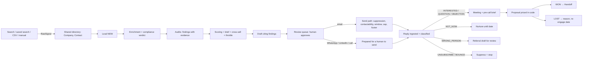
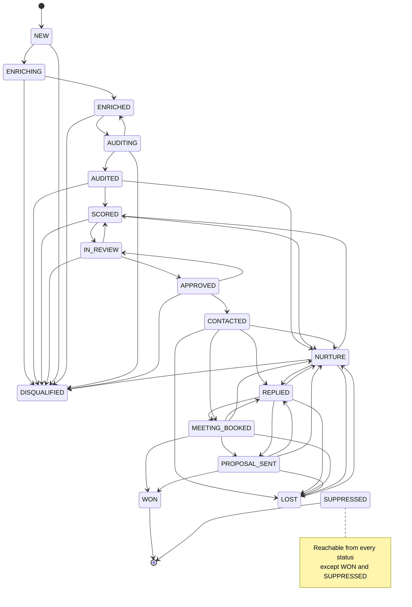

# Client Acquisition: module spec

| | |
|---|---|
| Status | Agreed (Phase 0 baseline) |
| Owner | Phase 0 (lead architect). Business owner: Prince Amadin, FUTUREUNI |
| Last updated | 2026-09-25 |
| Source brief | `docs/prompts/phase-00-requirements.md` Steps 3b and 10; phase prompts 7–19; `docs/background/FutureUni-Growth-Engine-Pipeline.pdf` |
| Module | `acquisition` · route prefix `/acquisition` · code in `src/modules/acquisition/` · tables `acq_*` |

**Read with:** `.claude/project-rules.md` (brand, the permission matrix, domain invariants `INV-n`, bans, output rules), `docs/specs/platform.md` (the core this module uses), `docs/specs/data-model.md` (fields), `docs/contracts/*.md` (interfaces: `service-line-profile.md`, `source-adapter.md`, `enrichment.md`, `audit-agent.md`, `ai-service.md`, `jobs.md`, `outreach-channel.md`, `permissions.md`, `events.md`), `docs/decisions.md` (ADRs), `docs/integrations.md` (providers). This spec says *what* the module does; rules live in project-rules and interfaces in the contracts.

**This spec is the source of truth for the lead lifecycle** (§5.2). Phase 2 implements the allowed-transitions table exactly.

## Changelog

| Date | Change |
|---|---|
| 2026-09-25 | First version (Phase 0) |

---

## 1. Problem and goal

**Problem.** FUTUREUNI finds clients by hand: someone notices a business with a slow website or a job post for a designer, looks up a contact, writes a message, and forgets to follow up. There is no shared record of who was contacted, what was said, which claims were true, what worked, or whether it was lawful (UK PECR, CAN-SPAM, Nigeria's NDPA).

**Goal.** A module that finds businesses that visibly need one of FUTUREUNI's four services, proves the need with evidence, writes truthful and compliant outreach for a human to approve, manages replies, and tracks every deal to won or lost — per service line, per market, on a schedule, with FUTUREUNI's capacity in mind.

**Success measures.**
- Every message sent cites at least one stored finding or signal with a source (INV-5); zero sends to suppressed contacts (INV-2); zero automatic WhatsApp or LinkedIn sends (INV-7).
- A service lead reviews and approves a drafted first touch in under 60 seconds on average, mostly from the keyboard.
- Every actionable reply gets a first human response within 4 business hours (SLA, §3.12) in at least 90% of cases.
- Management can see, per line and market, which sources, signals and pitch angles turn into replies, meetings and revenue (§3.14).

### 1.1 The end-to-end flow

> signal found → company created or matched in the shared directory → lead created (company × service line × market) → enriched → audited → scored → brief written → message drafted → review queue → approved → sent (email) or prepared (assisted channel) → reply received → classified → action (meeting / follow-up / referral / stop) → meeting → proposal → won or lost → handoff record

Claude is used at judgement points only (brief, borderline review, drafting, reply classification, reply drafts, audit vision checks, pre-call briefs, proposal prose, weekly insight), always through `@/platform/ai` (ADR-006) and never with side-effecting tools (INV-24).

---

## 2. Users and roles

The authoritative action × role matrix is `.claude/project-rules.md` §"Roles and permissions" (actions `acquisition.*`). Summary for this module:

| Role | In Client Acquisition |
|---|---|
| `ADMIN` | Everything on every line, plus mailboxes, suppression removal, data-subject requests, the global outreach pause, retention preview |
| `MANAGER` | All operational work on every line; approves proposal exceptions (discount above threshold or outside ranges); assigns handoffs; reads mailboxes and runs DNS checks; imports suppressions; manages consent |
| `SERVICE_LEAD` | Full operational rights on their lines: search, saved searches, CSV import, review queue, approve, inbox, pipeline, meetings, proposals, won/lost, line settings and profile publishing. Sees **every** service-line tab, but read-only outside their lines (leads, pipeline, analytics, profiles, throttle status) with action controls hidden. Review queue and inbox threads of other lines are **not** visible (they contain drafts and personal replies). No `/admin` access (`platform.admin.access`); reads and adds suppressions from the lead detail |
| `MEMBER` | Works leads assigned to them (`OWN`) on their lines: drafts, sends assisted messages, replies, meetings, proposals, won/lost. Approves outreach, borderline decisions and proposals only with `canApprove` (`OWN+A`). Sees only their lines' tabs; reads leads, pipeline and analytics for their lines. Can't run searches |

- **Scope:** `resource.serviceLine` is the lead's line; `resource.ownerId` is the lead's owner. A lead with no owner is visible to `SERVICE_LEAD` and above on its line, and to no `MEMBER`.
- **Lead owner** is set: to the creator for a manual add; by `assignLead` (manual or bulk); or by inbox routing on the first actionable reply if still unset (§3.12).
- Anyone may **add** a suppression (it only ever reduces contact); only `ADMIN` may remove one.

---

## 3. Module structure and domain rules

### 3.1 Views and sections

The module has **five top-level views** shown as tabs: **Web Development**, **UI/UX Design**, **Graphic Design**, **Video Editing**, and **Overview**. A service-line tab is visible when `acquisition.lead.read` allows that line: a `SERVICE_LEAD` sees every tab (read-only outside their lines, action controls hidden, server actions refused with `FORBIDDEN`); a `MEMBER` sees only their lines. Overview follows `acquisition.overview.read` (filtered to the user's lines for non-managers).

Every service-line tab has the same seven sections, in this navigation order: Search, Review, Leads, Pipeline, Inbox, Analytics, Settings (routes in §6). Leads is added to the six sections named in the Phase 0 brief and in Phases 2 and 15's prompts because its route already exists in the Wave 4 route map (R-A9); the acquisition manifest's navigation lists all seven.

| Section | What it is |
|---|---|
| **Search** | Market toggle Nigeria / International / Both; location; keywords; sources; result limit; cost estimate; **Run now** or **Save as scheduled search**; live run progress; run history; saved searches; CSV import; manual add |
| **Review queue** | Leads waiting for a human decision: context, audit findings as evidence, the drafted message. Actions: approve, edit, reject, reassign, snooze, regenerate; assisted WhatsApp/LinkedIn/call flows |
| **Leads** | Every lead of the line: filters in the URL (§6), saved views, bulk actions; opens the lead detail |
| **Pipeline** | A board by stage with per-currency totals |
| **Inbox** | Replies for that line, classified, with SLAs and AI-drafted responses |
| **Analytics** | The metrics in §3.14 for that line |
| **Settings** | Line-level: the profile (signals, sources, audits, scoring, pitch angles, portfolio, pricing, sequences, disqualifiers, approval mode, capacity policy), owners, capacity view, version history |

The **lead detail** (`/acquisition/[line]/leads/[leadId]`) is reached from Leads, Review, Pipeline, Inbox and analytics drill-downs.

- **Clicking a tab searches only that line.** The Search section always runs for the line of the tab it's in. There is **no global "search everything" action**.
- **Overview** is read-only: the four lines compared on key metrics, cross-sell opportunities, capacity and throttle status, market split, AI spend and a deliverability snapshot. No searching, drafting or approving from Overview.

### 3.2 Service-line profiles

A **profile** tells the engine everything line-specific; the engine never hardcodes line behaviour. A fifth service line later is a new profile (plus a new enum value, ADR-008), not new code paths. The schema is `ServiceLineProfile` in `docs/contracts/service-line-profile.md`. A profile contains:

- `id` (the `ServiceLine`), label, description, owner roles / owner user IDs, `contactRolePriority` (the role order used to pick the primary contact, Phase 9)
- `signals[]`: id, label, description, weight, markets, evidence needed, `detectingSources` (source adapter IDs), `confirmedBy` (audit check IDs), optional `derivedFrom` (`enrichment` or an audit check, for derived signals), `future`
- `sources[]`: source adapter ID, markets, default parameters per market (keywords, place types, job titles, regions, cities)
- `audits[]`: audit agent ID, required or optional, and per-check required/optional
- `scoring`: rules (condition → points, with a label), `qualifyThreshold`, `borderlineBand: { min, max }`, `lowScoreAction` (`DISQUALIFY` or `NURTURE`), negative rules
- `pitchAngles` per market: id, one-line hook, when to use (signals and findings), proof tags, phrases to avoid
- `portfolio[]`: title, description, URL, media file key, tags, markets, outcome metric, `isPlaceholder`
- `pricing`: packages per market with ranges in minor units + currency, and `needsReview`
- `sequences` per market: steps with channel, delay in business days, `purpose` (`INTRO_AUDIT_INSIGHT`, `VALUE_ADD`, `PORTFOLIO_PROOF`, `SOFT_BREAKUP`, `CALL`, `FOLLOW_UP`), pitch angle, `includeBookingLink`, `stopConditions`
- `disqualifiers[]`, `approvalMode` (`ALWAYS_REVIEW` default, or `AUTO_SEND_ABOVE_SCORE` with `autoSendMinScore`), `capacityPolicy` (`slowAtPercent`, `pauseAtPercent`, `slowFactor`, `pauseScheduledSearches`, `newQualifiedLeadsWhenPaused`, optional `dailyFirstTouchCap`)

**Versioning.** Profiles are seeded from code defaults (`src/modules/acquisition/profiles/defaults/`) as version 1, only when no version exists. After that the database is the truth: every edit is saved as a `DRAFT` version, validated, and published as a new active version; the previous version is archived. Rollback re-activates an older version as a new publish. Exactly one active version per line (INV-16). The Phase 18 editor edits every field, including `contactRolePriority`; the Phase 7 linter (`pnpm profiles:check`) warns about placeholder portfolio items, pricing that needs review and angles without proof.

### 3.3 Initial profiles (seed defaults)

These are the concrete Phase 7 seed defaults. Scoring conditions use the condition grammar defined in `docs/contracts/service-line-profile.md` (examples: `signal:no_website`, `finding.severity>=HIGH:web.pagespeed_mobile`, `company.legalForm in [LIMITED, LLP]`, `contact.primary.emailStatus == VALID`, `market == NIGERIA`). **Every price below is a placeholder, Prince to confirm** (`pricing.needsReview: true`). Portfolio entries start as placeholders (`isPlaceholder: true`, title "TODO: real FUTUREUNI project") and are never attached to outreach (INV-19).

Common to all four lines:
- **Bands:** `BELOW` < 40; `BORDERLINE` 40–60 inclusive; `QUALIFIED` ≥ 61 (`qualifyThreshold: 61`, `borderlineBand: { min: 40, max: 60 }`, `lowScoreAction: DISQUALIFY`). Scores are clamped to 0–100.
- **Common negative rules:** only a generic role email (`contact.primary.emailType == ROLE`) −5; company size `SIZE_201_1000` or `SIZE_1000_PLUS` −15.
- **Common positive rules:** reachable primary contact `contact.primary.emailStatus == VALID` +10; Nigeria with WhatsApp `market == NIGERIA and contact.primary.whatsappStatus in [CONFIRMED, LIKELY]` +8; legal form known `company.legalForm != UNKNOWN` +3.
- **Common disqualifiers:** `competitor_agency` (the company sells the same service), `government_body`, `adult_or_gambling`, `active_client` (`Company.isActiveClient`), `no_channel` (email `BLOCKED` and no WhatsApp, LinkedIn or phone channel allowed by contactability; the same reason Phase 11's channel check records, §3.8), `in_house_team` (job posts for 3 or more roles of this line within 90 days, or `SIZE_1000_PLUS`).
- **Approval mode:** `ALWAYS_REVIEW`.
- **Capacity policy:** `slowAtPercent: 70`, `pauseAtPercent: 100`, `slowFactor: 0.3`, `pauseScheduledSearches: true`, `newQualifiedLeadsWhenPaused: NURTURE`; `dailyFirstTouchCap` unset, so the setting `acquisition.firstTouchDailyCapPerLine` applies (§3.10).
- **Owners:** role-based default — the `SERVICE_LEAD` users whose team profile includes the line, resolved at runtime through `@/platform/team`.
- **Stop conditions on every sequence step** (`stopConditions`): `ANY_REPLY`, `BOUNCE`, `UNSUBSCRIBE`, `MEETING_BOOKED`, `SUPPRESSED`, `LEAD_INACTIVE` (the lead is no longer in an active status).
- **Channel availability:** a step whose channel is blocked by the lead's contactability verdict is skipped (the sequence moves to the next allowed step; if none, the enrolment completes).
- **Nigerian job sources:** every line's `NIGERIA` sources also include `myjobmag` (`optional: true`) with the same job titles; it reads only the public feeds and stays disabled for live runs until feed use is confirmed (§3.5.1).
- **Reserved and derived signals:** `csv-import` and `manual` always record the reserved signal `manual_lead` (weight 0, never scored, known to every profile) plus any profile signal the user selects. Signals first found by enrichment or audits (for example `outdated_site`, `slow_mobile`, `no_ssl`) are **derived** signals written by Phases 9 and 10; their profile `detectingSources` is `[]` (shown as "—" below) and the stored `Signal` records `detectedBy: "enrichment"` or `"audit:<checkId>"`. The adapter → signal ID table is in `docs/contracts/source-adapter.md`.

#### 3.3.1 Web Development (`WEB_DEVELOPMENT`)

Description: websites that load fast, work on phones, and turn visitors into customers.

**Signals**

| Id | Label | Weight | Markets | Evidence needed | Detected by | Confirmed by |
|---|---|---|---|---|---|---|
| `no_website` | No website | 25 | both | Places listing with no website field, or the website is a social or marketplace URL (instagram.com, facebook.com, jiji.ng, linktr.ee) | `google-places`, `manual`, `csv-import` | `web.no_website` |
| `slow_mobile` | Slow on mobile | 15 | both | PageSpeed mobile performance score < 50 or LCP > 4.0s | — | `web.pagespeed_mobile` |
| `no_ssl` | No working HTTPS | 10 | both | HTTPS unavailable, invalid or expiring certificate, or HTTP doesn't redirect to HTTPS | — | `web.ssl` |
| `not_mobile_friendly` | Not mobile friendly | 12 | both | No viewport meta tag, or the mobile capture overflows horizontally | — | `web.mobile_viewport` |
| `outdated_site` | Outdated site | 10 | both | Copyright year 3+ years old, or legacy tech hints (jQuery < 1.12, Flash, table layouts) | — (derived by enrichment from tech hints) | `web.outdated` |
| `broken_pages` | Broken pages | 8 | both | 2 or more of up to 20 internal links return 4xx/5xx | — | `web.broken_links` |
| `weak_seo_basics` | Weak SEO basics | 5 | both | Missing title, meta description, single H1 or OG tags | — | `web.seo_basics` |
| `job_post_web_developer` | Hiring a web developer | 15 | both | Job post in the last 60 days with a title matching `/web developer\|frontend developer\|wordpress developer\|website developer/i` | `jobs-serpapi`, `jobs-adzuna`, `myjobmag` | — |
| `ecommerce_on_social_only` | Selling through DMs | 12 | NIGERIA | "DM to order", "order on WhatsApp" or a product catalogue on a social profile or Places listing with no own site | `google-places`, `manual`, `csv-import` | `web.no_website` |

**Sources**

| Market | Adapter | Default parameters |
|---|---|---|
| NIGERIA | `google-places` | cities: Lagos, Abuja, Port Harcourt, Warri, Benin City; sectors: restaurants, private clinics, private schools, real estate agencies, hotels, fashion boutiques, logistics companies, event centres; churches off by default (open question OQ-6); up to 20 results per city × sector query |
| NIGERIA | `jobs-serpapi` | titles: "web developer", "wordpress developer", "frontend developer"; location: Nigeria and the five cities; posted within 30 days |
| INTERNATIONAL | `google-places` | cities: London, Manchester, Birmingham, Leeds, Bristol (GB); Dublin (IE); New York, Houston, Atlanta (US); Toronto (CA); sectors: independent restaurants, dental clinics, estate agents, law firms, fitness studios, trades |
| INTERNATIONAL | `jobs-serpapi` | same titles; locations: United Kingdom, Ireland, United States, Canada |
| INTERNATIONAL | `jobs-adzuna` | same titles; countries: gb, us, ca |
| both | `csv-import`, `manual` | — |

**Audits:** `audit.web` required. Required checks: `web.no_website`, `web.pagespeed_mobile`, `web.ssl`, `web.mobile_viewport` (each may report not applicable when there's no website). Optional: `web.pagespeed_desktop`, `web.broken_links`, `web.seo_basics`, `web.outdated`, `web.contact_path`, `web.visual_first_impression`.

**Scoring rules** (plus the common rules)

| Rule id | Condition | Points |
|---|---|---|
| `web_no_website` | `signal:no_website` | +30 |
| `web_slow_mobile` | `finding.severity>=HIGH:web.pagespeed_mobile` | +15 |
| `web_no_ssl` | `finding.severity>=MEDIUM:web.ssl` | +10 |
| `web_not_mobile` | `finding.severity>=MEDIUM:web.mobile_viewport` | +10 |
| `web_outdated` | `signal:outdated_site` | +8 |
| `web_broken` | `finding.severity>=MEDIUM:web.broken_links` | +5 |
| `web_hiring` | `signal:job_post_web_developer` | +15 |
| `web_social_commerce` | `signal:ecommerce_on_social_only` | +10 |

**Pitch angles**

| Market | Id | Hook | Use when | Proof tags | Avoid |
|---|---|---|---|---|---|
| NIGERIA | `ng_web_first_site` | "Customers search Google before they visit — right now they only find your Instagram." | `no_website` | `website-launch`, `local-business` | "your business looks unprofessional" |
| NIGERIA | `ng_web_whatsapp_orders` | "Let customers order and pay online, with WhatsApp kept for questions." | `ecommerce_on_social_only` | `ecommerce`, `whatsapp-integration` | promising sales figures |
| NIGERIA | `ng_web_mobile_data` | "Most of your visitors are on mobile data — a lighter site loads faster and costs them less." | `slow_mobile`, `not_mobile_friendly` | `performance` | technical jargon (LCP, CLS) in the first message |
| NIGERIA | `ng_web_trust` | "A secure, up-to-date site builds trust with customers and partners." | `no_ssl`, `outdated_site` | `redesign` | "your site is hacked/unsafe" |
| INTERNATIONAL | `intl_web_speed` | "Your homepage took {LCP}s to show its main content on mobile in our test on {date}." | `slow_mobile` | `performance`, `case-study` | exaggerating lost revenue |
| INTERNATIONAL | `intl_web_modernise` | "A fixed-price refresh that works on every phone." | `outdated_site`, `not_mobile_friendly` | `redesign` | "your site is terrible" |
| INTERNATIONAL | `intl_web_overlap` | "A senior team in Lagos that works your hours — Lagos shares working hours with the UK and much of Europe." | `job_post_web_developer` | `process`, `retainer` | "cheap offshore" |
| INTERNATIONAL | `intl_web_first_site` | "Customers look you up before they call — give them a site that answers their questions." | `no_website` | `website-launch` | — |

**Pricing** (placeholder, Prince to confirm; stored in minor units)

| Package id | Name | Includes | NIGERIA (NGN) | INTERNATIONAL (USD) | INTERNATIONAL (GBP) |
|---|---|---|---|---|---|
| `web_starter` | Starter site | Up to 5 responsive pages, contact form, basic SEO | ₦450,000–₦900,000 | $1,500–$3,000 | £1,200–£2,500 |
| `web_business` | Business site | Up to 12 pages, CMS, analytics, speed optimisation | ₦1,200,000–₦2,500,000 | $3,500–$7,500 | £3,000–£6,000 |
| `web_ecommerce` | Online store | Catalogue, checkout, payments, order emails | ₦2,000,000–₦5,000,000 | $6,000–$15,000 | £5,000–£12,000 |
| `web_care` | Care plan (monthly) | Hosting oversight, updates, small edits | ₦50,000–₦150,000 / month | $150–$400 / month | £120–£320 / month |

**Sequences**

| Market | Step (`index`) | Channel | Delay (business days after previous) | `purpose` | Angle | `includeBookingLink` |
|---|---|---|---|---|---|---|
| NIGERIA | 0 | `WHATSAPP_ASSISTED` | 0 | `INTRO_AUDIT_INSIGHT` (one audit insight) | best match | false |
| NIGERIA | 1 | `EMAIL` | 3 | `VALUE_ADD` (one practical tip from the findings) | same | false |
| NIGERIA | 2 | `WHATSAPP_ASSISTED` | 4 | `PORTFOLIO_PROOF` | proof-bearing angle | true |
| NIGERIA | 3 | `EMAIL` | 7 | `SOFT_BREAKUP` | — | false |
| INTERNATIONAL | 0 | `EMAIL` | 0 | `INTRO_AUDIT_INSIGHT` | best match | false |
| INTERNATIONAL | 1 | `EMAIL` | 3 | `VALUE_ADD` | same | false |
| INTERNATIONAL | 2 | `LINKEDIN_ASSISTED` | 2 | `PORTFOLIO_PROOF` (company-page note) | proof-bearing angle | false |
| INTERNATIONAL | 3 | `EMAIL` | 4 | `PORTFOLIO_PROOF` | same | true |
| INTERNATIONAL | 4 | `EMAIL` | 7 | `SOFT_BREAKUP` | — | false |

Every step carries the common `stopConditions`; each market's sequence has `isDefault: true`.

**Disqualifiers:** the common list plus `franchise_central_web` (a franchise whose website is managed centrally).

#### 3.3.2 UI/UX Design (`UI_UX_DESIGN`)

Description: product and app design that makes signup, onboarding and everyday use effortless.

**Signals**

| Id | Label | Weight | Markets | Evidence needed | Detected by | Confirmed by |
|---|---|---|---|---|---|---|
| `app_reviews_usability_complaints` | Users complain about usability | 20 | both | 3+ of the latest 50 App Store reviews mention confusing navigation, signup/login trouble, can't find, crashes on key flows | `apple-app-store` | `uiux.app_reviews` |
| `app_low_rating` | Low app rating | 10 | both | App Store rating < 3.5 with at least 20 ratings | `apple-app-store` | `uiux.app_reviews` |
| `high_friction_signup` | High-friction signup | 15 | both | The onboarding capture reaches signup in 3+ steps or shows 8+ required fields before any value | — | `uiux.onboarding_capture` |
| `inconsistent_ui` | Inconsistent interface | 10 | both | A heuristics finding with severity ≥ MEDIUM on consistency or hierarchy | — | `uiux.heuristics` |
| `accessibility_failures` | Accessibility failures | 10 | both | axe reports 1+ critical or 5+ serious violations on the landing page | — | `uiux.accessibility` |
| `recently_funded` | Recently funded | 15 | both | A funding announcement within 12 months, with a source URL | `manual`, `csv-import` (a funding-news source is future) | — |
| `job_post_product_designer` | Hiring a product designer | 15 | both | Job post in the last 60 days matching `/product designer\|ui\/ux designer\|ux designer\|ui designer/i` | `jobs-serpapi`, `jobs-adzuna`, `myjobmag` | — |

**Sources**

| Market | Adapter | Default parameters |
|---|---|---|
| NIGERIA | `apple-app-store` | country `ng`; categories: finance, shopping, food and drink, health and fitness, education, business, lifestyle; max rating 3.8; min ratings 20 |
| NIGERIA | `jobs-serpapi` | titles: "product designer", "UI/UX designer"; location: Nigeria, Lagos, Abuja |
| INTERNATIONAL | `apple-app-store` | countries `gb`, `us`, `ie`, `ca`; same categories and thresholds |
| INTERNATIONAL | `jobs-serpapi` | same titles; United Kingdom, Ireland, United States, Canada |
| INTERNATIONAL | `jobs-adzuna` | same titles; countries gb, us, ca |
| both | `csv-import`, `manual` | funded startups and referrals |

**Audits:** `audit.uiux` required. Required checks: `uiux.app_reviews` (not applicable without an app), `uiux.onboarding_capture` (not applicable without a website), `uiux.accessibility`. Optional: `uiux.heuristics`, `uiux.mobile_layout`.

**Scoring rules:** `uiux_reviews` `signal:app_reviews_usability_complaints` +20; `uiux_low_rating` `signal:app_low_rating` +8; `uiux_friction` `finding.severity>=MEDIUM:uiux.onboarding_capture` +15; `uiux_heuristics` `finding.severity>=MEDIUM:uiux.heuristics` +10; `uiux_a11y` `finding.severity>=HIGH:uiux.accessibility` +10; `uiux_funded` `signal:recently_funded` +15; `uiux_hiring` `signal:job_post_product_designer` +15; plus the common rules.

**Pitch angles**

| Market | Id | Hook | Use when | Proof tags | Avoid |
|---|---|---|---|---|---|
| NIGERIA | `ng_uiux_reviews` | "Your app reviews mention the same few frustrations — here's what we'd fix first." | `app_reviews_usability_complaints` | `app-redesign` | quoting a reviewer's name |
| NIGERIA | `ng_uiux_signup` | "Fewer steps before the first win means more signups, especially on slow networks." | `high_friction_signup` | `onboarding` | "your app is hard to use" |
| NIGERIA | `ng_uiux_trust` | "Clear, consistent screens build trust — it matters most in finance and health apps." | `inconsistent_ui` | `fintech`, `design-system` | fear-based claims |
| INTERNATIONAL | `intl_uiux_reviews` | "Recent reviews point to {theme} — a focused redesign of that flow is a quick win." | `app_reviews_usability_complaints` | `app-redesign`, `case-study` | — |
| INTERNATIONAL | `intl_uiux_onboarding` | "Your signup takes {steps} steps before users see value — we'd cut it down." | `high_friction_signup` | `onboarding` | invented conversion numbers |
| INTERNATIONAL | `intl_uiux_post_raise` | "After a raise, design debt compounds — a design system now saves months later." | `recently_funded` | `design-system` | congratulating on unverified funding |
| INTERNATIONAL | `intl_uiux_overlap` | "Senior product designers in Lagos, working your hours." | `job_post_product_designer` | `process`, `retainer` | "cheap offshore" |

**Pricing** (placeholder, Prince to confirm)

| Package id | Name | Includes | NGN | USD | GBP |
|---|---|---|---|---|---|
| `uiux_audit` | UX audit | Heuristic review, review analysis, prioritised fixes | ₦350,000–₦700,000 | $1,200–$2,500 | £1,000–£2,000 |
| `uiux_flow_redesign` | Flow redesign | One critical flow (for example onboarding) redesigned and prototyped | ₦800,000–₦1,800,000 | $3,000–$6,000 | £2,500–£5,000 |
| `uiux_product_design` | Product design | MVP or major feature design, prototype, handoff | ₦2,000,000–₦5,000,000 | $8,000–$20,000 | £6,500–£16,000 |
| `uiux_design_system` | Design system | Tokens, components, documentation | ₦1,500,000–₦4,000,000 | $5,000–$12,000 | £4,000–£10,000 |

**Sequences:** same shape as Web Development for each market (Nigeria: `WHATSAPP_ASSISTED` → `EMAIL` → `WHATSAPP_ASSISTED` → `EMAIL`; International: `EMAIL` → `EMAIL` → `LINKEDIN_ASSISTED` → `EMAIL` → `EMAIL`), with delays 0/3/4/7 and 0/3/2/4/7 business days.

**Disqualifiers:** the common list plus `large_product_team` (3+ design job posts in 90 days or `SIZE_201_1000` and above).

#### 3.3.3 Graphic Design (`GRAPHIC_DESIGN`)

Description: brand identities, social graphics and visual systems that look consistent everywhere.

**Signals**

| Id | Label | Weight | Markets | Evidence needed | Detected by | Confirmed by |
|---|---|---|---|---|---|---|
| `inconsistent_branding` | Inconsistent branding | 20 | both | Logo, colours or typography differ across the website and public social profiles | — | `graphic.consistency` |
| `low_quality_visuals` | Low-quality visuals | 12 | both | Pixelated, stretched or low-resolution logo or hero images | — | `graphic.logo_quality` |
| `no_brand_system` | No brand system | 12 | both | No consistent palette or type; generic template visuals | — | `graphic.consistency` |
| `new_business` | New business | 15 | both | Places listing with fewer than 10 reviews and first review within 12 months, or a recent registration noted in the source | `google-places`, `csv-import`, `manual` | — |
| `weak_ad_creatives` | Weak ad creatives | 0 (future) | both | Reserved: no compliant data source yet; manual entry only | `manual` | — |
| `job_post_graphic_designer` | Hiring a graphic designer | 15 | both | Job post in the last 60 days matching `/graphic designer\|brand designer\|visual designer/i` | `jobs-serpapi`, `jobs-adzuna`, `myjobmag` | — |

**Sources**

| Market | Adapter | Default parameters |
|---|---|---|
| NIGERIA | `google-places` | cities: Lagos, Abuja, Port Harcourt, Warri, Benin City; sectors: fashion brands, beauty salons, restaurants and cafés, event planners, bakeries, real estate |
| NIGERIA | `jobs-serpapi` | titles: "graphic designer", "brand designer"; Nigeria and the five cities |
| INTERNATIONAL | `google-places` | London, Manchester, Dublin, New York, Toronto; sectors: cafés, salons, boutiques, fitness studios, independent brands |
| INTERNATIONAL | `jobs-serpapi`, `jobs-adzuna` | titles: "graphic designer", "brand designer"; gb, ie (serpapi only), us, ca |
| both | `csv-import`, `manual` | — |

**Audits:** `audit.graphic` required. Required checks: `graphic.brand_surfaces`, `graphic.consistency`. Optional: `graphic.logo_quality`, `graphic.social_presence_fit`.

**Scoring rules:** `graphic_inconsistent` `finding.severity>=MEDIUM:graphic.consistency` +20; `graphic_low_quality` `finding.severity>=MEDIUM:graphic.logo_quality` +12; `graphic_no_system` `signal:no_brand_system` +10; `graphic_new_business` `signal:new_business` +15; `graphic_hiring` `signal:job_post_graphic_designer` +15; plus the common rules.

**Pitch angles**

| Market | Id | Hook | Use when | Proof tags | Avoid |
|---|---|---|---|---|---|
| NIGERIA | `ng_graphic_one_brand` | "Same logo, same colours everywhere — customers recognise you faster." | `inconsistent_branding` | `brand-identity` | mocking their current logo |
| NIGERIA | `ng_graphic_launch_kit` | "Launching? Start with a brand kit you can use from day one." | `new_business` | `brand-identity`, `social-pack` | — |
| NIGERIA | `ng_graphic_social` | "Social posts that look as good as your product." | `low_quality_visuals` | `social-pack` | — |
| INTERNATIONAL | `intl_graphic_refresh` | "Your logo on {surfaceA} and {surfaceB} doesn't match — a light refresh fixes that." | `inconsistent_branding` | `brand-identity`, `case-study` | "your branding is a mess" |
| INTERNATIONAL | `intl_graphic_system` | "A simple brand system so every post and flyer looks like you." | `no_brand_system` | `brand-system` | — |
| INTERNATIONAL | `intl_graphic_overlap` | "Design on retainer with same-day turnaround, from a team in your working hours." | `job_post_graphic_designer` | `retainer`, `process` | "cheap offshore" |

**Pricing** (placeholder, Prince to confirm)

| Package id | Name | Includes | NGN | USD | GBP |
|---|---|---|---|---|---|
| `graphic_logo_kit` | Logo and mini brand kit | Logo, palette, type pairing, usage sheet | ₦150,000–₦400,000 | $400–$1,200 | £350–£1,000 |
| `graphic_brand_identity` | Brand identity | Full identity, guidelines, templates | ₦500,000–₦1,500,000 | $1,500–$4,000 | £1,200–£3,200 |
| `graphic_social_pack` | Social design pack (monthly) | 12–20 designed posts per month | ₦100,000–₦300,000 / month | $300–$900 / month | £250–£750 / month |
| `graphic_retainer` | Design retainer (monthly) | Agreed hours of design per month | ₦250,000–₦600,000 / month | $800–$2,000 / month | £650–£1,600 / month |

**Sequences:** same shape as Web Development per market.

**Disqualifiers:** the common list plus `franchise_central_branding` (branding set centrally by a franchisor).

#### 3.3.4 Video Editing (`VIDEO_EDITING`)

Description: editing, captions and thumbnails that help creators, coaches and brands post consistently.

**Signals**

| Id | Label | Weight | Markets | Evidence needed | Detected by | Confirmed by |
|---|---|---|---|---|---|---|
| `active_creator` | Active creator | 5 | both | Uploads in the last 30 days, subscriber band 1k–500k | `youtube-channels` | `video.cadence` |
| `active_creator_rough_editing` | Active creator, rough editing | 20 | both | Active creator and a thumbnails or titles finding with severity ≥ MEDIUM | — | `video.thumbnails`, `video.titles_hooks` |
| `no_captions` | No captions | 12 | both | Fewer than 30% of the last 20 videos have captions | — | `video.captions` |
| `inconsistent_thumbnails` | Inconsistent thumbnails | 12 | both | Thumbnails differ in style, legibility or branding | — | `video.thumbnails` |
| `gone_quiet` | Gone quiet | 15 | both | The posting gap is growing and the latest upload is more than 45 days old | `youtube-channels` | `video.cadence` |
| `long_unedited_uploads` | Long unedited uploads | 10 | both | Average long-form duration > 25 minutes with engagement below the channel median, or re-uploaded livestreams | — | `video.duration_profile` |
| `job_post_video_editor` | Hiring a video editor | 15 | both | Job post in the last 60 days matching `/video editor\|youtube editor\|content editor\|reels editor/i` | `jobs-serpapi`, `jobs-adzuna`, `myjobmag` | — |

**Sources**

| Market | Adapter | Default parameters |
|---|---|---|
| NIGERIA | `youtube-channels` | `regionCode: NG`; niche keywords: Nigerian food recipes, Lagos vlog, tech reviews Nigeria, fitness coach Nigeria, real estate Lagos, business podcast Nigeria, church media (off by default, OQ-6); subscriber band 1k–200k |
| NIGERIA | `jobs-serpapi` | titles: "video editor", "YouTube editor"; Nigeria, Lagos, Abuja |
| INTERNATIONAL | `youtube-channels` | `regionCode`: GB, US, CA, IE; niches: coaches, fitness, cooking, personal finance, B2B podcasts, real estate; subscriber band 5k–500k |
| INTERNATIONAL | `jobs-serpapi`, `jobs-adzuna` | titles: "video editor", "YouTube editor"; gb, ie (serpapi only), us, ca |
| both | `csv-import`, `manual` | — |

**Audits:** `audit.video` required. Required checks: `video.cadence`, `video.captions`, `video.thumbnails`. Optional: `video.duration_profile`, `video.engagement`, `video.titles_hooks`. Instagram and TikTok are "not assessed: no compliant data source" (INV-14).

**Scoring rules:** `video_rough` `signal:active_creator_rough_editing` +20; `video_active` `signal:active_creator` +5; `video_captions` `finding.severity>=MEDIUM:video.captions` +12; `video_thumbnails` `finding.severity>=MEDIUM:video.thumbnails` +12; `video_quiet` `signal:gone_quiet` +15; `video_long` `signal:long_unedited_uploads` +8; `video_hiring` `signal:job_post_video_editor` +15; plus the common rules.

**Pitch angles**

| Market | Id | Hook | Use when | Proof tags | Avoid |
|---|---|---|---|---|---|
| NIGERIA | `ng_video_consistency` | "Post every week without editing at midnight — we handle the edit." | `active_creator`, `gone_quiet` | `youtube`, `retainer` | commenting on their content quality |
| NIGERIA | `ng_video_captions` | "Most people watch on mute — captions keep them watching." | `no_captions` | `captions`, `shorts` | — |
| NIGERIA | `ng_video_thumbnails` | "Thumbnails that look like one brand help people recognise your videos." | `inconsistent_thumbnails` | `thumbnails` | — |
| INTERNATIONAL | `intl_video_captions` | "{share}% of your last 20 videos have captions — adding them is an easy reach win." | `no_captions` | `captions`, `case-study` | invented view uplifts |
| INTERNATIONAL | `intl_video_thumbnails` | "A consistent thumbnail system makes your videos easier to spot." | `inconsistent_thumbnails` | `thumbnails` | "your thumbnails are bad" |
| INTERNATIONAL | `intl_video_comeback` | "Your last upload was {days} days ago — we can get you back on a schedule." | `gone_quiet` | `retainer` | guilt-tripping |
| INTERNATIONAL | `intl_video_overlap` | "An editing team in your working hours with 24–48h turnaround." | `job_post_video_editor` | `process`, `retainer` | "cheap offshore" |

**Pricing** (placeholder, Prince to confirm)

| Package id | Name | Includes | NGN | USD | GBP |
|---|---|---|---|---|---|
| `video_shorts_pack` | Shorts and Reels pack (monthly) | 8 short-form edits with captions | ₦120,000–₦300,000 / month | $300–$800 / month | £250–£650 / month |
| `video_long_form` | Long-form edit (per video) | Edit, captions, colour, sound clean-up | ₦40,000–₦120,000 / video | $120–$400 / video | £100–£320 / video |
| `video_channel_retainer` | Channel retainer (monthly) | 4 long-form + 8 shorts + thumbnails | ₦350,000–₦900,000 / month | $1,000–$2,800 / month | £800–£2,200 / month |
| `video_thumbnail_pack` | Thumbnail system | Template set + 10 thumbnails | ₦60,000–₦150,000 | $150–$400 | £120–£320 |

**Sequences:** same shape as Web Development per market.

**Disqualifiers:** the common list plus `large_media_company` (a broadcaster or studio with an in-house post-production team) and `made_for_kids_channel` (channels marked made for kids).

### 3.4 Markets

Every company, lead and message carries its market (`NIGERIA` or `INTERNATIONAL`); international records also carry an ISO 3166-1 alpha-2 country code (ADR-009). A search can target one market or both.

| Aspect | NIGERIA | INTERNATIONAL |
|---|---|---|
| Sources | Places in Lagos, Abuja, Port Harcourt, Warri, Benin City. Jobs via `jobs-serpapi` with Nigerian locations. `myjobmag` from its public XML job feeds. `jobberman` stays disabled: its terms (clause 22) forbid robots and scraping without written approval, and robots.txt blocks `/job/`. YouTube `regionCode: NG`; App Store `ng`. See §3.5.1 | Places in target UK/IE/US/CA cities; `jobs-serpapi`; `jobs-adzuna` only once a commercial licence exists (disabled by default, §3.5.1); YouTube and App Store by country |
| Channel preference | Assisted WhatsApp first, then email | Email first, with a LinkedIn-assisted touch |
| Tone and pitch angles | Warm, respectful, professional; clear greeting; no slang in first contact; short WhatsApp messages that identify FUTUREUNI in the first line; no voice notes | UK: understated and direct; US: benefit-led and concise; EU: formal. The honest timezone angle: Lagos shares working hours with the UK and much of Europe |
| Currency | NGN | USD by default; GBP for `GB`; EUR for eurozone countries once EUR ranges exist (OQ-4) |
| Portfolio | Items tagged for `NIGERIA` (local work first) | Items tagged for `INTERNATIONAL` (case studies, process) |
| Compliance | NDPA 2023 and the NDPC's GAID 2025 (in force 19 Sep 2025). GAID Art. 18(1)(a) requires consent "for any direct marketing activity", with no B2B carve-out; Art. 26 requires a documented legitimate-interest assessment. So `NG` email defaults to `REVIEW` until Nigerian counsel's view is recorded (ADR-034). Honour opt-outs and data-subject rights | UK PECR (INV-6) and UK GDPR (PECR fines raised to £17.5m or 4% of turnover from 5 Feb 2026); US CAN-SPAM; EU ePrivacy by country: `DE`, `AT`, `IT`, `ES`, `BE` default to `CONSENT_REQUIRED` (ADR-034). Country rules table in `src/modules/acquisition/compliance/` (Phase 9); unknown countries → `REVIEW` |
| Send windows | Weekdays 09:00–17:00 `Africa/Lagos` | Weekdays 09:00–17:00 in the recipient's timezone (from country and city; capital as fallback) (INV-8, INV-12) |

Market derivation for a sourced record: explicit country → phone country code → address → ccTLD. `NG` means `NIGERIA`; anything else means `INTERNATIONAL`. Results outside the requested markets are dropped and counted.

### 3.5 Sourcing and search (Phase 8)

- `runSearch(spec)` with a `SearchSpec` (service line, markets, `locations[]` with one entry per market, keywords, sources, limit, saved search ID). It runs the line's configured adapters (`docs/contracts/source-adapter.md`) concurrently under per-adapter rate limits and a per-run budget cap (provider calls and estimated cost).
- For each `RawSignal`: normalise → derive market and country → **early suppression check** (never create a lead for a suppressed domain, phone or email; count it) → match or create the company in the shared directory (dedupe: normalised domain, then phone, then name + city) → store the `Signal` with evidence and source URL (manual and CSV signals may have no source URL; only signals with one can be cited, INV-5) → create a lead in `NEW` (if no open lead exists for the same company × line × market) or attach the signal to the existing lead → record a cross-line hint if the company has an open lead on another line.
- A company with a `DISQUALIFIED` or `SUPPRESSED` lead for this line, or marked as an active client, is never reopened.
- One adapter failing doesn't fail the run: the run ends `PARTIAL` with that adapter's error.
- `SearchRun` records trigger, status, counts (`fetched`, `outOfMarket`, `suppressed`, `companiesCreated`, `companiesMatched`, `leadsCreated`, `leadsUpdated`, `notReopened`, `errors`), cost and duration.
- **Signal IDs per adapter** are fixed in `docs/contracts/source-adapter.md` (for example `google-places` → `no_website`, `new_business`; job adapters → `job_post_<role>`; `youtube-channels` → `active_creator`, `gone_quiet`; `apple-app-store` → `app_low_rating`, `app_reviews_usability_complaints`, which supersede the names `low_rating` and `usability_complaints_candidate` in Phase 8's prompt; `csv-import` and `manual` → `manual_lead` plus user-selected profile signals).
- **Saved searches** run on a cron schedule in their timezone (default `Africa/Lagos`) through the platform dispatcher's dynamic schedules. When the line is at capacity, the scheduled run is skipped with reason `capacity` and the line owners get `capacity.line-full` at most once a day.
- **CSV import** requires an attestation that the data wasn't bought and was collected lawfully (ban on purchased lists); maximum rows from settings; row-level validation and a downloadable error report. **Manual add** records source `manual:<userId>`.
- Provider terms: never scrape behind a login; no LinkedIn scraping (INV-14). The provider-specific constraints below were researched on 2026-09-25 (sources in `docs/integrations.md`). Phase 8 re-verifies them and records the evidence in each adapter's README.

#### 3.5.1 Provider terms that shape sourcing

- **Google Places (`google-places`):**
  - The Maps Platform terms let us store the **`place_id` indefinitely** and coordinates for 30 days.
  - They forbid copying or saving business names, addresses or user reviews, and forbid using Places data in a listings or directory service.
  - **So the directory persists only the `place_id`** (`CompanySourceRef`), plus derived facts we own: the `no_website` signal, a category mapped to our own industry label, and the search that found it.
  - A Places-only company's name, address and phone are fetched live by `place_id` for display, never stored. Any stored values must come from a non-Google source: the business's own website or public social profile found during enrichment, a job post, CSV import or manual entry. `Company.fieldSources` records where each stored field came from.
  - Requesting `websiteUri` or phone fields bills Text Search at the Enterprise rate ($35 per 1,000 after 1,000 free a month), so field masks stay minimal and cost is estimated per run.
- **Adzuna (`jobs-adzuna`):** commercial use is allowed only as a 14-day evaluation trial, "any attempt to contact a third party … will be considered a breach", and Nigeria isn't covered. The adapter is built (and mocked) but **registered `DISABLED` by default**, with that reason, until FUTUREUNI holds a licence that allows contacting advertisers.
- **Jobberman (`jobberman`):** there's no API, the terms ban automated gathering without written approval, and robots.txt disallows `/job/`. It's **disabled**, with that reason, unless a written data partnership exists.
- **MyJobMag (`myjobmag`):** it publishes public RSS/XML job feeds (for example `jobsxml.xml` and `aggregate_feed.xml`) that robots.txt allows, and its terms have no anti-scraping clause. The adapter reads **only the feeds** (never query-string pages), politely (the feed TTL is 10 minutes). It's enabled for real use only after FUTUREUNI confirms feed use with MyJobMag; until then it runs in mock and stays disabled for live runs.
- **SerpApi (`jobs-serpapi`):** Google's lawsuit against SerpApi (filed December 2025) is ongoing. Keep it behind the adapter as a supply-continuity risk (RISK in §10).
- **YouTube Data API (`youtube-channels`, `audit.video`):** `search.list` has its own quota of 100 calls a day. Public, non-authorised data may be stored for at most 30 days before it's refreshed or deleted, so signals and audit evidence from YouTube carry `observedAt`, and a refresh job re-fetches or drops them.
- **Apple (`apple-app-store`):** the iTunes Search API is limited to about 20 calls a minute. The customer-reviews RSS feed is legacy and undocumented, so treat it as best-effort. App artwork is never displayed.

### 3.6 Enrichment and compliance (Phase 9)

- **Safe fetching:** every page fetch goes through `@/platform/http` (`safeFetch`, `isAllowedByRobots`): SSRF protection, robots.txt with the `FUTUREUNI-Bot/1.0 (+<platform.crawlerContactUrl>)` user agent, size/time limits, per-origin politeness.
- **Crawl:** homepage then contact, about, team, services, careers, legal and footer links; same registrable domain; at most 10 pages; stop early when key fields are found. A company with no website skips the crawl (itself a Web Development signal).
- **Extraction:** emails (including common obfuscations; classified `PERSONAL` or `ROLE`), phones (E.164), WhatsApp (`wa.me` links → `CONFIRMED`; Nigerian mobile prefixes → `LIKELY`), social handles (LinkedIn company page URL only, never scraped), address, tech hints and copyright year, legal-form hints (Ltd/LLP/PLC/UK company number; Nigerian RC/BN numbers; "sole trader").
- **Finder and verifier** (ADR-020, Hunter): used only when the crawl found no verified personal email for a good role; per-day and per-lead caps; don't re-verify within 30 days. Never guess personal emails from name patterns without verification. Hunter's HTTP 451 `claimed_email` (the person asked Hunter to stop processing their data) immediately adds an `EMAIL` suppression with reason `OBJECTION` and source `PROVIDER_SIGNAL`. A `webmail` status is treated as a possible individual subscriber for PECR (INV-6).
- **Primary contact** chosen by the `acquisition.enrich-pick-contact` task with line-specific role priorities (Web Development: owner/founder > operations or marketing manager; Graphic Design: founder > marketing/brand; Video Editing: the creator or their manager; UI/UX: founder, CPO or CTO > product manager). A verified role email is primary only when there's no person.
- **Legal form:** UK via Companies House (company number, or name + postcode/city with fuzzy matching and a confidence score); Nigeria RC/BN recorded for context and scoring (NDPA and GAID govern Nigeria, not PECR, and the legal form doesn't change the Nigerian verdict); elsewhere from hints or `UNKNOWN`.
- **Country rules defaults (ADR-034), pending legal review:**
  - `NG` email → `REVIEW` until the setting `acquisition.compliance.ngDirectMarketingBasis` records counsel's view. `LEGITIMATE_INTEREST_CONFIRMED` makes it `ALLOWED` for incorporated bodies (other forms stay `REVIEW`); `CONSENT_ONLY` makes it `CONSENT_REQUIRED` for every form.
  - `GB` follows INV-6.
  - `DE`, `AT`, `IT`, `ES` and `BE` → `CONSENT_REQUIRED`.
  - `US`, `CA`, `IE`, `FR` and `NL` → `ALLOWED` for incorporated bodies (with unsubscribe and postal address).
  - Everything else → `REVIEW`.
  - Nigerian leads carry `complianceReview` under the same setting (whatever the channel, because GAID Art. 18 covers any direct-marketing channel). `complianceReview` is defined once in `.claude/project-rules.md` §"Domain invariants".
- **Contactability verdict** (`docs/contracts/enrichment.md`): per channel status (email `ALLOWED`/`CONSENT_REQUIRED`/`REVIEW`/`BLOCKED`; WhatsApp, LinkedIn `ASSISTED_ALLOWED`/`BLOCKED`; phone `CALL_TASK_ALLOWED`/`BLOCKED`) and lawful basis, applied in order: suppression blocks everything → consent overrides `CONSENT_REQUIRED` → country rules + legal form decide email (UK sole traders/partnerships → `CONSENT_REQUIRED`, UK `UNKNOWN` → `REVIEW`, INV-6) → invalid email → `BLOCKED` → WhatsApp only ever assisted (INV-7). Stored on the lead; every send path calls `assertEmailAllowed` (INV-2).
- **Suppression:** adding one immediately stops matching enrolments (contact and company, INV-3), moves matching open leads to `SUPPRESSED`, and emits `compliance.suppressed`. Removal is `ADMIN`-only with a reason.
- **Consent records**, **data-subject requests** (export to a private JSON file with a signed URL; delete = anonymise personal fields and add a hashed suppression so the person is never sourced again) and the **retention purge**: its own job `acquisition.compliance.retention-purge` (daily 03:15 `Africa/Lagos`, exported by Phase 9 and registered in the acquisition manifest; the platform's `platform.retention-purge` covers platform-owned data only) anonymises personal data on `DISQUALIFIED`/`LOST` leads older than `platform.retention.personalDataMonths` (default 12, ADR-015); dry-run first.

### 3.7 Audits (Phase 10)

- The free mini-audit: each line's audit agent (`audit.web`, `audit.uiux`, `audit.graphic`, `audit.video`, `docs/contracts/audit-agent.md`) inspects the prospect's public presence and produces **findings**. Every finding has a precise claim, structured evidence, a source URL and/or an artifact (screenshot, report), the capture time, a method (`MEASURED`, `OBSERVED`, `AI_JUDGED`), a confidence and whether it's `pitchable` (INV-18).
- Deterministic checks phrase claims from templates filled with measured values ("Your homepage took 7.2s to show its main content on mobile in our test on 3 Oct."). AI-judged findings must cite the artifact keys, review IDs or thumbnail URLs they judged, from the input only; anything else is dropped.
- A failing check produces a `CHECK_FAILED` result, not a failed audit. Checks without a compliant data source are recorded as `NOT_ASSESSED` with the reason.
- The headless browser runtime (`@/platform/browser`, ADR-017) never types, submits forms, logs in, or accepts cookie banners; it navigates by visible text and scrolls only; SSRF and robots checks run first.
- Domain-level results (PageSpeed, captures) are cached for 7 days across leads and lines for the same company; `force` bypasses. A per-lead cost cap stops further checks (`SKIPPED_COST_CAP`).
- A human may **dismiss** a finding with a reason; a dismissed finding can never be cited (INV-18).

### 3.8 Scoring and qualification (Phase 11)

- `scoreLead(input)` is a pure, deterministic function: the profile's rules over signals, non-dismissed findings, company attributes, the contactability verdict and market; points clamped to 0–100; reasons sorted by absolute points; band per §3.3.
- **Qualification** (`qualifyLead`): channel check first:
  - email `BLOCKED` (suppressed or invalid) **and** no assisted channel (`ASSISTED_ALLOWED` WhatsApp or LinkedIn, `CALL_TASK_ALLOWED` phone) → `DISQUALIFIED` `no_channel`;
  - email `CONSENT_REQUIRED` or `REVIEW` **with** an assisted channel → continues, with `complianceReview` already set by Phase 9 (Phase 9 owns the flag; scoring only reads it);
  - email `CONSENT_REQUIRED` or `REVIEW` with **no** assisted channel → a **compliance hold**, never a disqualification: `AUDITED → NURTURE` with nurtureReason `COMPLIANCE` and `complianceReview: true` (a re-score of a `SCORED` lead that lands here moves `SCORED → NURTURE` the same way). On `compliance.verdict.changed`, when email becomes `ALLOWED` or an assisted channel appears, the lead is re-scored and released `NURTURE(COMPLIANCE) → SCORED`. Phase 9 emits that event per affected lead both when new facts arrive (legal form, consent, email status) and when an `ADMIN` changes `acquisition.compliance.ngDirectMarketingBasis`. Its `settings.changed` subscriber enqueues `acquisition.compliance.reevaluate`, which re-evaluates every open Nigerian lead. `complianceReview` is defined in `.claude/project-rules.md` §"Domain invariants";
  - then profile disqualifiers → `DISQUALIFIED` `disqualifier:<id>`; band `QUALIFIED` → `SCORED`; `BORDERLINE` → Claude review (`acquisition.score-borderline-review`) then `SCORED` with `needsHumanReview: true` (**never auto-disqualified**); `BELOW` → `DISQUALIFIED` `low_score` (or `NURTURE` with reason `LOW_SCORE` when the profile's `scoring.lowScoreAction` is `NURTURE`); throttle `PAUSED` → `NURTURE` reason `CAPACITY` instead of `SCORED`.
- The **Claude borderline review** returns QUALIFY / DISQUALIFY / NEEDS_HUMAN with reasons, cited finding IDs and risk flags. It assists; a human accepts or overrides (`acceptReview`, `overrideReview`), and the human decision is final and audited.
- The **lead brief** (`acquisition.score-lead-brief`): 2–3 sentences on why the lead matters, up to 3 key finding IDs, a suggested pitch angle from `resolvePitchAngle`'s candidates, up to 3 talking points; citations validated.
- **Re-scoring** on `audit.completed`, `signal.recorded` and `compliance.verdict.changed` for leads not yet contacted, and nightly for `SCORED` leads older than N days. A score change never moves a lead backwards once it is `CONTACTED`.
- **Manual disqualification**: `disqualifyLead(actor, leadId, reason)` from any pre-contact status or `NURTURE`; `assignLead(actor, leadId, ownerId)` sets the owner (both Phase 11, audited, events `lead.statusChanged` / `lead.assigned`).
- Thresholds, the borderline band and the low-score behaviour are configurable per line (profile + settings).

### 3.9 Cross-sell (Phase 11)

- When one company has two or more open, qualified leads on different lines (or a signal carries a cross-line hint), it becomes **one** `CrossSellGroup`, flagged once, with owners of all lines notified (`crosssell.detected`).
- The **leading lead** is the one with the higher score; on a tie, the line with more free capacity. Owners may change it (`setLeadingLead`); `splitGroup` is allowed only if no thread is active.
- Non-leading leads stay `SCORED` with `heldByCrossSell: true`; outreach never drafts for them. Only one outreach thread per company is active at a time (INV-9, enforced in the database for `ACTIVE` and `PAUSED` enrolments, ADR-032).
- The first message speaks with one voice, leading with the leading line and mentioning the other lines only as a secondary offer.

### 3.10 Capacity throttling (Phase 11)

A line's load/capacity ratio comes from its owners' team profiles (`getLineCapacity`, platform spec §2.1).

| Load / capacity | Mode | Effect |
|---|---|---|
| < 70% | `NORMAL` | New first touches capped at `acquisition.firstTouchDailyCapPerLine` (default 30 per line per day; the profile's `capacityPolicy.dailyFirstTouchCap` overrides it) |
| 70–99% | `SLOW` | The first-touch cap drops to `slowFactor` (default 0.3) of normal. Scheduled searches still run |
| ≥ 100% | `PAUSED` | No new first touches. Scheduled searches for the line are skipped (`pauseScheduledSearches`). New qualified leads go to `NURTURE` (reason `CAPACITY`, `newQualifiedLeadsWhenPaused`). **Conversations already under way continue** |

Thresholds are settings; the profile's `capacityPolicy` (`slowAtPercent`, `pauseAtPercent`, `slowFactor`) may override them. **`newFirstTouchesToday`** (SEAM-THROTTLE) is the number of the line's first-touch messages approved today (the `Africa/Lagos` calendar day), whether already sent or still scheduled; approval of a new first touch is refused once it reaches the day's cap. When a line leaves `PAUSED`, the release job moves `NURTURE(CAPACITY)` leads back to `SCORED` in score order, up to the day's cap, and notifies the owners (`capacity.line-released`). Mode changes emit `capacity.mode.changed` and notify owners on entering `SLOW` or `PAUSED` (`capacity.line-full`). The current mode is stored per line (`LineCapacityState`).

### 3.11 Outreach (Phase 12)

**Drafting.** `acquisition.outreach-draft` writes each message from: company facts, the contact's name and role, line and market, up to 5 pitchable non-dismissed findings (preferring the brief's key findings), the pitch angle, up to 2 non-placeholder portfolio items, the sequence step (index, purpose, channel), the previous messages in the thread, cross-sell context, the sender's name and title, and the booking link when the step calls for it. Validated in code after generation (one repair attempt, then status `NEEDS_EDIT`):
- every factual claim about the prospect cites an input finding or signal ID (INV-5); citations are stored as `MessageCitation` rows;
- shape per channel: email first touch subject ≤ 60 characters and body ≤ 120 words; follow-ups ≤ 90 words; WhatsApp ≤ 600 characters, at most one link (portfolio or booking), first line identifies FUTUREUNI; LinkedIn note ≤ 300 characters;
- no banned phrases (voice skill), no false urgency, no fake "Re:"/"Fwd:", no prices unless from the profile, links only from the input;
- **the model never writes the footer**: the system appends signature, unsubscribe line and postal address (INV-4).

**Review queue.** Only the leading lead of a cross-sell group gets drafts. A first-touch draft moves the lead `SCORED → IN_REVIEW`. Approving (`approveMessage`) requires: permission (`acquisition.message.approve`, `canApprove` for members), `assertEmailAllowed` for email, `assertNotSuppressed`, no cited finding dismissed since, and the throttle allowing a first touch; then status `APPROVED`, lead `IN_REVIEW → APPROVED`, enrolment on first touch, send scheduled. Editing re-runs the checks; approving edited text requires `humanConfirmedClaims: true` ("I confirm every statement about this business is true"), recorded with who and when (the scope of INV-5 is in `.claude/project-rules.md`). Rejecting uses a fixed reason (`RejectReason`) plus a note and either regenerates (`IN_REVIEW → SCORED`) or disqualifies. Regenerating accepts a short style instruction, never a source of facts. Snooze sets `snoozedUntil`.

**Auto-send.** With `approvalMode: AUTO_SEND_ABOVE_SCORE`, drafts for leads at or above the threshold that pass every automatic check and aren't flagged `needsHumanReview` or `complianceReview` are approved by the system actor, and every auto-approval is audited. Assisted channels always need a human.

**Sequences.** `enroll` creates an `Enrollment` from the profile's sequence for the lead's market (materialised as `Sequence`/`SequenceStep` rows for the active profile version). The tick job (`acquisition.outreach.tick`, every 5 minutes) re-checks stop conditions, drafts the next step (queued for review or auto-approved), and schedules the following step in **business days** for the recipient's country. `stopEnrollments(scope, reason)` accepts a lead, contact or company scope; replies, bounces, unsubscribes, meetings booked, won and lost always stop by **company** (`{ companyId }`), which covers every contact there (INV-3); `pauseEnrollment` pauses until a date and resumes at the same step; `proposeEnrollment` creates a review-queue draft for a referral or re-engagement, never an automatic send.

**Sending** (ADR-016). One send path, `sendEmailMessage(messageId)`, for every automatic and one-off email. Its exact order of checks and steps is defined once in `docs/contracts/outreach-channel.md` (the single send path); in short it re-checks suppression (INV-2), contactability (INV-6, INV-25), that no cited finding has been dismissed (INV-18), the global pause, the postal address (INV-4), the recipient's send window (INV-8) and the mailbox's daily cap and warm-up ramp, then builds the MIME with the system footer and RFC 8058 headers and sends with the message ID as idempotency key (INV-22). The warm-up ramp runs from `warmupStartCap` (default 5/day) to `dailyCapTarget` (default 35) over `warmupRampDays` (default 24) **calendar days** from `warmupStartDate`; rotation picks the mailbox with the most remaining capacity while keeping a lead's thread on the same mailbox. A first touch moves `APPROVED → CONTACTED` and emits `outreach.step.sent`. A compliance change or dismissed citation after approval blocks the send (`BLOCKED`) and returns the lead `APPROVED → IN_REVIEW`.

**Assisted channels.** WhatsApp: `prepareWhatsApp` returns `https://wa.me/<E.164 digits>?text=<url-encoded body>` after the suppression and contactability checks; status `PREPARED`; the human sends and `markAssistedSent` records it (`SENT_ASSISTED`; first touch → `CONTACTED`). Never through a WhatsApp API (INV-7). LinkedIn: text to copy plus the company page URL, recorded the same way; never automated. Call task: talking points plus an outcome log.

**Unsubscribe.** Tokens are HMAC-signed (contact ID, message ID, scope), don't expire and can be revoked. `POST /api/unsubscribe/[token]` (RFC 8058 one-click) needs no session: verify → `addSuppression(EMAIL, UNSUBSCRIBE, source ONE_CLICK)` → `stopEnrollments({ companyId }, "UNSUBSCRIBE")` (always the whole company, INV-3) → 200; idempotent. `acquisition.unsubscribeScope` governs only the **breadth of the suppression**: `COMPANY` (default) also adds a `DOMAIN` suppression for the company's domain (skipped for webmail domains); `CONTACT` adds the `EMAIL` suppression only. A tampered or unknown token returns 404 `NOT_FOUND` and changes nothing. `/u/[token]` confirms immediately on load, offers an optional "tell us why", shows FUTUREUNI's name and contact, no tracking. An unsubscribe is never answered (INV-23).

**Tracking.** No open pixels and no link rewriting by default (ADR-031). Metrics come from sends, replies, bounces and meetings.

**Mailboxes and domains.** Dedicated outreach mailboxes on 2–3 separate outreach domains, never the main company domain. `checkDomainDns` reports SPF, DKIM (selector from `SendingDomain.dkimSelector`, default `google`), DMARC and MX with the exact fix. Health tracks bounces, complaints and replies per mailbox; a mailbox auto-pauses when the hard-bounce rate over its last 100 sends exceeds 3% and admins are notified (`mailbox.paused`). Hard bounces add an `EMAIL` suppression, stop enrolments and mark the email `INVALID`; soft bounces retry twice, then count as hard.

### 3.12 Reply inbox (Phase 13)

- **Ingestion** through `InboundReplySource` (`docs/contracts/outreach-channel.md`; ADR-016: Gmail API history polling every 5 minutes with a per-mailbox cursor; IMAP fallback; push optional). Replies are normalised (headers, safe text, quoted history and signatures stripped into `latestText`, attachment metadata only), deduplicated per mailbox + provider message ID, and matched in order: `In-Reply-To`/`References` → provider thread ID → sender address matching a contact with an active or recent enrolment → sender domain matching a company with an active thread → **unmatched** (kept for manual linking). Our own sent copies and internal addresses are ignored.
- **Classification:** deterministic rules first (delivery status notifications → `BOUNCE`; `Auto-Submitted`/`X-Autoreply`/out-of-office subjects → `OUT_OF_OFFICE` with return date; clear stop language → `UNSUBSCRIBE`), then `acquisition.inbox-classify` with extraction (follow-up date, referral, objection summary, questions, sentiment, language, one-line summary). **Safety bias:** any request to stop contact anywhere in the reply → `UNSUBSCRIBE`. Low confidence → `needsHumanReview` (the sequence is still stopped).
- **Every reply first stops every enrolment at the company** (`stopEnrollments({ companyId }, "REPLY")`, INV-3), except an `OUT_OF_OFFICE` auto-reply, which only pauses (`pauseEnrollment`, reason `OUT_OF_OFFICE`). `NOT_NOW` stops like any other reply; the `NOT_NOW` pause reason exists only because the SEAM-PAUSE-SEQUENCE signature includes it and is not used by default. Then the default action per class:

| Class | Default action |
|---|---|
| `INTERESTED` | `CONTACTED → REPLIED`; notify the owner (`reply.interested`, critical); start the SLA timer; draft a suggested response including the booking link |
| `QUESTION` | `→ REPLIED`; draft an answer from the services catalogue and profile; flag anything needing pricing beyond profile ranges; notify the owner (`reply.needs-action`) |
| `OBJECTION_PRICE`, `OBJECTION_OTHER` | `→ REPLIED`; draft a respectful response using the market reference's objection guidance; notify the owner |
| `NOT_NOW` | `→ NURTURE` (reason `NOT_NOW`) with `nextActionAt` = the extracted follow-up date or +90 days (setting); reminder on that date (`nurture.follow-up-due`); optional short acknowledgement draft |
| `WRONG_PERSON` | If a referral email is given: verify it, upsert the contact through the directory, check contactability, then `proposeEnrollment({ reason: "REFERRAL" })` — a draft for review, never an automatic send; optional thank-you draft to the original person |
| `UNSUBSCRIBE` | `addSuppression(EMAIL, UNSUBSCRIBE, source REPLY)` (plus a `DOMAIN` suppression when `acquisition.unsubscribeScope` is `COMPANY`); every enrolment at the company is already stopped; `→ SUPPRESSED`; **no reply is sent**; audited |
| `OUT_OF_OFFICE` | `pauseEnrollment` until the return date + 1 business day (or +7 days); not counted as a reply in analytics |
| `BOUNCE` | `recordBounce` with the failed recipient and hard/soft kind |
| `OTHER` | `→ REPLIED`; `needsHumanReview`; notify the owner |

- **Human override:** `reclassify` re-runs the actions for the new class idempotently and stores a `ReplyCorrection` for evals. Reclassifying to `UNSUBSCRIBE` suppresses immediately; moving away from `UNSUBSCRIBE` never removes the suppression (an `ADMIN` must).
- **Routing:** the lead's owner; else the line's owners by round robin weighted by free capacity (sets the lead owner if unset); else the managers.
- **SLA:** actionable replies (`INTERESTED`, `QUESTION`, `OBJECTION_PRICE`, `OBJECTION_OTHER`) need a first human response within **4 business hours** in the owner's timezone and working hours (`TeamProfile.workingDays`, `workingHoursStart`, `workingHoursEnd`; default Mon–Fri 09:00–17:00); warning at 75% (`reply.sla-warning`), breach notifies owner and managers (`reply.sla-breached`); the outcome is recorded for analytics.
- **Drafted responses** (`acquisition.inbox-draft-reply`) are always sent by a human through `sendReply`, which calls `sendOneOffEmail` in the same thread with `humanConfirmedClaims: true`. Drafts never commit to prices outside the profile ranges, timelines outside the catalogue or capabilities FUTUREUNI doesn't offer; a draft that needs a price decision is stored with `Message.needsPricingApproval = true`. Human-written one-off messages carry `humanConfirmedClaims: true` instead of AI citations (scope of INV-5 in `.claude/project-rules.md`).
- **Assisted-channel replies:** `logAssistedReply` stores a pasted WhatsApp, LinkedIn or phone reply and runs the same classification and actions. WhatsApp and LinkedIn are never read automatically. WhatsApp response drafts are ≤ 600 characters.

### 3.13 Pipeline, meetings, proposals, won/lost and handoff (Phase 14)

- **Board columns** per line: Awaiting reply (`CONTACTED`, collapsed), Conversation (`REPLIED`), Meeting booked, Proposal sent, Won, Lost, and a separate Nurture lane. Cards show company, contact, owner, days in stage, next action (overdue highlighted), stale badge, market and estimated value (latest proposal total, else the profile's typical package midpoint). Column totals show count and value **per currency, never summed** (INV-11).
- **Moves** validate required data: `LOST` needs a `LostReason`; `WON` needs value, currency and services; `MEETING_BOOKED` without a calendar booking needs a date and time. Moving to `MEETING_BOOKED`, `WON` or `LOST` stops enrolments at the company (INV-3).
- **Parking a lead:** `nurtureLead(actor, leadId, { until, note })` moves a lead from `AUDITED`, `SCORED`, `IN_REVIEW`, `APPROVED`, `CONTACTED`, `REPLIED`, `MEETING_BOOKED` or `PROPOSAL_SENT` to `NURTURE` (reason `MANUAL`) with `nextActionAt = until`, cancels pending scheduled messages and stops enrolments at the company.
- **Meetings** (ADR-021): `getBookingLink` returns the owner's booking URL with the lead reference embedded; the calendar webhook (signature verified, deduped) creates, reschedules or cancels meetings (a booking straight from a sequence message's booking link moves `CONTACTED → MEETING_BOOKED`); a cancellation without rebooking returns the lead to `REPLIED` with a follow-up next action; unmatched bookings are matched by attendee email or parked (`MeetingStatus.UNMATCHED`). Manual meetings for bookings arranged by WhatsApp or phone. Reminders to the owner 24h and 1h before; any prospect reminder only through the calendar provider. **Pre-call brief** (`acquisition.pipeline-precall-brief`) 2 hours before and on demand, with a price range taken from the profile. After the meeting: outcome (`HELD`, `NO_SHOW`, or rescheduled, which returns the meeting to `SCHEDULED` with the new times, recorded in `outcomeNotes` and a `LeadEvent` of kind `FLAG`) and an optional summary from notes or a pasted transcript (`acquisition.pipeline-meeting-summary`).
- **Proposals:** priced by a pure deterministic function in integer minor units (packages from `getPricingForLine`, custom line items, a percentage or fixed discount, optional tax, currency matching the market; INV-11, INV-17). `acquisition.pipeline-proposal-draft` writes the section prose from already-computed figures; a number-consistency check compares every amount and date in the text with the input (one repair, then error). A discount above 10% (setting) or a total outside the profile's package ranges requires `acquisition.proposal.approveException` (`MANAGER`/`ADMIN`); otherwise the owner approves. The branded PDF (ADR-022) follows project-rules §"Output/document rules" with sections: cover, understanding of the client's situation (citing findings in plain language), proposed solution, scope and deliverables, timeline, investment table, why FUTUREUNI (non-placeholder portfolio only), terms summary and validity, next steps and acceptance. Sending uses `sendOneOffEmail` with the PDF attached, then `PROPOSAL_SENT`. Proposals are accepted, declined (with reason) or expire after `validUntil` (follow-up next action). `markProposalDeclined(actor, proposalId, { reason, keepOpen })` with `keepOpen: true` returns the lead `PROPOSAL_SENT → REPLIED` so the conversation continues; otherwise the lead stays `PROPOSAL_SENT` until won or lost.
- **Won:** `markWon` creates the `Deal`, moves to `WON`, stops enrolments for the company, creates the **handoff** (client, contacts, services, scope and deliverables, timeline and start date, value and payment notes, key findings, meeting summaries, the proposal PDF) with a suggested delivery owner per service by line capacity (a manager may override with `assignHandoff`; the assignee's load is recalculated so throttling reacts), exports it as a branded PDF and Markdown, and notifies owner, line lead and managers (`deal.won`). The assignee acknowledges (`NEW → ACKNOWLEDGED`).
- **Lost:** `markLost` with `LostReason` (`PRICE`, `TIMING`, `NO_RESPONSE`, `CHOSE_COMPETITOR`, `IN_HOUSE`, `NOT_A_FIT`, `SCOPE_CHANGED`, `OTHER`), optional competitor, note and re-engagement date; on that date the daily job `acquisition.pipeline.reengage` (service `releaseDueReengagements(now)`) moves the lead `LOST → NURTURE` (reason `REENGAGE`) and notifies the owner. `reengageLead(actor, leadId)` is the manual `NURTURE → REPLIED` move (Phase 14's prompt).
- **Stale detection:** a daily check flags leads with no activity for N days per stage (settings) and notifies owners (`lead.stale`).

### 3.14 Analytics (Phase 17)

Every metric has a **date range** and a **market filter** (Nigeria / International / Both), per line and compared on Overview. Metric definitions live in one registry (`analytics/metrics.ts`); period views count events in the range, cohort views follow leads created in the range (the funnel defaults to cohort, time series to period). Money is always per currency. Timezone bucketing uses `Africa/Lagos`; the reply heatmap uses the recipient's local time.

| Metric id | Definition (summary) | Brief item |
|---|---|---|
| `leads_found` | Leads created (`NEW` events) in the period; broken down by source | Leads found per source |
| `enrichment_rate` | Leads reaching `ENRICHED` ÷ leads created | Enrichment rate |
| `audit_rate` | `AUDITED` ÷ `ENRICHED` | — |
| `qualification_rate` | `SCORED` ÷ `AUDITED` | — |
| `avg_score` | Mean score of scored leads | Average score |
| `approval_rate` | Approved first-touch drafts ÷ first-touch drafts reviewed | Approval rate |
| `sent` | First touches sent (email sent + assisted sends confirmed) | Sent |
| `reply_rate` | Leads with any non-auto reply (excluding `OUT_OF_OFFICE`, `BOUNCE`) ÷ leads contacted | Reply rate |
| `positive_reply_rate` | `INTERESTED` or `QUESTION` replies ÷ leads contacted | Positive-reply rate |
| `unsubscribe_rate`, `bounce_rate` | Per leads contacted | — |
| `meetings_booked`, `meeting_rate` | Meetings booked; meetings ÷ positive replies | Meetings |
| `no_show_rate` | `NO_SHOW` ÷ meetings held or missed | — |
| `proposals_sent`, `proposal_acceptance_rate` | Proposals sent; accepted ÷ sent | Proposals |
| `won`, `win_rate` | Deals won; won ÷ leads contacted and won ÷ proposals | Won |
| `revenue` | Sum of won deal values **per currency** | Revenue (minor units + currency) |
| `avg_deal_size` | Mean won value per currency | Average deal size |
| `time_to_first_reply`, `time_to_close` | Median and p75 (first contact → first reply; first contact → won) | Time to close |
| `sla_met_rate`, `median_first_response_time` | From reply SLA outcomes | — |
| `cost_per_lead` | Source cost + AI cost per lead, USD (`costMicros`) | — |
| `ai_cost_per_won_deal` | AI cost of won leads ÷ won deals, USD | AI cost per won deal |
| `stage_conversion`, `time_in_stage` | Stage-to-stage conversion and time in stage | — |

Breakdowns: by `market` (conversion by market), `country`, `source` (conversion by source), `signal` (conversion by signal), `owner`, `channel`, `pitchAngle`. Small samples are visually muted with a "low sample" note. Score calibration (score bands against outcomes) comes from Phase 11. An optional weekly insight (`acquisition.analytics-weekly-insight`) cites metric IDs, may only use numbers from its input, and is emailed to managers and admins on Mondays at 08:00 `Africa/Lagos`.

### 3.15 AI tasks

All run through `runTask`/`streamTask` (`docs/contracts/ai-service.md`); skills in `runtime-skills/acquisition/<name>/`, evals in `evals/acquisition/<name>/`; references from `selectAcquisitionReferences({ serviceLine, market })` (catalogue → evidence rules → line file → market file(s)).

| Task | Phase | Tier | Purpose |
|---|---|---|---|
| `acquisition.profile-sanity` | 7 | balanced | Eval-only: proves the references keep openers truthful |
| `acquisition.source-classify-job-post` | 8 | fast | Is a job post a real signal for the line; recruitment agency; in-house full team |
| `acquisition.source-extract-company` | 8 | fast | Clean company name, website, city/country from messy records |
| `acquisition.enrich-extract-people` | 9 | fast | Names and roles from team/about page text, with evidence quotes |
| `acquisition.enrich-pick-contact` | 9 | fast | Primary and backup contacts by line role priorities |
| `acquisition.audit-web-first-impression` | 10 | balanced (vision) | Optional first-impression check on captures |
| `acquisition.audit-uiux-review-analysis` | 10 | fast | Usability themes from App Store reviews, quoting review IDs |
| `acquisition.audit-uiux-heuristics` | 10 | balanced (vision) | Heuristic findings over onboarding captures |
| `acquisition.audit-graphic-consistency` | 10 | balanced (vision) | Brand consistency across surfaces; logo quality |
| `acquisition.audit-video-thumbnails` | 10 | balanced (vision) | Thumbnail consistency and legibility |
| `acquisition.audit-video-titles` | 10 | fast | Title patterns and hooks (optional) |
| `acquisition.score-borderline-review` | 11 | balanced | Second opinion on borderline leads |
| `acquisition.score-lead-brief` | 11 | fast | Lead brief, key findings, suggested angle |
| `acquisition.outreach-draft` | 12 | balanced | Outreach drafts citing findings |
| `acquisition.outreach-draft-edit` | 12 | fast | Streaming editor assist ("shorter", "warmer") |
| `acquisition.inbox-classify` | 13 | fast | Reply class and extraction |
| `acquisition.inbox-draft-reply` | 13 | balanced | Response drafts |
| `acquisition.pipeline-precall-brief` | 14 | balanced | Pre-call brief |
| `acquisition.pipeline-meeting-summary` | 14 | balanced | Meeting summary from notes/transcript |
| `acquisition.pipeline-proposal-draft` | 14 | deep | Proposal prose restating computed figures |
| `acquisition.analytics-weekly-insight` | 17 | balanced | Weekly "what changed" summary citing metrics |

### 3.16 Jobs, events, notifications and settings

- **Jobs** (defaults; final times in `docs/schedules.md`, Phase 19): `acquisition.sourcing.run`; `acquisition.enrichment.lead|batch|refresh`; `acquisition.audits.lead|batch|refresh`; `acquisition.scoring.lead|batch|rescore-nightly`; `acquisition.crosssell.detect`; `acquisition.capacity.release`; `acquisition.outreach.tick|send|mailbox-health|dns-check`; `acquisition.inbox.poll|process|sla-check|nurture-reminders`; `acquisition.pipeline.precall-brief|meeting-reminders|stale-check|proposal-expiry|reengage`; `acquisition.compliance.retention-purge` (daily 03:15, Phase 9); `acquisition.compliance.reevaluate` (on `settings.changed` for `acquisition.compliance.ngDirectMarketingBasis`, Phase 9); `acquisition.analytics.weekly-report`; `acquisition.lead.advance` (workflow per lead, key `leadId:advanceVersion`). Each area exports its jobs, settings, schedules, notification types and AI tasks from its own folder (`jobs.ts`, `settings.ts`, `schedules.ts`, `notifications.ts`, `tasks.ts`); integration sessions register them in `src/modules/acquisition/manifest.ts`.
- **Events** emitted by this module: `lead.created`, `lead.statusChanged`, `lead.assigned`, `lead.scored`, `lead.needsAttention`, `signal.recorded`, `sourcing.run.completed`, `compliance.verdict.changed`, `compliance.suppressed`, `compliance.dsr.completed`, `audit.completed`, `finding.dismissed`, `profile.published`, `crosssell.detected`, `capacity.mode.changed`, `message.drafted`, `message.approved`, `outreach.enrolled`, `outreach.step.sent`, `outreach.enrollment.stopped`, `outreach.bounce.recorded`, `mailbox.paused`, `reply.received`, `reply.classified`, `meeting.booked`, `meeting.updated`, `proposal.sent`, `deal.won`, `deal.lost`, `handoff.created` (payloads in `docs/contracts/events.md`).
- **Notification types** (the full registry with category, default channels and `critical` flags is in `docs/contracts/events.md`) added by this module: `sourcing.run-completed`, `crosssell.detected`, `capacity.line-released`, `mailbox.paused` (critical), `reply.sla-warning`, `reply.sla-breached` (critical), `nurture.follow-up-due`, `precall.ready`, `proposal.approval-needed`, `proposal.expired`, `handoff.assigned`, `lead.stale`, `lead.needs-attention`, `analytics.weekly-report`; and it uses the platform types `review.queue-waiting`, `reply.interested`, `reply.needs-action`, `meeting.booked`, `meeting.reminder`, `deal.won`, `deal.lost`, `capacity.line-full`.
- **Shared settings:** `acquisition.outreach.globalPause` (false), `acquisition.unsubscribeScope` (`COMPANY`), `acquisition.defaultBookingUrl`, `acquisition.bookingUrl` (user), `acquisition.sendWindow` (Mon–Fri 09:00–17:00), `acquisition.firstTouchDailyCapPerLine` (30), `acquisition.compliance.ngDirectMarketingBasis` (`PENDING_LEGAL_REVIEW` | `LEGITIMATE_INTEREST_CONFIRMED` | `CONSENT_ONLY`; default `PENDING_LEGAL_REVIEW`, ADR-034); plus `platform.postalAddress` and `platform.crawlerContactUrl`. Area-specific settings (budget caps, page limits, TTLs, warm-up parameters, SLA hours, discount threshold, stale days) are exported by each phase.

---

## 4. User stories and acceptance criteria

Role-restricted stories carry a negative criterion. "Line A" means a line in the user's team profile; "line B" a line not in it.

### US-1: Run a search for one line
As a `SERVICE_LEAD`, I want to search for businesses that need my line's service in a market so that new qualified leads arrive.
- **AC-1.1** Given a Web Development lead on `/acquisition/web-development/search` with market Nigeria, location Lagos and keyword "restaurants", when they click **Run now**, then an `acquisition.sourcing.run` job starts for `WEB_DEVELOPMENT` only and a `SearchRun` with status `RUNNING` appears.
- **AC-1.2** Given the mock `google-places` adapter returns a Lagos restaurant with no website, when the run finishes, then a company, a `no_website` signal with a source URL, and a lead in `NEW` with a `LeadEvent` exist.
- **AC-1.3** Given the same search is run twice, when the second run finishes, then no duplicate company or lead exists and `companiesMatched` counts the repeats.
- **AC-1.4 (negative)** Given a `SERVICE_LEAD` for `VIDEO_EDITING`, when they call `runSearch` for `WEB_DEVELOPMENT`, then it fails with `FORBIDDEN` and no `SearchRun` exists.
- **AC-1.5 (negative)** Given a `MEMBER`, when they open the Search panel, then **Run now** is not available and `runSearch` returns `FORBIDDEN`.
- **AC-1.6** Given market Both, when the search runs, then results from outside Nigeria and outside the international targets are dropped and counted as `outOfMarket`.

### US-2: See the cost before running
As a `SERVICE_LEAD`, I want an estimated cost next to **Run now** so that I don't overspend.
- **AC-2.1** Given a spec with 5 cities × 3 sectors on `google-places`, when the form changes, then `estimateSearchCost` shows the provider call count and an approximate cost in USD.
- **AC-2.2** Given an estimate above the per-run budget cap, when the estimate renders, then a warning says the run will stop at the cap.

### US-3: Watch a run live
As a `SERVICE_LEAD`, I want to watch sources and counts update so that I know what the search found.
- **AC-3.1** Given a running search, when the page is open, then per-source status and the counters (fetched, new companies, matched, leads created, suppressed, out of market) update about every 2 seconds and stop when the run ends.
- **AC-3.2** Given one adapter fails, when the run ends, then its status is `PARTIAL`, the failed source shows its error and a **Retry this source** action.

### US-4: Saved and scheduled searches
As a `SERVICE_LEAD`, I want to save a search on a schedule so that leads arrive without me.
- **AC-4.1** Given a saved search "Weekdays at 09:00 WAT", when the editor shows the schedule, then the next 3 run times in `Africa/Lagos` are listed.
- **AC-4.2** Given a due saved search, when the cron tick runs, then exactly one `acquisition.sourcing.run` job starts for that slot.
- **AC-4.3** Given the line is at capacity, when the saved search is due, then no run starts, a `SearchRun` with status `SKIPPED` and `skipReason` `capacity` is recorded, and the line owners get at most one `capacity.line-full` notification that day.
- **AC-4.4 (negative)** Given a `SERVICE_LEAD` of line B, when they create a saved search for line A they don't own, then it fails with `FORBIDDEN`.

### US-5: Import a CSV
As a `SERVICE_LEAD`, I want to import a lawful list of businesses so that my own research enters the pipeline.
- **AC-5.1** Given a CSV with company name and website columns, when it's uploaded, then the wizard auto-maps the columns and previews valid rows, warnings and errors per row.
- **AC-5.2 (negative)** Given the attestation checkbox unticked, when the user clicks Import, then the import is refused and nothing is created.
- **AC-5.3** Given a CSV with errors, when the preview renders, then a CSV of the rejected rows with reasons can be downloaded.
- **AC-5.4** Given more rows than the settings maximum, when uploaded, then the import is refused with the maximum shown.

### US-6: Add a lead by hand
As a `SERVICE_LEAD` or `MEMBER`, I want to add one business I found so that it follows the same pipeline.
- **AC-6.1** Given a company name, an Instagram URL and a Warri phone, when a `MEMBER` of the line submits **Add lead**, then a company (market `NIGERIA`, `websiteKind` `SOCIAL_ONLY`), a lead in `NEW` owned by that member and a signal with source `manual:<userId>` exist.
- **AC-6.2 (negative)** Given a suppressed phone number, when the lead is added, then no lead is created and the form says the contact is on the suppression list.

### US-7: Enrich leads automatically
As a line owner, I want new leads enriched with contacts, socials and legal form so that they're reachable and compliant.
- **AC-7.1** Given a `NEW` lead whose site has a `mailto:` for the founder, when enrichment runs, then the lead goes `NEW → ENRICHING → ENRICHED` with events, and the founder is stored as the primary contact with a verified email status.
- **AC-7.2** Given a company with no website, when enrichment runs, then the crawl is skipped, `crawlStatus` is `NO_WEBSITE`, and the lead still reaches `ENRICHED`.
- **AC-7.3** Given the crawl times out, when enrichment runs, then the lead still reaches `ENRICHED` with `crawlStatus` `FAILED` and the error recorded.
- **AC-7.4** Given a page listing only `careers@`, when the contact is picked, then the role email is not chosen as a person and the verdict notes "role email only".

### US-8: Contactability and the UK rule
As FUTUREUNI, I want every lead's channels judged by law and suppression so that no unlawful message is ever sent.
- **AC-8.1** Given a UK sole trader with no consent record, when contactability is evaluated, then email is `CONSENT_REQUIRED` with the PECR rule ID (INV-6).
- **AC-8.2** Given a UK limited company with a valid email, then email is `ALLOWED`.
- **AC-8.3** Given a UK company with legal form `UNKNOWN`, then email is `REVIEW` and the lead is flagged `complianceReview` at scoring.
- **AC-8.4** Given any contact, then WhatsApp is never anything other than `ASSISTED_ALLOWED` or `BLOCKED` (INV-7).
- **AC-8.5** Given a country missing from the country rules table, then email is `REVIEW`.

### US-9: Suppress a contact
As any staff member, I want to add an email, phone or domain to the suppression list so that it is never contacted again.
- **AC-9.1** Given an active enrolment for contact C at company K, when `addSuppression(EMAIL, C's email)` runs, then in the same transaction every `ACTIVE` or `PAUSED` enrolment for K is `STOPPED` with reason `SUPPRESSED`, matching open leads move to `SUPPRESSED` with events, and `compliance.suppressed` is emitted.
- **AC-9.2** Given `Info@Example.COM` is added, when `isSuppressed` checks `info@example.com`, then it returns true.
- **AC-9.3 (negative)** Given a `MANAGER`, when they call `removeSuppression`, then it fails with `FORBIDDEN`; an `ADMIN` must give a reason.
- **AC-9.4** Given a CSV of suppressions, when an `ADMIN` or `MANAGER` imports it, then each valid row is added normalised and duplicates are skipped.

### US-10: Data-subject requests
As an `ADMIN`, I want to export or delete everything held about a person so that FUTUREUNI honours NDPA and UK GDPR rights (INV-10).
- **AC-10.1** Given a person with a contact, two messages and a reply, when an export request is fulfilled, then a private JSON file contains all of them and a signed download URL is returned.
- **AC-10.2** Given a delete request, when fulfilled, then the person's personal fields are anonymised across related rows, a hashed `EMAIL` suppression is added, the request is `COMPLETED`, and the action is audited.
- **AC-10.3** Given the anonymised person appears in a later search result, when the run processes it, then no lead is created (hashed suppression matched).
- **AC-10.4 (negative)** Given a `MANAGER`, when they open `/admin/data-requests`, then they see the no-permission state.

### US-11: Retention purge
As FUTUREUNI, I want personal data on dead leads removed after the retention period so that data isn't kept longer than needed.
- **AC-11.1** Given a `LOST` lead closed 12 months and 1 day ago, when the purge dry-run runs, then it lists that lead's contact; when the real run executes, the contact is anonymised and the counts appear in the job-run log.
- **AC-11.2** Given a `LOST` lead closed 11 months ago, then it is not purged.

### US-12: Audit a lead
As a line owner, I want each lead's public presence audited with evidence so that outreach is specific and true.
- **AC-12.1** Given an `ENRICHED` Web Development lead with a website, when audits run, then an `Audit` row for `audit.web` exists, the lead goes `ENRICHED → AUDITING → AUDITED` with events, and every finding has evidence plus a source URL or artifact key.
- **AC-12.2** Given a company with no website, when `audit.web` runs, then `web.no_website` fires with severity `HIGH` and the other website checks are `NOT_APPLICABLE`.
- **AC-12.3** Given an optional check fails, when the audit ends, then the lead still reaches `AUDITED` and the check shows `CHECK_FAILED`.
- **AC-12.4** Given a required check fails 3 times, then the lead returns `AUDITING → ENRICHED` and is flagged for manual review.
- **AC-12.5** Given two leads (different lines) for the same company, when both are audited within 7 days, then the PageSpeed result is fetched once and reused.
- **AC-12.6** Given an AI-judged finding that cites an artifact key not in its input, then that finding is dropped and logged.

### US-13: Dismiss a wrong finding
As a line owner, I want to dismiss a finding I believe is wrong so that it is never used in outreach.
- **AC-13.1** Given a finding cited by an approved-but-unsent message, when it is dismissed with a reason, then the message can no longer be sent and returns for review.
- **AC-13.2 (negative)** Given a `MEMBER` who doesn't own the lead, when they dismiss one of its findings, then it fails with `FORBIDDEN`.

### US-14: Score and explain
As a line owner, I want every audited lead scored with reasons so that I trust the ranking.
- **AC-14.1** Given the same lead input twice, when scored, then the score, band and reasons are identical.
- **AC-14.2** Given scores 39, 40, 60 and 61, then the bands are `BELOW`, `BORDERLINE`, `BORDERLINE` and `QUALIFIED`.
- **AC-14.3** Given a qualified lead with a valid email, when qualification runs, then it moves `AUDITED → SCORED` and `lead.scored` is emitted.
- **AC-14.4** Given email `BLOCKED` and no assisted channel, then the lead moves `AUDITED → DISQUALIFIED` with reason `no_channel`.
- **AC-14.5** Given a `CONTACTED` lead whose score drops, when re-scored, then its status doesn't change.
- **AC-14.6** Given a qualified lead whose email verdict is `REVIEW` (for example a Nigerian lead while `acquisition.compliance.ngDirectMarketingBasis = PENDING_LEGAL_REVIEW`) and no assisted channel, when qualification runs, then it moves `AUDITED → NURTURE` with nurtureReason `COMPLIANCE` and `complianceReview: true`, and is **not** disqualified.
- **AC-14.7** Given a lead held in `NURTURE(COMPLIANCE)`, when `compliance.verdict.changed` reports email `ALLOWED`, then it is re-scored and moves `NURTURE → SCORED`.

### US-15: Borderline review
As a line owner, I want a second opinion on borderline leads so that good leads aren't lost to rigid rules.
- **AC-15.1** Given a score of 50, when qualification runs, then a `ScoreReview` exists, the lead is `SCORED` with `needsHumanReview`, and it is never auto-disqualified.
- **AC-15.2** Given a review recommending DISQUALIFY, when the owner overrides to QUALIFY with a note, then the human decision is stored, audited and final.
- **AC-15.3 (negative)** Given a `MEMBER` without `canApprove`, when they accept or override a review, then it fails with `FORBIDDEN`.

### US-16: Lead brief
As a reviewer, I want a short brief with key findings and a suggested angle so that I understand the lead in seconds.
- **AC-16.1** Given a scored lead, then its brief is 2–3 sentences, cites at most 3 key finding IDs that all exist on the lead, and the suggested angle is one of `resolvePitchAngle`'s candidates.
- **AC-16.2** Given a brief whose claim cites a missing finding, when validated, then generation is repaired once and fails if still invalid.

### US-17: Cross-sell
As FUTUREUNI, I want one voice per company so that a prospect never gets two parallel pitches.
- **AC-17.1** Given one company qualified for Web Development (score 72) and Graphic Design (score 65), when detection runs, then one `CrossSellGroup` exists, the Web Development lead leads, the Graphic Design lead is `heldByCrossSell`, and both lines' owners receive one `crosssell.detected` notification.
- **AC-17.2** Given the group, when outreach drafts are created, then only the leading lead gets a draft.
- **AC-17.3** Given an `ACTIVE` enrolment for the company, when a second enrolment is attempted for another line, then the database rejects it (INV-9).
- **AC-17.4 (negative)** Given an active thread, when someone tries `splitGroup`, then it fails with `CONFLICT`.

### US-18: Capacity throttling
As a line owner, I want outreach to slow and pause when my team is full so that we never promise work we can't deliver.
- **AC-18.1** Given load/capacity of 69%, 70%, 99% and 100%, then the mode is `NORMAL`, `SLOW`, `SLOW` and `PAUSED`.
- **AC-18.2** Given `PAUSED`, when a lead qualifies, then it moves `AUDITED → NURTURE` with reason `CAPACITY`, and `approveMessage` for a new first touch fails.
- **AC-18.3** Given `PAUSED`, when an `INTERESTED` reply arrives for an existing conversation, then it is processed normally.
- **AC-18.4** Given the line returns to `NORMAL`, when the release job runs, then `NURTURE(CAPACITY)` leads move back to `SCORED` in score order up to the day's cap and owners get `capacity.line-released`.

### US-19: Draft outreach that cites evidence
As a reviewer, I want drafts built only from real findings so that every claim is true (INV-5).
- **AC-19.1** Given a scored lead with 3 pitchable findings, when a first-touch draft is created, then the message status is `DRAFT`, the lead moves `SCORED → IN_REVIEW`, and every cited finding ID is stored as a `MessageCitation`.
- **AC-19.2** Given a draft that claims a fact with no cited finding, when validated twice, then the message status is `NEEDS_EDIT`.
- **AC-19.3** Given an email first touch, then the subject is ≤ 60 characters, the body ≤ 120 words, and the body contains no footer text written by the model.
- **AC-19.4** Given a Nigerian WhatsApp first touch, then it is ≤ 600 characters, contains at most one link, and its first line names FUTUREUNI.
- **AC-19.5** Given only placeholder portfolio items, when drafting, then no portfolio item is attached (INV-19).

### US-20: Review and approve quickly
As a reviewer, I want to approve, edit, reject, regenerate or snooze from the keyboard so that I can clear the queue fast.
- **AC-20.1** Given a draft in focus mode, when the reviewer presses `A`, then the message is `APPROVED` (optimistically removed from the queue), the lead is `APPROVED`, and the next lead appears.
- **AC-20.2** Given the contact was suppressed a moment ago, when `A` is pressed, then the approval rolls back and the card shows "Contact was suppressed a moment ago".
- **AC-20.3** Given the reviewer edits the body, when they try to approve without ticking "I confirm every statement about this business is true", then Approve stays disabled and the server refuses the approval.
- **AC-20.4** Given a reject with reason `TONE`, then the lead returns to `SCORED` for regeneration and the reason is stored.
- **AC-20.5 (negative)** Given a `MEMBER` without `canApprove`, when they call `approveMessage` for their own lead, then it fails with `FORBIDDEN`.
- **AC-20.6 (negative)** Given a `SERVICE_LEAD` of `VIDEO_EDITING`, when they open `/acquisition/web-development/review`, then they see the no-permission state.

### US-21: Auto-send above a score
As a line owner, I want low-risk, high-scoring drafts sent without manual approval when I opt in so that volume scales.
- **AC-21.1** Given `AUTO_SEND_ABOVE_SCORE` with threshold 80 and a lead scored 85 with no flags, when the draft passes every check, then it is approved by the system actor and an audit entry records the auto-approval.
- **AC-21.2 (negative)** Given the same settings and a lead flagged `complianceReview`, then the draft waits in the review queue.
- **AC-21.3** Given a WhatsApp step, then it is never auto-approved.

### US-22: Sequences and stop rules
As FUTUREUNI, I want follow-ups on a schedule that stop the moment someone replies so that we're persistent but never pushy (INV-3).
- **AC-22.1** Given step 0 sent on a Friday with a 3-business-day delay, when the tick runs, then step 1 is scheduled for Wednesday in the recipient's country (skipping the weekend).
- **AC-22.2** Given a reply from any contact at the company, then every enrolment for the company is `STOPPED` with reason `REPLY` before the next tick.
- **AC-22.3** Given an `OUT_OF_OFFICE` reply with a return date, then the enrolment is `PAUSED` until the day after and resumes at the same step.
- **AC-22.4** Given a step whose channel is blocked by contactability, then the step is skipped and the next allowed step is scheduled.

### US-23: Send email safely
As FUTUREUNI, I want every email sent inside the recipient's hours, within caps, with a working unsubscribe and our address, so that sending is lawful and protects our domains.
- **AC-23.1** Given an approved email for a London recipient at 18:30 London time, when the send job runs, then it is rescheduled to the next weekday 09:00–09:59 London time (INV-8).
- **AC-23.2** Given a mailbox that has reached today's warm-up cap, when a send is attempted, then another mailbox with capacity is used unless the lead's thread is on this mailbox, in which case the send is rescheduled.
- **AC-23.3** Given any sent email, then it contains the system footer with the unsubscribe line and `platform.postalAddress`, and headers `List-Unsubscribe` (mailto and https) and `List-Unsubscribe-Post: List-Unsubscribe=One-Click` (INV-4).
- **AC-23.4** Given the send job retried after a timeout, then the provider receives the message once (INV-22).
- **AC-23.5** Given a contact suppressed after approval but before sending, then the send is refused and the lead moves to `SUPPRESSED` (INV-2).
- **AC-23.6** Given `acquisition.outreach.globalPause=true`, then no email is sent and no assisted link is generated; drafts can still be reviewed.

### US-24: Assisted WhatsApp, LinkedIn and calls
As a Nigerian-market reviewer, I want a pre-filled WhatsApp link I send myself so that first contact happens on the channel prospects use, without automation (INV-7).
- **AC-24.1** Given an approved WhatsApp step for `+234 803 123 4567`, when **Send on WhatsApp** is clicked, then the link `https://wa.me/2348031234567?text=…` opens with the URL-encoded body and the message is `PREPARED`.
- **AC-24.2** Given the reviewer clicks **Mark as sent**, then the message is `SENT_ASSISTED`, the lead moves `APPROVED → CONTACTED`, and the send is logged with the user.
- **AC-24.3 (negative)** Given the contact is suppressed, when **Send on WhatsApp** is clicked, then no link is generated.
- **AC-24.4** Given a LinkedIn step, then the UI shows the text to copy and the company page URL only; no LinkedIn API is called.

### US-25: One-click unsubscribe
As a recipient, I want to unsubscribe in one click without signing in so that I'm never contacted again (INV-23).
- **AC-25.1** Given a valid token, when `POST /api/unsubscribe/[token]` is called without a session, then it returns 200, an `EMAIL` suppression exists, and every enrolment at the company is stopped (INV-3); with `acquisition.unsubscribeScope = COMPANY` (default) a `DOMAIN` suppression for the company's non-webmail domain also exists.
- **AC-25.2** Given the same token posted twice, then the second call returns 200 and changes nothing.
- **AC-25.3 (negative)** Given a tampered token, then it returns 404 `NOT_FOUND` and nothing changes.
- **AC-25.4** Given `/u/[token]` opened on a 375px screen, then the page confirms the unsubscribe on load, meets AA contrast, and loads no tracking scripts.

### US-26: Mailboxes and sending domains
As an `ADMIN`, I want to add mailboxes, check DNS and watch health so that deliverability stays high.
- **AC-26.1** Given a domain missing DMARC, when `checkDomainDns` runs, then DMARC shows `FAIL` with the exact TXT record to add.
- **AC-26.2** Given a mailbox with `warmupStartDate` 10 calendar days ago, `warmupStartCap` 5, `dailyCapTarget` 35 and `warmupRampDays` 24, then today's cap is between 5 and 35 per the linear ramp over calendar days, and `/admin/mailboxes` shows the day counter (day 11 of 24).
- **AC-26.3** Given 4 hard bounces in a mailbox's last 100 sends, then the mailbox is `PAUSED` and admins receive `mailbox.paused`.
- **AC-26.4 (negative)** Given a `MANAGER`, when they call `addMailbox`, then it fails with `FORBIDDEN`; they can run `checkDomainDns`.

### US-27: Ingest and match replies
As a line owner, I want every reply caught and matched to its lead so that nothing is missed.
- **AC-27.1** Given a reply whose `In-Reply-To` equals a stored message's `Message-ID`, when polled, then it is stored as a `Reply` matched by `IN_REPLY_TO` to that lead.
- **AC-27.2** Given the same mailbox polled twice, then no duplicate `Reply` exists.
- **AC-27.3** Given a reply that matches no rule, then it is `UNMATCHED` and an owner can link it to a lead.
- **AC-27.4** Given a copy of our own sent message in "Sent", then it is ignored.

### US-28: Classify replies and act
As a line owner, I want each reply classified and actioned automatically so that the right next step happens immediately.
- **AC-28.1** For each class in §3.12, given a scripted reply of that class, when processed, then the listed action and transition happen.
- **AC-28.2** Given "not interested, please don't email again", then the class is `UNSUBSCRIBE`, the sender is suppressed, the lead is `SUPPRESSED`, and no reply is sent.
- **AC-28.3** Given "not now, try us in March" received in October, then the lead is `NURTURE` with `nextActionAt` in March of next year.
- **AC-28.4** Given "talk to Sarah (sarah@example.com)", then a verified contact for Sarah is created and a referral draft appears in the review queue; nothing is sent automatically.
- **AC-28.5** Given a reclassification from `OTHER` to `UNSUBSCRIBE`, then suppression applies immediately; given a reclassification away from `UNSUBSCRIBE`, then the suppression remains.
- **AC-28.6** Given the classification eval suite, then `UNSUBSCRIBE` recall is 100%.

### US-29: SLAs and routing
As a manager, I want actionable replies answered within 4 business hours so that interest doesn't go cold.
- **AC-29.1** Given an `INTERESTED` reply at 16:00 on Friday for an owner in `Africa/Lagos` working 09:00–17:00, then the SLA is due at 12:00 on Monday.
- **AC-29.2** Given 75% of the SLA elapsed without a response, then the owner receives `reply.sla-warning`; at breach, the owner and managers receive `reply.sla-breached`.
- **AC-29.3** Given an unowned lead, when an actionable reply arrives, then the lead is assigned to a line owner weighted by free capacity.

### US-30: Answer a reply with an AI draft
As a line owner, I want a drafted response I can edit and send so that I reply fast and accurately.
- **AC-30.1** Given an `INTERESTED` reply, when the thread opens, then a draft including the owner's booking link is loaded into the composer.
- **AC-30.2** Given the owner sends it after confirming the claims, then `sendReply` sends through `sendOneOffEmail` in the same thread and the SLA timer closes.
- **AC-30.3** Given a price question below the profile minimum, then the draft suggests a smaller package honestly and sets `needsPricingApproval` rather than discounting.
- **AC-30.4 (negative)** Given a `MEMBER` who doesn't own the lead, when they call `sendReply`, then it fails with `FORBIDDEN`.

### US-31: Log an assisted reply
As a Nigerian-market owner, I want to paste a WhatsApp reply so that it's classified and actioned like email.
- **AC-31.1** Given a pasted WhatsApp reply "abeg call me tomorrow", when logged, then a `Reply` with channel `WHATSAPP` exists, it is classified, and the class action runs.
- **AC-31.2** Given a WhatsApp thread, when a response is drafted, then it is ≤ 600 characters and offered as "Copy for WhatsApp".

### US-32: Pipeline board
As a line owner, I want a board with per-currency totals so that I see the value of my pipeline.
- **AC-32.1** Given deals in NGN and USD in one column, then the column header shows each currency separately and never a combined total (INV-11).
- **AC-32.2** Given a card dropped on Won, when the dialog is cancelled, then the card snaps back and nothing changes.
- **AC-32.3** Given a card dropped on Proposal sent without a sent proposal, then the move is refused with an explanation and "Create proposal" is offered.
- **AC-32.4** Given a move not in the allowed transitions, then the card snaps back and `INVALID_TRANSITION` is explained.
- **AC-32.5 (negative)** Given a `MEMBER`, when they move a lead they don't own, then it fails with `FORBIDDEN`.
- **AC-32.6** Given a `REPLIED` lead with a scheduled follow-up message, when `nurtureLead` runs with a date, then the lead is `NURTURE` with reason `MANUAL` and `nextActionAt` set, the scheduled message is `CANCELLED`, and enrolments at the company are stopped.

### US-33: Meetings and pre-call briefs
As a line owner, I want bookings to land automatically with a brief before the call so that I'm prepared.
- **AC-33.1** Given a signed calendar webhook for a booking with the lead reference, then a `Meeting` exists (times in UTC), the lead moves `REPLIED → MEETING_BOOKED`, enrolments stop, and the owner receives `meeting.booked`.
- **AC-33.2** Given a webhook with an invalid signature, then it returns 401 and nothing changes.
- **AC-33.3** Given a meeting at 14:00, when the clock reaches 12:00, then a pre-call brief is stored with a price range from the profile and the owner receives `precall.ready`.
- **AC-33.4** Given a cancellation without rebooking, then the lead returns to `REPLIED` with a follow-up next action.
- **AC-33.5** Given a meeting arranged on WhatsApp, when the owner creates a manual meeting, then the lead moves to `MEETING_BOOKED`.
- **AC-33.6** Given a `CONTACTED` lead whose prospect books through a sequence message's booking link, when the signed webhook arrives, then the lead moves `CONTACTED → MEETING_BOOKED` and enrolments at the company stop.

### US-34: Proposals
As a line owner, I want to build, approve and send a priced proposal so that quoting is fast and never wrong.
- **AC-34.1** Given packages `web_business` (₦1,500,000) and a 5% discount, then the total is computed in kobo by the pricing function and the AI text states exactly those figures.
- **AC-34.2** Given a 15% discount, then the proposal is `PENDING_APPROVAL` and only a `MANAGER` or `ADMIN` can approve it (`acquisition.proposal.approveException`).
- **AC-34.3** Given an approved proposal, when sent, then the branded PDF is attached through `sendOneOffEmail` and the lead moves to `PROPOSAL_SENT`.
- **AC-34.4** Given AI prose that states ₦1,450,000 when the total is ₦1,425,000, then the number check fails, one repair runs, and an error is raised if it still differs.
- **AC-34.5 (negative)** Given a Nigerian lead, when a proposal in GBP is created, then it is refused (currency must match the market).
- **AC-34.6** Given a sent proposal, when `markProposalDeclined` runs with `keepOpen: true`, then the proposal is `DECLINED` with its reason and the lead moves `PROPOSAL_SENT → REPLIED`.

### US-35: Won, lost and handoff
As a line owner, I want to close deals with a clean handoff so that delivery starts well and capacity updates.
- **AC-35.1** Given an accepted proposal, when `markWon` runs with value and services, then a `Deal` exists, the lead is `WON`, enrolments at the company stop, a `Handoff` with a suggested assignee per service exists, and `deal.won` is emitted.
- **AC-35.2** Given a manager assigns the handoff to a user, then that user's `currentLoad` increases by 1 and the line's throttle is re-evaluated.
- **AC-35.3** Given `markLost` with reason `TIMING` and a re-engagement date, when that date arrives and the `acquisition.pipeline.reengage` job runs `releaseDueReengagements`, then the lead moves `LOST → NURTURE` with reason `REENGAGE` and the owner is notified.
- **AC-35.4 (negative)** Given `markLost` without a reason, then it fails with `VALIDATION_FAILED`.

### US-36: Leads list
As a line owner, I want to filter, save views and act in bulk on my line's leads so that I can manage volume.
- **AC-36.1** Given filters status = Replied and market = Nigeria, when applied, then only matching leads show and the URL holds the filters.
- **AC-36.2** Given 10 selected leads and bulk assign, when one fails permission, then 9 are assigned and the failure is reported per lead.
- **AC-36.3** Given a 375px screen, then the list renders as cards with no horizontal overflow.
- **AC-36.4 (negative)** Given a `MEMBER`, when they try bulk disqualify on leads they don't own, then each is refused.
- **AC-36.5** Given the URL `/acquisition/web-development/leads?signal=no_website&market=NIGERIA&from=2026-09-01&to=2026-09-30`, when it opens, then the list shows only matching leads and the filter bar reflects each parameter (§6 query parameters).

### US-37: Lead detail
As a line owner, I want everything about a lead in one place so that I can act without hunting.
- **AC-37.1** Given a `SCORED` lead, then the primary action is "Draft outreach"; given `PROPOSAL_SENT`, the primary actions are "Mark won" and "Mark lost".
- **AC-37.2** Given the Evidence tab, then every finding shows severity, claim, method, confidence, evidence metrics, source link and screenshots; `NOT_ASSESSED` checks show their reason.
- **AC-37.3** Given the quote builder, when a line item changes, then totals come from the server pricing service (no client money maths).
- **AC-37.4** Given the Activity tab, then every `LeadEvent` shows who, what, when and from → to.

### US-38: Line analytics
As a manager, I want per-line analytics with date and market filters so that I know what works.
- **AC-38.1** Given the range 30d and market Nigeria, when the page loads, then every metric in §3.14 is shown for that range and market, and changing either updates the URL and charts.
- **AC-38.2** Given revenue in NGN and GBP, then revenue is shown per currency, never summed.
- **AC-38.3** Given a reply at 23:30 UTC, then it is bucketed on the next day in `Africa/Lagos` period views.
- **AC-38.4 (negative)** Given a `MEMBER` of Web Development, when they open `/acquisition/video-editing/analytics`, then they see the no-permission state.

### US-39: Overview
As a manager, I want all lines compared side by side with cross-sell and capacity so that I can steer the team.
- **AC-39.1** Given a `MANAGER`, when `/acquisition/overview` opens, then the four lines are compared on leads, reply rate, meetings, won, revenue per currency and cost per won deal, with cross-sell opportunities and each line's throttle mode.
- **AC-39.2** Given a `SERVICE_LEAD` of one line, then the Overview shows only their line.
- **AC-39.3** Given Overview, then there are no search, draft or approve actions on it.

### US-40: Edit a service-line profile
As a `SERVICE_LEAD`, I want to edit my line's profile as a draft, preview scores, and publish with a note so that the engine reflects how we sell.
- **AC-40.1** Given a draft that raises `no_website` from 25 to 30, when the preview runs on 10 real leads, then current and draft scores and reasons are shown side by side.
- **AC-40.2** Given a draft whose scoring rule references an unknown signal, then validation lists the error and Publish is disabled.
- **AC-40.3** Given publish with a note, then a new active version exists, the previous is archived, an audit entry and `profile.published` exist (INV-16).
- **AC-40.4** Given version 3 active, when the owner rolls back to version 2, then version 2's content becomes active as a new version.
- **AC-40.5 (negative)** Given a `SERVICE_LEAD` of Video Editing, when they open Web Development settings, then the profile is shown read-only (edit controls absent). When they call `saveDraft` or `publishProfile` for it, then it returns `FORBIDDEN` and nothing changes.

### US-41: Disqualify or reassign a lead by hand
As a line owner, I want to disqualify or reassign a lead so that the queue holds only real prospects owned by the right person.
- **AC-41.1** Given a `SCORED` lead, when `disqualifyLead` runs with a reason, then it moves to `DISQUALIFIED` with a `LeadEvent` carrying the reason.
- **AC-41.2 (negative)** Given a `CONTACTED` lead, when `disqualifyLead` runs, then it fails with `INVALID_TRANSITION` (use Lost instead).
- **AC-41.3** Given `assignLead` to a teammate on the line, then the owner changes, `lead.assigned` is emitted, and it is audited.
- **AC-41.4 (negative)** Given `assignLead` to a user without the lead's line, then it fails with `VALIDATION_FAILED`.

### US-42: Pause all outreach
As an `ADMIN`, I want one switch that stops all outreach so that I can react to an incident instantly.
- **AC-42.1** Given `acquisition.outreach.globalPause=true`, then no email sends, no WhatsApp links are generated, the platform shows a banner, and drafts can still be reviewed.
- **AC-42.2 (negative)** Given a `MANAGER`, when they try to change the setting, then it fails with `FORBIDDEN`.

### US-43: Weekly insight
As a manager, I want a short weekly summary of what changed so that I spot trends without reading every chart.
- **AC-43.1** Given this week's and last week's metrics, then the insight cites metric IDs and every number in it equals an input value.
- **AC-43.2** Given a metric with a small sample, then the insight uses cautious language and doesn't claim a cause.
- **AC-43.3** Given Monday 08:00 `Africa/Lagos`, then managers and admins receive the weekly report email once.

### US-44: Leads advance automatically
As FUTUREUNI, I want every new lead to move from discovery to a draft in review without anyone pushing it.
- **AC-44.1** Given a new lead, then the `acquisition.lead.advance` workflow runs enrich → audit → score and brief → first-touch draft (only if `SCORED`, leading any cross-sell group, and the throttle allows), each step skipping if already done.
- **AC-44.2** Given a lead stuck in `ENRICHING` for over 2 hours, when the sweeper runs, then its workflow restarts; after N restarts the lead is flagged and owners get `lead.needs-attention`.

---

## 5. Data model (acquisition)

Field-level definitions, indexes, constraints and `onDelete` rules are in `docs/specs/data-model.md`; tables are mapped to `acq_*`. Shared records (`Company`, `Contact`, `Note`, `FileObject`, `JobRun`, `AiCall`) are platform entities (`docs/specs/platform.md` §5).

### 5.1 Entities

| Id | Entity | Key fields (plain words) | Relations | Owned by |
|---|---|---|---|---|
| E-A1 | ServiceLineProfileVersion | line, version, status, active flag, profile JSON, note | created/published by User; has many Sequences | The line (edited by its owners) |
| E-A2 | SavedSearch | name, line, spec, cron, timezone, enabled | owned by User; has many SearchRuns | Its owner |
| E-A3 | SearchRun | line, markets, spec, trigger, status, counts, per-source results, cost, attestation | optional SavedSearch, JobRun, CSV FileObject; has many Signals | The actor |
| E-A4 | Signal | company, line, signal type, evidence, source URL, observed at, adapter, cross-line hint | belongs to Company; optional Lead, SearchRun | The system |
| E-A5 | Lead | company, line, market, country, status, owner, primary contact, score, band, reasons, brief, flags, contactability, next action, snooze | belongs to Company; has many LeadEvents, Audits, Findings, Messages, Replies, Meetings, Proposals; optional Deal, CrossSellGroup | The line; worked by its owner |
| E-A6 | LeadEvent | kind, from/to status, actor, reason, metadata | belongs to Lead | The system (append-only) |
| E-A7 | Audit | agent, status, attempt, times, cost | belongs to Lead, Company; has many AuditCheckRuns, AuditFindings | The system |
| E-A8 | AuditCheckRun | check, status, reason, cost | belongs to Audit | The system |
| E-A9 | AuditFinding | check, severity, claim, evidence, source URL / artifact, method, confidence, pitchable, dismissed | belongs to Audit, Lead, Company; cited by Messages | The system (dismissed by a human) |
| E-A10 | AuditCacheEntry | cache key, domain, check, result, expiry | — | The system |
| E-A11 | ScoreReview | recommendation, confidence, reasons, cited findings, human decision | belongs to Lead | The system; decided by a human |
| E-A12 | CrossSellGroup | company, status, leading lead | belongs to Company; has many Leads | The system (managed by owners) |
| E-A13 | LineCapacityState | line, mode, since | — | The system |
| E-A14 | Sequence, SequenceStep | line, market, profile version, steps (channel, delay, purpose, angle) | belong to ServiceLineProfileVersion; have many Enrollments | The profile |
| E-A15 | Enrollment | lead, contact, company, sequence, status, current step, next run, pause/stop reason, mailbox | belongs to Lead, Contact, Company, Sequence | The system |
| E-A16 | Message | lead, contact, kind, channel, status, subject, body, approval, human confirmation, schedule, mailbox, provider IDs, unsubscribe token | belongs to Lead; optional Enrollment, Mailbox; has many MessageCitations, MessageAttachments | The line; approved by a human or the system actor |
| E-A17 | MessageCitation | message, finding or signal | belongs to Message and AuditFinding or Signal | The system |
| E-A18 | MessageAttachment | message, file, filename | belongs to Message, FileObject | The sender |
| E-A19 | SendingDomain | domain, DNS statuses, selector | has many Mailboxes | The platform (ADMIN) |
| E-A20 | Mailbox | address, display name, sender user, domain, provider, status, warm-up start/cap/target, send window | belongs to SendingDomain; has many Messages, MailboxDailyStats | The platform (ADMIN) |
| E-A21 | MailboxDailyStat | mailbox, day, sent, bounces, complaints, replies | belongs to Mailbox | The system |
| E-A22 | MailboxSyncState | mailbox, cursor, last polled | belongs to Mailbox | The system |
| E-A23 | TrackingEvent | message, type, provider event ID | optional Message, Mailbox | The system |
| E-A24 | Reply | mailbox, lead, contact, matched message, channel, headers, latest text, match method, class, extraction, SLA fields | optional Lead, Contact, Message, Mailbox | The line (read by its owners) |
| E-A25 | ReplyCorrection | reply, from/to class, note | belongs to Reply | The human who corrected it |
| E-A26 | InboxThread | lead, assignee, snooze, last in/out, unread count | belongs to Lead | The line |
| E-A27 | Suppression | type, normalised or hashed value, reason, source, removal | — | FUTUREUNI (added by anyone, removed by ADMIN) |
| E-A28 | ConsentRecord | contact or email, scope, method, evidence, revoked | optional Contact | FUTUREUNI |
| E-A29 | DataSubjectRequest | type, status, subject email/phone, requester, fulfilment, export file | optional FileObject | FUTUREUNI (ADMIN) |
| E-A30 | Meeting | lead, owner, source, external ID, status, times, location, notes, transcript, summary, pre-call brief, reminders | optional Lead, Company, Contact, owner User | The lead's line |
| E-A31 | Proposal, ProposalLineItem | lead, group and version, status, currency, packages, discount, tax, totals, valid until, sections, PDF, approval, send, response | belongs to Lead; optional FileObject, Message | The lead's line |
| E-A32 | Deal | lead, company, line, market, outcome, value, currency, services, lost reason, re-engage date | belongs to Lead (one), Company; optional Proposal | The lead's line |
| E-A33 | Handoff, HandoffAssignment | deal, status, content snapshot, PDF; per-service suggested and assigned user | belongs to Deal; assignments to Users | Delivery (assigned by MANAGER) |

### 5.2 Lead lifecycle (source of truth)

Statuses: `NEW`, `ENRICHING`, `ENRICHED`, `AUDITING`, `AUDITED`, `SCORED`, `IN_REVIEW`, `APPROVED`, `CONTACTED`, `REPLIED`, `MEETING_BOOKED`, `PROPOSAL_SENT`, `WON`, `LOST`, `NURTURE`, `DISQUALIFIED`, `SUPPRESSED`.

- **Terminal:** `WON`, `SUPPRESSED`. `DISQUALIFIED` is terminal except → `SUPPRESSED`.
- **Pre-contact statuses:** `NEW`, `ENRICHING`, `ENRICHED`, `AUDITING`, `AUDITED`, `SCORED`, `IN_REVIEW`, `APPROVED`.
- **Active (post-contact) statuses:** `CONTACTED`, `REPLIED`, `MEETING_BOOKED`, `PROPOSAL_SENT`, `NURTURE`.

**Allowed transitions.** Every status change goes through `transitionLead()` and writes a `LeadEvent` in the same transaction (INV-1, INV-15). Anything not listed fails with `INVALID_TRANSITION`.

| From | To | Made by (phase / service) | Trigger |
|---|---|---|---|
| — | `NEW` | 8 sourcing (`runSearch`, csv, manual) | lead created |
| `NEW` | `ENRICHING` | 9 enrichment | enrichment starts |
| `ENRICHING` | `ENRICHED` | 9 | enrichment done |
| `ENRICHING` | `DISQUALIFIED` | 9 compliance | a country rule is `PROHIBITED` for the company (email `BLOCKED`) **and** no assisted channel exists (reason `compliance:<ruleId>`); every other compliance outcome is a hold, never a disqualification |
| `ENRICHED` | `AUDITING` | 10 audits | audits start |
| `AUDITING` | `AUDITED` | 10 | required audits OK or not applicable |
| `AUDITING` | `ENRICHED` | 10 | required audit failed N times; lead flagged for manual review |
| `AUDITED` | `SCORED` | 11 scoring | qualified or borderline |
| `AUDITED` | `DISQUALIFIED` | 11 | low score (`low_score`), no channel (`no_channel`), disqualifier (`disqualifier:<id>`) |
| `AUDITED` | `NURTURE` | 11 | capacity PAUSED (`CAPACITY`), `lowScoreAction: NURTURE` (`LOW_SCORE`), or compliance hold: email `CONSENT_REQUIRED`/`REVIEW` with no assisted channel (`COMPLIANCE`, §3.8) |
| `SCORED` | `NURTURE` | 11 | capacity PAUSED on re-score (`CAPACITY`) or compliance hold on re-score (`COMPLIANCE`) |
| `SCORED` | `DISQUALIFIED` | 11 | re-score before contact disqualifies |
| `NURTURE` | `SCORED` | 11 | capacity released (nurtureReason `CAPACITY`) or compliance hold resolved (nurtureReason `COMPLIANCE`) |
| `SCORED` | `IN_REVIEW` | 12 outreach | first-touch draft created |
| `IN_REVIEW` | `APPROVED` | 12 | message approved (human or auto) |
| `IN_REVIEW` | `SCORED` | 12 | draft rejected for regeneration |
| `IN_REVIEW` | `DISQUALIFIED` | 12 | reviewer rejects with disqualify |
| `APPROVED` | `CONTACTED` | 12 | first touch sent (email) or marked sent (assisted) |
| `APPROVED` | `IN_REVIEW` | 12 | send blocked by a compliance change after approval; needs re-review |
| `CONTACTED` | `REPLIED` | 13 inbox | actionable reply |
| `CONTACTED` | `NURTURE` | 13 | NOT_NOW reply (`NOT_NOW`) |
| `REPLIED` | `NURTURE` | 13 | NOT_NOW reply |
| `NURTURE` | `REPLIED` | 13 (inbox path) / 14 (`reengageLead`, manual) | re-engaged by reply or manually |
| `REPLIED` | `MEETING_BOOKED` | 14 pipeline | booking webhook or manual meeting |
| `CONTACTED` | `MEETING_BOOKED` | 14 | a booking arrives straight from a sequence message's booking link |
| `MEETING_BOOKED` | `REPLIED` | 14 | meeting cancelled without rebooking |
| `MEETING_BOOKED` | `PROPOSAL_SENT` | 14 | proposal sent |
| `REPLIED` | `PROPOSAL_SENT` | 14 | proposal sent without a meeting |
| `MEETING_BOOKED` | `WON` | 14 | deal won without a formal proposal |
| `PROPOSAL_SENT` | `WON` | 14 | proposal accepted / markWon |
| `PROPOSAL_SENT` | `REPLIED` | 14 | proposal declined or withdrawn but the conversation continues (`markProposalDeclined` with `keepOpen: true`) |
| `CONTACTED`, `REPLIED`, `MEETING_BOOKED`, `PROPOSAL_SENT`, `NURTURE` | `LOST` | 14 | manual, with a `LostReason` |
| `LOST` | `NURTURE` | 14 (`releaseDueReengagements`, job `acquisition.pipeline.reengage`) | re-engagement date reached (`REENGAGE`) |
| `CONTACTED`, `REPLIED`, `MEETING_BOOKED`, `PROPOSAL_SENT` | `NURTURE` | 14 (`nurtureLead`, manual) | a human parks a contacted lead with a follow-up date (`MANUAL`); pending scheduled messages are cancelled. Before first contact, use `snoozeLead` instead (no status change) |
| `NURTURE` (reason `CAPACITY` or `COMPLIANCE`) | `DISQUALIFIED` | 11 | the re-score on release falls `BELOW` with `lowScoreAction: DISQUALIFY`, or a profile disqualifier now matches |
| `NEW`, `ENRICHING`, `ENRICHED`, `AUDITING`, `AUDITED`, `SCORED`, `IN_REVIEW`, `APPROVED`, `NURTURE` | `DISQUALIFIED` | 11 (`disqualifyLead`, manual) | human disqualifies with reason |
| any status except `WON` and `SUPPRESSED` | `SUPPRESSED` | 9 (`addSuppression`), 13 (unsubscribe reply via 9) | suppression matched |

**Rules.**
- A score change never moves a lead backwards once it is `CONTACTED`.
- Re-entering the same status is not a transition and writes no event.
- `transitionLead(tx, …)` returns `{ lead, event }` (the updated lead and its `LeadEvent`); the caller publishes `lead.statusChanged` after commit.
- Booking a meeting while `PROPOSAL_SENT` creates the `Meeting` without a status change.
- `NURTURE → SCORED` requires nurtureReason `CAPACITY` or `COMPLIANCE`; a lead parked for `NOT_NOW`, `LOW_SCORE`, `REENGAGE` or `MANUAL` returns through a reply (`NURTURE → REPLIED`) or is lost or disqualified.
- `LOST → NURTURE` is skipped (with a note on the lead) if another open lead now exists for the same company × line × market.
- A company can have at most one open lead per line and market: open = any status except `WON`, `LOST`, `DISQUALIFIED`, `SUPPRESSED` (database partial unique index).

### 5.3 Other state machines

- **Message:** `DRAFT | NEEDS_EDIT → APPROVED → SCHEDULED → SENDING → SENT` (email); `APPROVED → PREPARED → SENT_ASSISTED` (assisted); `DRAFT | NEEDS_EDIT → REJECTED`; `APPROVED | SCHEDULED → BLOCKED` (suppression/compliance at send time) → back to `DRAFT` for re-review; `SCHEDULED | SENDING → FAILED` (after retries); any unsent → `CANCELLED` (enrolment stopped). `SENT_MOCK` is written only by the `SEAM-SEND-ONEOFF` stand-in, never by the real send path.
- **Enrollment:** `ACTIVE → PAUSED → ACTIVE`; `ACTIVE | PAUSED → STOPPED` (with `EnrollmentStopReason`) or `COMPLETED`.
- **SearchRun:** `QUEUED → RUNNING → SUCCEEDED | PARTIAL | FAILED | CANCELLED`; `QUEUED → SKIPPED` (capacity).
- **Audit:** `QUEUED → RUNNING → SUCCEEDED | PARTIAL | FAILED | NOT_APPLICABLE`.
- **Proposal:** `DRAFT → PENDING_APPROVAL → APPROVED` or `DRAFT → APPROVED` (within limits) → `SENT → ACCEPTED | DECLINED | EXPIRED`; any earlier version → `SUPERSEDED` when revised.
- **Mailbox:** `WARMING → ACTIVE`; `WARMING | ACTIVE → PAUSED` (auto or manual) → back; any → `DISABLED` (ADMIN).
- **Meeting:** `SCHEDULED → HELD | NO_SHOW | CANCELLED`; a rescheduled outcome keeps `SCHEDULED` with the new times (recorded in `outcomeNotes` and a `LeadEvent`); `UNMATCHED → SCHEDULED` when linked.
- **Handoff:** `NEW → ACKNOWLEDGED`. **DataSubjectRequest:** `OPEN → IN_PROGRESS → COMPLETED | REJECTED`. **CrossSellGroup:** `ACTIVE → SPLIT | CLOSED`.

---

## 6. Page and route map

Fixed by `docs/prompts/wave-4/wave-4-prep-and-merge.md` Part B1; every phase links using exactly these paths. Line slugs: `web-development` = `WEB_DEVELOPMENT`, `ui-ux-design` = `UI_UX_DESIGN`, `graphic-design` = `GRAPHIC_DESIGN`, `video-editing` = `VIDEO_EDITING`. An invalid slug returns not found.

| Id | Route | Phase | Purpose | Roles (permission) | Data needed | Stories |
|---|---|---|---|---|---|---|
| R-A1 | `/acquisition` | 15 | Redirect to the user's first line, or `/acquisition/overview` for managers and admins | Any (`acquisition.module.access`) | user lines | — |
| R-A2 | `/acquisition/overview` | 17 | Cross-line comparison, cross-sell, capacity, market split, AI spend, deliverability | Any; lines filtered (`acquisition.overview.read`) | analytics, throttle, cross-sell | US-39, US-43 |
| R-A3 | `/acquisition/[line]` | 15 | Redirect to `review` if the queue has items for the user, else `search`; for a line the user can only read (a `SERVICE_LEAD` outside their lines), redirect to `leads` | Line access (`acquisition.lead.read`) | queue count | — |
| R-A4 | `/acquisition/[line]/search` | 15 | Search panel, live runs, run history | Run: `acquisition.search.run`; view: `acquisition.search.read` | profile defaults, runs | US-1–US-3, US-6 |
| R-A5 | `/acquisition/[line]/search/saved` | 15 | Saved searches | `acquisition.savedSearch.manage` (read for `search.read`) | saved searches | US-4 |
| R-A6 | `/acquisition/[line]/search/import` | 15 | CSV import wizard | `acquisition.import.run` | upload URL, mapping preview | US-5 |
| R-A7 | `/acquisition/[line]/search/runs/[runId]` | 15 | One run: spec, per-source results, leads created | `acquisition.search.read` | run detail | US-3 |
| R-A8 | `/acquisition/[line]/review` | 15 | Review queue (focus and list modes) | `acquisition.review.read` + action permissions | queue items with context, evidence, draft, contactability | US-19–US-21, US-24, US-15 |
| R-A9 | `/acquisition/[line]/leads` | 16 | Leads list (a navigation section, §3.1) | `acquisition.lead.read` | leads, saved views | US-36 |
| R-A10 | `/acquisition/[line]/leads/[leadId]` (`?tab=overview\|evidence\|conversation\|meetings\|proposals\|activity\|notes`) | 16 | Lead detail | `acquisition.lead.read` + action permissions | lead, contacts, contactability, audits, thread, meetings, proposals, events, notes | US-37, US-13, US-34, US-35, US-41 |
| R-A11 | `/acquisition/[line]/pipeline` | 16 | Pipeline board | `acquisition.pipeline.read`; moves `acquisition.pipeline.move` | board columns, totals | US-32, US-35 |
| R-A12 | `/acquisition/[line]/inbox` (`?thread=<leadId>`) | 16 | Inbox: thread list, conversation, context rail; Unmatched tab | `acquisition.inbox.read` + action permissions | threads, thread detail, drafts | US-27–US-31 |
| R-A13 | `/acquisition/[line]/analytics` | 17 | Line analytics | `acquisition.analytics.read` | metrics, funnel, breakdowns, heatmap, calibration | US-38 |
| R-A14 | `/acquisition/[line]/settings` (`?section=overview\|signals\|sources\|audits\|scoring\|pitch-angles\|portfolio\|pricing\|sequences\|disqualifiers\|advanced\|history`) | 18 | Line settings and profile editor (`contactRolePriority`, owners, approval mode and capacity policy are edited in `overview`) | read `acquisition.profile.read`; edit/publish/rollback `acquisition.profile.*`; line settings `acquisition.lineSettings.update`; `advanced` ADMIN only | active version, draft, validation, preview, versions, capacity | US-40 |
| R-A15 | `/u/[token]` | 12 | Public unsubscribe confirmation | Public (signed token) | token | US-25 |

**Admin screens backed by this module** (platform routes, Phase 18; `/admin` requires `platform.admin.access`, so `ADMIN` and `MANAGER` only): `/admin/mailboxes` (US-26), `/admin/suppression` (US-9), `/admin/data-requests` (US-10), `/admin/platform` (global pause and acquisition-wide settings, US-42). A `SERVICE_LEAD` or `MEMBER` adds suppressions from the lead detail's secondary actions. See `docs/specs/platform.md` §6.

**API routes:** `POST /api/unsubscribe/[token]` (12, public, signed token), `/api/webhooks/outbound/[provider]` (12, signature), `/api/webhooks/inbound/[provider]` (13, signature), `/api/webhooks/calendar/[provider]` (14, signature).

**Query parameters (fixed; Phases 15, 16 and 17 run in parallel and deep-link into each other).** Every filter, sort, tab and selection lives in the URL (nuqs). Build links with `lineHref(line, section, query)` (SEAM-LINE-CONTEXT). Unknown parameters are ignored; invalid values fall back to the default.

| Screen | Parameters |
|---|---|
| Leads list `/acquisition/[line]/leads` | `status` (comma-separated `LeadStatus`), `market`, `country`, `owner` (user ID or `me`), `source` (adapter ID), `signal` (signalType), `angle` (pitchAngleId), `scoreMin`, `scoreMax`, `from`, `to` (ISO dates, created date), `flags` (comma-separated `needsReview`, `complianceReview`, `crossSell`), `view` (saved view ID), `q` (search) |
| Review queue `/acquisition/[line]/review` | `lead` (focus that lead), `market`, `owner`, `channel`, `flags`, `scoreMin`, `scoreMax`, `mode` (`focus` \| `list`) |
| Manual add | `/acquisition/[line]/search?add=1` opens the manual-add Sheet (Phase 15) |
| Lead detail `/acquisition/[line]/leads/[leadId]` | `tab` (`overview` \| `evidence` \| `conversation` \| `meetings` \| `proposals` \| `activity` \| `notes`) |
| Inbox `/acquisition/[line]/inbox` | `thread` (leadId), `class`, `unread`, `sla`, `owner`, `market`, `tab` (`unmatched`) |
| Pipeline `/acquisition/[line]/pipeline` | `market`, `owner`, `overdue`, `stale`, `nurture` (show the Nurture lane) |
| Analytics `/acquisition/[line]/analytics` and `/acquisition/overview` | `from`, `to`, `range` (`7d` \| `30d` \| `90d` \| `qtd` \| `ytd`), `market`, `compare` (`previous_period` \| `none`), `source`, `owner` |
| Line settings `/acquisition/[line]/settings` | `section` (see R-A14) |

Analytics drill-downs link to the leads list with the matching parameters (for example a signal bar → `?signal=<signalType>&from&to&market`).

---

## 7. API surface

Names and shapes only (types in the contracts). Services are server-only; actions follow the saas-api handler shape; every mutation checks the listed permission and is audited. "System" = called by jobs/workflows with the system actor.

| Id | Area (phase) | Kind | Name | Input → output | Permission | Stories |
|---|---|---|---|---|---|---|
| API-A1 | profiles (7) | Service | `getActiveProfile(line)`, `listActiveProfiles()` | line → `ServiceLineProfile` (SEAM-PROFILE signatures) | system / `acquisition.profile.read` | US-40 |
| API-A2 | profiles (7) | Action | `saveDraft`, `validateProfile`, `publishProfile`, `rollbackProfile` | line, profile / draft version, note | `acquisition.profile.edit\|publish\|rollback` | US-40 |
| API-A3 | profiles (7) | Service | `getProfileVersion`, `listProfileVersions`, `diffProfiles`, `getLineOwners`, `resolvePitchAngle`, `resolvePortfolio`, `getPricingForLine`, `selectAcquisitionReferences` | — | system / `acquisition.profile.read` | US-16, US-19, US-34 |
| API-A4 | sourcing (8) | Job/Service | `runSearch(spec, { actor, jobRunId? })` (job `acquisition.sourcing.run`) | `SearchSpec` → `SearchRun` | `acquisition.search.run` | US-1, US-3 |
| API-A5 | sourcing (8) | Action | `estimateSearchCost(spec)` | spec → calls, cost | `acquisition.search.run` | US-2 |
| API-A6 | sourcing (8) | Action | `createSavedSearch`, `updateSavedSearch`, `pauseSavedSearch`, `deleteSavedSearch`, `runSavedSearchNow`, `listSavedSearches({ serviceLine })` | saved search fields | `acquisition.savedSearch.manage` | US-4 |
| API-A7 | sourcing (8) | Action | `listSearchRuns`, `getSearchRun`, `cancelSearchRun`, `getSourceStats` | filters / id | `acquisition.search.read` (cancel: `search.run`) | US-3, US-38 |
| API-A8 | sourcing (8) | Action | `previewCsvImport(fileKey, mapping)`, `commitCsvImport(previewId, attestation)` | file, mapping → preview / SearchRun | `acquisition.import.run` | US-5 |
| API-A9 | sourcing (8) | Action | `addManualLead(input)` | company, contact, location → lead | `acquisition.lead.create` | US-6 |
| API-A10 | sourcing (8) | Service | `getSourcingDynamicSchedules()` | → schedules | system | US-4 |
| API-A11 | http (9) | Service | `safeFetch(url, opts)`, `isAllowedByRobots(url, ua?)` | SEAM-SAFE-FETCH types | system | US-7, US-12 |
| API-A12 | enrichment (9) | Job/Service | `enrichLead(leadId, { actor, jobRunId? })` | → lead | system / `acquisition.lead.reaudit` for manual re-run | US-7 |
| API-A13 | enrichment (9) | Action | `setPrimaryContact(leadId, contactId)` | → lead | `acquisition.lead.update` | US-37 |
| API-A14 | compliance (9) | Service | `getContactability(tx, { companyId, contactId? })`, `assertEmailAllowed(tx, { companyId, contactId })` | → `Contactability` / throws `CONTACT_BLOCKED` | system | US-8 |
| API-A15 | compliance (9) | Action | `addSuppression`, `removeSuppression`, `listSuppressions`, `importSuppressions` | type, value, reason / reason | `acquisition.suppression.*` | US-9 |
| API-A16 | compliance (9) | Action | `recordConsent`, `revokeConsent` | contact or email, scope, method, evidence | `acquisition.consent.manage` | US-8 |
| API-A17 | compliance (9) | Action | `createDataSubjectRequest`, `fulfilExport`, `fulfilDelete` | type, email/phone → request / signed URL | `acquisition.dsr.manage` | US-10 |
| API-A18 | compliance (9) | Job/Action | `runRetentionPurge({ dryRun })` (job `acquisition.compliance.retention-purge`, daily 03:15; not part of `platform.retention-purge`) | → candidates / counts | system / `acquisition.retention.preview` | US-11 |
| API-A19 | browser (10) | Service | `capture(req)` | `CaptureRequest` → `CaptureResult` | system | US-12 |
| API-A20 | audits (10) | Job/Service | `runAudits(leadId, { actor, jobRunId?, force? })` | → audits | system | US-12 |
| API-A21 | audits (10) | Action | `getAuditsForLead`, `getFinding`, `rerunAudit`, `dismissFinding` | ids, reason | `acquisition.lead.read`, `acquisition.lead.reaudit`, `acquisition.finding.dismiss` | US-12, US-13, US-37 |
| API-A22 | scoring (11) | Service | `scoreLead(input)` (pure), `qualifyLead(leadId, { actor, jobRunId?, now })` | → `{ score, reasons, band }` | system | US-14 |
| API-A23 | scoring (11) | Action | `getLeadScore`, `rescoreLead`, `acceptReview`, `overrideReview` | leadId, decision, note | `acquisition.lead.read`, `acquisition.lead.rescore`, `acquisition.scoreReview.decide` | US-14, US-15 |
| API-A24 | scoring (11) | Service | `getLeadBrief(leadId)`, `getOutreachThrottle(line)`, `getThrottleStatus()`, `getScoreCalibrationData(...)` | SEAM-LEAD-BRIEF / SEAM-THROTTLE signatures | system / `acquisition.throttle.read` | US-16, US-18 |
| API-A25 | scoring (11) | Action | `disqualifyLead(actor, leadId, reason)`, `assignLead(actor, leadId, ownerId)` | → lead | `acquisition.lead.disqualify`, `acquisition.lead.assign` | US-41 |
| API-A26 | crosssell (11) | Service/Action | `getCrossSellContext(leadId)`, `setLeadingLead`, `splitGroup`, `listCrossSellOpportunities` | SEAM-CROSSSELL signature | system / `acquisition.crossSell.manage` / `acquisition.overview.read` | US-17 |
| API-A27 | outreach (12) | Service/Action | `createDraft(leadId, { stepIndex, actor })`, `getReviewQueue(filters)`, `countReviewQueue({ serviceLine, userId? })` | → message / queue page / count | `acquisition.message.draft`, `acquisition.review.read` | US-19, US-20 |
| API-A28 | outreach (12) | Action | `approveMessage`, `editMessage`, `rejectMessage`, `regenerateMessage`, `snoozeLead`, `streamDraftEdit` | messageId, fields, reason, instruction | `acquisition.message.*`, `acquisition.lead.update` | US-20, US-21 |
| API-A29 | outreach (12) | Service | `enroll(tx, leadId, contactId)`, `stopEnrollments(tx, scope, reason)`, `pauseEnrollment(tx, leadId, until, reason)`, `proposeEnrollment(actor, input)` | SEAM-STOP/PAUSE/PROPOSE signatures | system | US-22, US-28 |
| API-A30 | outreach (12) | Job/Service | `sendEmailMessage(messageId)` (job `acquisition.outreach.send`), `sendOneOffEmail(actor, input)`, `recordBounce(tx, input)` | SEAM-SEND-ONEOFF / SEAM-RECORD-BOUNCE signatures | system / `acquisition.message.sendOneOff` | US-23, US-30 |
| API-A31 | outreach (12) | Action | `prepareWhatsApp`, `prepareLinkedIn`, `markAssistedSent`, `createCallTask`, `logCallOutcome` | messageId, sentAt, note, outcome | `acquisition.message.sendAssisted` | US-24 |
| API-A32 | outreach (12) | Action | `addMailbox`, `updateMailbox`, `pauseMailbox`, `listActiveMailboxes()`, `getMailboxHealth`, `checkDomainDns(domain)` | mailbox fields, domain | `acquisition.mailbox.*`, `acquisition.domain.checkDns` | US-26 |
| API-A33 | outreach (12) | Route | `POST /api/unsubscribe/[token]`; page `/u/[token]` | token → 200 | public (signed token) | US-25 |
| API-A34 | outreach (12) | Webhook | `/api/webhooks/outbound/[provider]` | provider events → 2xx | provider (signed) | US-26 |
| API-A35 | inbox (13) | Job/Webhook | `acquisition.inbox.poll`, `acquisition.inbox.process`, `/api/webhooks/inbound/[provider]` | → replies | system / provider (signed) | US-27, US-28 |
| API-A36 | inbox (13) | Action | `listThreads(filters)`, `getThread(leadId)`, `markRead`, `markUnread`, `getUnmatchedReplies`, `linkReply`, `getInboxCounts(userId)` | filters / ids | `acquisition.inbox.read`, `acquisition.inbox.link` | US-27, US-29 |
| API-A37 | inbox (13) | Action | `reclassify`, `sendReply`, `logAssistedReply`, `assignThread`, `snoozeThread` | replyId, class, note / body / text | `acquisition.inbox.*` | US-28–US-31 |
| API-A38 | pipeline (14) | Action | `getPipeline(filters)`, `moveLead(leadId, to, payload)`, `setNextAction`, `getOverdueNextActions(userId)`, `nurtureLead(actor, leadId, { until, note })`, `reengageLead(actor, leadId)` (manual `NURTURE → REPLIED`) | → board / lead | `acquisition.pipeline.*` (`nurtureLead`: `acquisition.lead.update`) | US-32 |
| API-A38b | pipeline (14) | Service | `releaseDueReengagements(now)` (job `acquisition.pipeline.reengage`: `LOST → NURTURE` with reason `REENGAGE`) | → count | system | US-35 |
| API-A39 | pipeline (14) | Service/Action | `getBookingLink(leadId, ownerId?)`, `createMeeting`, `recordMeetingOutcome`, `regeneratePrecallBrief` | SEAM-BOOKING-LINK signature; meeting fields | system / `acquisition.meeting.manage` | US-33 |
| API-A40 | pipeline (14) | Webhook | `/api/webhooks/calendar/[provider]` | booking events → 2xx | provider (signed) | US-33 |
| API-A41 | pipeline (14) | Action | `priceProposal(input)` (pure), `createProposal`, `reviseProposal`, `diffProposalVersions`, `approveProposal`, `sendProposal`, `markProposalAccepted`, `markProposalDeclined(actor, proposalId, { reason, keepOpen? })` | packages, line items, discount → totals / proposal | `acquisition.proposal.*` | US-34 |
| API-A42 | pipeline (14) | Action | `markWon`, `markLost`, `assignHandoff`, `acknowledgeHandoff`, `exportHandoff` | deal fields / assignment | `acquisition.deal.close`, `acquisition.handoff.*` | US-35 |
| API-A43 | pipeline (14) | Action | `addLeadNote`, `listLeadNotes` | leadId, body, mentions | `acquisition.lead.update` / `acquisition.lead.read` | US-37 |
| API-A44 | pipeline (14) | Service | `getRevenueSummary`, `getLossReasons`, `getMeetingStats`, `getStageConversion` | filters → aggregates | `acquisition.analytics.read` | US-38 |
| API-A45 | ui/shell (15) | Service | `resolveLine(slug)`, `lineHref(line, section?, query?)`, `LINE_SLUGS` | SEAM-LINE-CONTEXT signatures | — | all screens |
| API-A46 | ui/leads (16) | Read query | `listLeads(filters, cursor)`, `exportLeadsCsv(filters)` (read-side, `ui/leads/*.repo.ts`) | → page / CSV | `acquisition.lead.read`, `acquisition.lead.export` | US-36 |
| API-A47 | analytics (17) | Service | `getLineAnalytics`, `getFunnel`, `getTimeSeries`, `getBreakdown`, `getReplyHeatmap`, `getOverview` | filters → metrics | `acquisition.analytics.read`, `acquisition.overview.read` | US-38, US-39 |
| API-A48 | workflows (19) | Workflow | `acquisition.lead.advance` + sweepers | leadId, advanceVersion | system | US-44 |

---

## 8. Screen states

Every async view has loading, error (with retry) and empty states; an error never renders as an empty success. Every screen also has a no-permission state ("You don't have access to this" + link to an allowed line).

| Route | Loading | Error | Empty: first use | Empty: no results |
|---|---|---|---|---|
| R-A1 `/acquisition` | Redirect spinner in the shell | "Couldn't load your lines" + retry | User has no lines: "You're not on a service line yet — ask a manager" | n/a |
| R-A2 Overview | Stat row + comparison bar skeletons | Per-panel error with retry | No leads anywhere: "No activity yet — run a first search on a line" | "No data in this range" + widen range |
| R-A3 `/acquisition/[line]` | Redirect | Falls back to Search | n/a | n/a |
| R-A4 Search | Panel renders at once; runs table skeleton | Run failed to start: inline error with the reason (budget, permission); history error with retry | "No searches yet" + suggested first search from the profile defaults | "No runs match these filters" + clear |
| R-A5 Saved searches | List skeleton | Error with retry | "No saved searches" + "Save your first scheduled search" | "No saved searches match" |
| R-A6 CSV import | Step skeleton; upload progress | Upload or validation error per step with retry; row errors listed | Dropzone with the required columns explained | n/a |
| R-A7 Run page | Per-source row skeletons | Not found for unknown or other-line IDs | Run with 0 results: "No businesses matched — try more keywords or another city" | n/a |
| R-A8 Review queue | Focus-card skeleton (context, evidence, draft) | Queue load error with retry; per-action errors inline with rollback reason | "Queue clear" + when the next drafts are expected + link to Search | "No items match these filters" + clear |
| R-A9 Leads list | Table skeleton / card skeletons on mobile | Error with retry | "No leads yet" + link to Search | "No leads match" + clear filters |
| R-A10 Lead detail | Header + side rail + tab skeletons | Not found for other-line IDs; per-tab error with retry | Tabs with no data: Evidence "No audits yet — they run after enrichment"; Conversation "No messages yet"; Meetings "No meetings yet" + booking link; Proposals "No proposals yet" + create; Notes "No notes yet" | n/a |
| R-A11 Pipeline | Column skeletons | Error with retry; failed move rolls back with a toast | "No conversations yet — replies will appear here" | "No leads match these filters" |
| R-A12 Inbox | Thread list + conversation skeleton | Error with retry; send failure keeps the draft | "No replies yet" | "No threads match" + clear; Unmatched tab "Nothing to link" |
| R-A13 Analytics | Stat row + chart skeletons | Per-chart error with retry | "No data yet — analytics fill in as leads move" | "No data in this range or market" + widen |
| R-A14 Line settings | Section form skeleton | Save/validation errors inline with counts; publish failure shows the validation list | Draft not started: active version read-only + "Edit" | History: only version 1 |
| R-A15 `/u/[token]` | "Unsubscribing…" | Invalid token: "This link isn't valid — reply to the email to be removed" | n/a | n/a |

---

## 9. Non-goals

- **No LinkedIn automation** of any kind (no scraping, no automated messages or connection requests).
- **No unsolicited WhatsApp messaging through any API**; WhatsApp is assisted only.
- **No buying or importing purchased contact lists** (CSV import requires an attestation).
- **No open-tracking pixels or link rewriting** by default (ADR-031).
- **No scraping of login-walled platforms** (Instagram, TikTok, Facebook beyond public metadata) (INV-14).
- **No automated pricing decisions by AI**; prices come only from the deterministic function.
- **No invoicing, payments or contracts e-signature**; the handoff ends the module's scope.
- **No SMS channel** and no automated phone calls.
- **No global cross-line search**.

---

## 10. Risks and open questions

| Id | Risk | Likelihood | Impact | Mitigation |
|---|---|---|---|---|
| RISK-A1 | Outreach domains get blacklisted or Google Workspace suspends a mailbox for cold outreach | M | H | Separate outreach domains, warm-up ramps, low caps, one-click unsubscribe, auto-pause on bounces, global pause (ADR-016, US-26, US-42) |
| RISK-A2 | An AI draft states something untrue about a prospect | M | H | Citation enforcement (INV-5), dismissible findings (INV-18), human review by default, human confirmation after edits, evals with trap cases |
| RISK-A3 | A UK sole trader or EU prospect is emailed unlawfully | M | H | Contactability verdict before approval and at send (INV-6), conservative country rules defaulting to `REVIEW`, legal review before launch |
| RISK-A4 | Provider terms change (Places caching, job boards) or quotas are hit | M | M | Terms notes per adapter, disabled adapters with reasons, per-run and per-day caps, mock-first |
| RISK-A5 | Placeholder pricing or portfolio reach a prospect | L | H | `needsReview`, `isPlaceholder` never attached (INV-19), launch gate in Phase 21 |
| RISK-A6 | Capacity data is stale, so outreach overpromises or stalls | M | M | Load recalculated on handoff assignment; team page edits; throttle visible on every line |
| RISK-A7 | Reply misclassification misses an unsubscribe | L | H | Rules first, safety bias to `UNSUBSCRIBE`, 100% recall target on evals, human reclassification applies immediately |
| RISK-A8 | Timezone mistakes send outside business hours | M | M | Injectable clock, recipient timezone from country and city, DST tests (INV-8, INV-12) |
| RISK-A9 | Instagram/TikTok presence can't be assessed | H | L | Record "not assessed: no compliant data source"; rely on YouTube and public `og` metadata |
| RISK-A10 | AI or provider cost per lead is higher than planned | M | M | Per-lead cost caps, domain-level audit cache, model tiers, `cost_per_lead` metric, Phase 20 cost model |
| RISK-A11 | Nigeria's GAID Art. 18(1)(a) ("consent is required … for any direct marketing activity") makes cold outreach to Nigerian prospects unlawful without consent | M | H | `NG` defaults to `REVIEW`, with Nigerian leads flagged `complianceReview` (ADR-034); Nigerian counsel's written view is a Phase 21 launch gate; the setting `acquisition.compliance.ngDirectMarketingBasis` records the outcome |
| RISK-A12 | Google Maps terms make a Places-sourced lead unusable without its name | M | M | Persist `place_id` only and fetch display fields live (§3.5.1); enrichment fills the stored name from the business's own site or social profile; per-view cost is capped and cached only in memory for the request |
| RISK-A13 | Supply continuity: SerpApi faces Google's lawsuit, Adzuna needs a licence, and Jobberman forbids robots | M | M | All behind adapters; Adzuna and Jobberman disabled by default; MyJobMag feeds and SerpApi Nigerian locations cover Nigerian job signals; Places and YouTube are independent sources |
| RISK-A14 | Google Workspace acceptable-use enforcement against outreach mailboxes | M | H | A dedicated outreach tenant separate from FUTUREUNI's main email, low per-mailbox volume, real personalisation and human review, suppression, no warm-up pools (ADR-016) |

**Assumptions to confirm**
- **A1** Each person handles about 3 active projects a week by default. Default used: `weeklyCapacity` 3.
- **A2** Business hours for sends are weekdays 09:00–17:00 recipient time. Default used: `acquisition.sendWindow`.
- **A3** The first-touch cap is 30 per line per day in `NORMAL` mode (10 per line per day for the first two weeks after launch, Phase 21).
- **A4** Qualify at 61+, borderline 40–60. Default used: §3.3.

**Open questions**
- **OQ-1** Real package prices per line and market. Owner: Prince. Default: the placeholder ranges in §3.3 with `needsReview: true`; real outreach blocked from quoting prices until cleared (Phase 21 gate).
- **OQ-2** Real portfolio items per line and market. Owner: Prince. Default: placeholders, never attached (INV-19).
- **OQ-3** Outreach domain names and sender identities. Owner: Prince. Default: 2–3 brand-variant domains with 1–2 real staff senders each, decided in Phase 21.
- **OQ-4** Should eurozone prospects be quoted in EUR? Owner: Prince. Default: USD until EUR ranges are set in the profiles.
- **OQ-5** Target sectors and cities per market beyond §3.3. Owner: line leads. Default: §3.3 lists, editable in the profile editor.
- **OQ-6** Should churches, religious media and government bodies be targeted? Owner: Prince. Default: churches and church media off; government bodies disqualified.
- **OQ-7** Default lead owner assignment for new leads. Owner: managers. Default: unassigned until manual assignment or the first actionable reply routes it (§2).
- **OQ-8** Nigerian VAT on proposals. Owner: Prince. Default: tax off (setting).
- **OQ-9** Legal review of the country rules, PECR/NDPA handling and retention. Owner: Prince. Default: conservative rules and 12-month retention; launch blocked until reviewed or accepted (Phase 20/21).
- **OQ-10** Under GAID 2025 Art. 18(1)(a), may FUTUREUNI cold-contact Nigerian businesses (by email or assisted WhatsApp) on legitimate interest? And does the rule reach FUTUREUNI's outreach to non-Nigerian prospects, since FUTUREUNI is a Nigeria-domiciled controller? Owner: Prince, with Nigerian counsel. Default: `acquisition.compliance.ngDirectMarketingBasis = PENDING_LEGAL_REVIEW`, so `NG` email is `REVIEW` and every Nigerian first touch carries a compliance notice; no Nigerian outreach at launch until answered (ADR-034).
- **OQ-11** Should FUTUREUNI license Adzuna (to contact advertisers) or ask Jobberman for a data partnership? Owner: Prince. Default: no; both adapters disabled and job signals come from SerpApi and MyJobMag feeds (§3.5.1).

---

## 11. Milestones: phase-to-milestone map

Build phases, not vertical slices (ADR-029). Each milestone names the part of this spec the phase delivers and the acceptance criteria that prove it's done. Future phase prompts quote these IDs (`M<phase>-AC<n>`). The user stories' criteria (AC-n.m) apply in addition, as listed. Batches and parallel partners: `phases/README.md`.

| Id | Phase | Delivers | Skills | Stories |
|---|---|---|---|---|
| M7 | 7 Profiles and runtime skill | §3.2, §3.3, `runtime-skills/acquisition/_references/` | saas-data, saas-api, saas-ai | US-40 (services) |
| M8 | 8 Sourcing | §3.5 | saas-api, saas-data, saas-ai | US-1–US-6 (services) |
| M9 | 9 Enrichment and compliance | §3.6, `@/platform/http` | saas-api, saas-data, saas-ai | US-7–US-11 |
| M10 | 10 Audits | §3.7, `@/platform/browser` | saas-ai, saas-api | US-12, US-13 |
| M11 | 11 Scoring, cross-sell, throttling | §3.8–§3.10 | saas-ai, saas-data | US-14–US-18, US-41 |
| M12 | 12 Outreach | §3.11 | saas-api, saas-notify, saas-ai | US-19–US-26, US-42 (key only) |
| M13 | 13 Inbox | §3.12 | saas-api, saas-ai, saas-notify | US-27–US-31 |
| M14 | 14 Pipeline | §3.13 | saas-api, saas-ai, saas-data | US-32–US-35 (services) |
| M15 | 15 Module shell, search, review | §3.1, R-A1–R-A8 | saas-ui | US-1–US-6, US-19–US-21, US-24 (UI) |
| M16 | 16 Leads, pipeline, inbox screens | R-A9–R-A12 | saas-ui | US-27–US-37 (UI) |
| M17 | 17 Analytics | §3.14, R-A2, R-A13 | saas-ui, dataviz | US-38, US-39, US-43 |
| M18 | 18 Admin and settings (acquisition part) | R-A14, admin screens for mailboxes, suppression, DSR | saas-ui | US-9, US-10, US-26, US-40 (UI) |
| M19 | 19 Integration | §1.1 end to end, manifest, workflows | saas-testing | US-44 and every journey |

### M7: Service-line profiles and runtime references (Phase 7)
- **M7-AC1** Given each of the four code defaults, then it parses with the `ServiceLineProfile` schema and passes `validateProfile` with the default known adapter, audit and signal lists.
- **M7-AC2** Given a profile whose scoring rule references `signal:does_not_exist`, when `validateProfile` runs, then it returns an error naming the rule.
- **M7-AC3** Given a pitch angle whose proof tags match only placeholder portfolio items, then validation flags it and `resolvePortfolio` returns no items for it.
- **M7-AC4** Given a `NIGERIA` pricing package in GBP, then validation fails with a currency/market error.
- **M7-AC5** Given `publishProfile` on a draft, then a new active version exists, the previous version is `ARCHIVED`, an audit entry and `profile.published` exist, and exactly one version per line is active.
- **M7-AC6** Given a version edited in the database, when the seed runs again, then it is not overwritten. Hand-over from Phase 2: Phase 2's development seed creates version 1 of each line with `note = "seed:placeholder"`. Phase 7's seeder treats a line whose **only** version is that untouched placeholder as "no version exists", and publishes its code defaults as the next version. Any other version is left alone.
- **M7-AC7** Given `selectAcquisitionReferences({ serviceLine: WEB_DEVELOPMENT, market: both })`, then it returns, in order, `services-catalogue.md`, `evidence-rules.md`, `lines/web-development.md`, `markets/nigeria.md`, `markets/international.md`.
- **M7-AC8** Given a `SERVICE_LEAD` of Graphic Design, when they publish the Video Editing profile, then it fails with `FORBIDDEN`.
- **M7-AC9** Given every figure in §3.3 pricing, then each is listed under "For Prince to confirm" in `phases/07/SUMMARY.md`, and every pricing block has `needsReview: true`.

### M8: Sourcing (Phase 8)
- **M8-AC1** Given each line in each market with mock adapters, when `runSearch` runs, then companies, signals with source URLs, and `NEW` leads with `LeadEvent`s are created (AC-1.2).
- **M8-AC2** Given the same search twice, then no duplicate companies or leads exist (AC-1.3).
- **M8-AC3** Given a suppressed domain in the results, then no lead is created and `suppressed` is counted.
- **M8-AC4** Given a company with a `DISQUALIFIED` lead on the line, then no new lead is created for it on that line.
- **M8-AC5** Given a company with an open lead on another line, then the new signal carries a `crossLineHint`.
- **M8-AC6** Given a failing adapter, then the run is `PARTIAL` with the error recorded (AC-3.2).
- **M8-AC7** Given a saved search on a line at capacity, then the run is `SKIPPED` with reason `capacity` (AC-4.3).
- **M8-AC8** Given a CSV import without attestation, then it is refused (AC-5.2).
- **M8-AC9** Given each adapter's recorded fixture, then its mapping to `RawSignal` is tested without network access, and each adapter README records verified docs and terms links; `jobberman` and `myjobmag` are built or disabled with the evidence recorded.
- **M8-AC10** Given the job-post classifier evals (including a recruitment agency and an injection attempt), then they pass in mock mode.
- **M8-AC11** Given a `google-places` result for a company with no other source, when it's stored, then the directory holds its `place_id` in `CompanySourceRef` and no Google-sourced name, address, phone or review text is persisted (§3.5.1). The UI resolves the display name live by `place_id`, and in mock mode from the mock adapter.
- **M8-AC12** Given the adapter registry, then `jobs-adzuna` and `jobberman` are registered `DISABLED` with their terms-based `disabledReason`. `myjobmag` reads only its public XML feeds, and stays disabled for live runs until feed use is confirmed.

### M9: Enrichment and compliance (Phase 9)
- **M9-AC1** Given `safeFetch` to a URL that redirects to `169.254.169.254` or a private IP, then it returns `blockedReason: "ssrf"` without connecting.
- **M9-AC2** Given a path disallowed by robots.txt for `FUTUREUNI-Bot/1.0`, then `safeFetch` returns `blockedReason: "robots"`.
- **M9-AC3** AC-7.1 to AC-7.4 pass.
- **M9-AC4** AC-8.1 to AC-8.5 pass, and the country rules table covers at least NG, GB, IE, US, CA, DE, FR, NL, ES, IT, ZA, GH, KE, AE, marked "requires legal review".
- **M9-AC5** AC-9.1 to AC-9.4 pass (suppression stops enrolments and suppresses leads in one transaction).
- **M9-AC6** AC-10.1 to AC-10.3 pass (DSR export complete; delete anonymises and re-suppresses by hash).
- **M9-AC7** AC-11.1 and AC-11.2 pass (retention purge dry run and real run).
- **M9-AC8** Given an obfuscated email `name [at] example [dot] com` and a Nigerian number `0803 123 4567`, then the extractors return `name@example.com` and `+2348031234567` (`LIKELY` WhatsApp).
- **M9-AC9** Given the default setting `acquisition.compliance.ngDirectMarketingBasis = PENDING_LEGAL_REVIEW`, when contactability is evaluated for a `NG` company's valid contact, then email is `REVIEW` and the lead is flagged `complianceReview`. Given `DE`, then email is `CONSENT_REQUIRED` unless a consent record exists (ADR-034).
- **M9-AC10** Given the mock verifier returns HTTP 451 `claimed_email` for an address, then an `EMAIL` suppression with reason `OBJECTION` and source `PROVIDER_SIGNAL` exists, and the lead moves to `SUPPRESSED` in the same transaction.
- **M9-AC11** Given the exports in `jobs.ts`, then `acquisition.compliance.retention-purge` exists as its own job (daily 03:15 `Africa/Lagos`) and `platform.retention-purge` never imports module code.
- **M9-AC12** Given a Nigerian lead in `NURTURE(COMPLIANCE)` whose company is `NG_REGISTERED_COMPANY`, with a valid email and no assisted channel, when an `ADMIN` sets `acquisition.compliance.ngDirectMarketingBasis` to `LEGITIMATE_INTEREST_CONFIRMED`, then `acquisition.compliance.reevaluate` emits `compliance.verdict.changed` for it, and (after integration) Phase 11 releases it to `SCORED`.

### M10: Audits (Phase 10)
- **M10-AC1** AC-12.1 to AC-12.6 pass for a lead on each line.
- **M10-AC2** Given every finding produced in tests, then each has evidence plus a `sourceUrl` or `artifactKey` (INV-18).
- **M10-AC3** Given a `capture` request with a "type into field" action, then it is rejected before the browser starts.
- **M10-AC4** Given the per-lead cost cap reached, then remaining checks are `SKIPPED_COST_CAP` and the audit still completes.
- **M10-AC5** AC-13.1 passes (a dismissed finding can't be cited).
- **M10-AC6** Given each AI-judged task's evals (consistent brand with no false finding, pixelated logo, review injection, "nothing wrong here"), then they pass in mock mode and report precision.
- **M10-AC7** Given the ADR-017 runtime, then a local capture runs and the timing and cost per capture are recorded in `phases/10/SUMMARY.md`.

### M11: Scoring, qualification, briefs, cross-sell and throttling (Phase 11)
- **M11-AC1** AC-14.1 to AC-14.5 pass, including golden snapshots per line.
- **M11-AC2** AC-15.1 to AC-15.3 pass (borderline never auto-disqualified; overrides recorded).
- **M11-AC3** AC-16.1 and AC-16.2 pass.
- **M11-AC4** AC-17.1, AC-17.2 and AC-17.4 pass.
- **M11-AC5** AC-18.1, AC-18.2 and AC-18.4 pass.
- **M11-AC6** AC-41.1 to AC-41.4 pass (`disqualifyLead`, `assignLead`).
- **M11-AC7** Given `getLeadBrief`, `getOutreachThrottle` and `getCrossSellContext`, then their signatures match `docs/prompts/wave-3/wave-3-prep-and-merge.md` Part B2 exactly.
- **M11-AC8** Given new findings on a `SCORED` lead, when `audit.completed` is published, then the lead is re-scored.
- **M11-AC9** AC-14.6 and AC-14.7 pass (compliance hold in `NURTURE(COMPLIANCE)`, released on a verdict change; never a permanent disqualification).

### M12: Outreach (Phase 12)
- **M12-AC1** AC-19.1 to AC-19.5 pass.
- **M12-AC2** AC-20.1 to AC-20.5 pass (services; UI keyboard in M15).
- **M12-AC3** AC-21.1 to AC-21.3 pass.
- **M12-AC4** AC-22.1 to AC-22.4 pass.
- **M12-AC5** AC-23.1 to AC-23.6 pass, including the global pause key.
- **M12-AC6** AC-24.1 to AC-24.4 pass.
- **M12-AC7** AC-25.1 to AC-25.4 pass.
- **M12-AC8** AC-26.1 to AC-26.4 pass.
- **M12-AC9** Given a second `ACTIVE` enrolment attempt for a company, then the unique violation is handled and no second thread starts (AC-17.3).
- **M12-AC10** Given every provided seam (`stopEnrollments`, `pauseEnrollment`, `proposeEnrollment`, `sendOneOffEmail`, `recordBounce`, `listActiveMailboxes`), then its signature matches Part B2 exactly.

### M13: Reply inbox (Phase 13)
- **M13-AC1** AC-27.1 to AC-27.4 pass.
- **M13-AC2** AC-28.1 to AC-28.6 pass for every class.
- **M13-AC3** AC-29.1 to AC-29.3 pass with a controlled clock.
- **M13-AC4** AC-30.1 to AC-30.4 pass.
- **M13-AC5** AC-31.1 and AC-31.2 pass.
- **M13-AC6** Given an `OUT_OF_OFFICE` reply, then it is not counted as a reply in analytics.

### M14: Pipeline, meetings, proposals and won/lost (Phase 14)
- **M14-AC1** AC-32.1 passes at service level (per-currency totals).
- **M14-AC2** AC-33.1 to AC-33.5 pass.
- **M14-AC3** AC-34.1 to AC-34.5 pass; pricing tests cover packages, line items, percent and fixed discounts, tax on and off, rounding, and currency/market mismatch.
- **M14-AC4** AC-35.1 to AC-35.4 pass.
- **M14-AC5** Given `getBookingLink`, then its signature matches Part B2 exactly and the lead reference round-trips through the webhook.
- **M14-AC6** Given sample Nigerian and UK proposals, then their PDFs follow project-rules output rules and are saved under `phases/14/samples/`.
- **M14-AC7** Given `addLeadNote` with a teammate mention, then a note exists and the teammate is notified.
- **M14-AC8** AC-32.6, AC-33.6 and AC-34.6 pass (`nurtureLead`, booking from `CONTACTED`, declined proposal kept open).

### M15: Module shell, search and review queue (Phase 15)
- **M15-AC1** Given each role, then the tab bar shows the lines `acquisition.lead.read` allows (a `SERVICE_LEAD` sees every line tab, read-only outside their lines; a `MEMBER` only their lines) plus Overview where allowed; each line shows the seven sections (Search, Review, Leads, Pipeline, Inbox, Analytics, Settings); section badges show live counts (review, inbox, overdue pipeline) matching the services.
- **M15-AC2** Given a line in `SLOW` or `PAUSED`, then the capacity banner explains it. For `ADMIN` and `MANAGER` it links to `/admin/team`; for other roles it links to the line's capacity view (`/acquisition/[line]/settings?section=overview`).
- **M15-AC3** US-1 to US-6 pass through the UI, including live counters and a CSV import with attestation.
- **M15-AC4** Given focus mode, then `A`, `E`, `R`, `G`, `S`, `J`/`K`, `O` and `Y`/`N` work as in Phase 15's table, and citation markers highlight their evidence chips and the reverse.
- **M15-AC5** AC-20.1 to AC-20.6 and AC-24.1 to AC-24.2 pass through the UI.
- **M15-AC6** Given every screen R-A1 to R-A8 at 375 and 1440 in both themes, then there is no horizontal overflow and axe reports zero serious or critical issues.
- **M15-AC7** Given `resolveLine`, `lineHref` and `LINE_SLUGS`, then they match SEAM-LINE-CONTEXT exactly.

### M16: Leads, lead detail, pipeline board and inbox (Phase 16)
- **M16-AC1** AC-36.1 to AC-36.4 pass.
- **M16-AC2** AC-37.1 to AC-37.4 pass.
- **M16-AC3** AC-32.1 to AC-32.5 pass through the board, including keyboard drag with screen-reader announcements.
- **M16-AC4** Inbox flows pass: open an `INTERESTED` thread and send the AI draft; reclassify to `UNSUBSCRIBE` with the consequence confirmation; log a WhatsApp reply; link an unmatched reply.
- **M16-AC5** Given any money total, then it comes from a service and is shown per currency (no client money maths).
- **M16-AC6** Every screen R-A9 to R-A12 meets the Wave 4 UI quality bar (both themes, 375–1440, axe clean).
- **M16-AC7** AC-36.5 passes, and every query parameter in §6 for the leads list, pipeline and inbox round-trips (open the URL, see the filter; change the filter, see the URL).

### M17: Analytics and Overview (Phase 17)
- **M17-AC1** Given the metric registry, then every metric in §3.14 exists with an unambiguous definition.
- **M17-AC2** AC-38.1 to AC-38.4 and AC-39.1 to AC-39.3 pass.
- **M17-AC3** Given a 50,000-lead test dataset, then every analytics query returns in under 800ms at p95 locally, or a rollup plan and request are recorded.
- **M17-AC4** AC-43.1 to AC-43.3 pass (weekly insight number check, cautious language, one email).
- **M17-AC5** Given a signal bar clicked, then the leads list opens at `/acquisition/[line]/leads?signal=<signalType>&from&to&market` (§6 query parameters) filtered to that signal.

### M18: Line settings, profile editor and acquisition admin screens (Phase 18)
- **M18-AC1** AC-40.1 to AC-40.5 pass through the UI; the editor covers every field of the profile contract, including `contactRolePriority`, `lowScoreAction`, `autoSendMinScore` and every `capacityPolicy` field.
- **M18-AC2** Given `/admin/mailboxes`, then DNS results show the exact record to add with a copy button, and warm-up progress shows today's cap against the target.
- **M18-AC3** Given `/admin/suppression`, then an `ADMIN` can add, import and remove (with reason); hashed DSR entries show "Hashed (data request)" with no value.
- **M18-AC4** Given `/admin/data-requests`, then export and delete fulfilment work with a strong confirmation for delete.
- **M18-AC5** Given `/admin/platform`, then the global outreach pause, postal address and acquisition-wide settings render with `SettingField` and are audited on change.

### M19: End-to-end integration (Phase 19)
- **M19-AC1** AC-44.1 and AC-44.2 pass.
- **M19-AC2** Given one journey per line × market (8), then search → automatic advance to a review draft → approve (email internationally, WhatsApp prepare-and-confirm in Nigeria) → next step inside the send window after a time jump → `INTERESTED` reply → AI-drafted response with booking link → booking webhook and pre-call brief → proposal priced by the server → won → handoff by capacity → analytics reflect it, all pass in mock mode.
- **M19-AC3** Given the branch journeys (`NOT_NOW`, one-click and reply unsubscribe, `WRONG_PERSON`, `OUT_OF_OFFICE`, hard bounce, UK sole trader, capacity, cross-sell, scheduled saved search via the cron tick, stuck lead sweeper, provider failure and retry), then each passes.
- **M19-AC4** Given the final manifest, then its permissions equal the project-rules matrix fixture, its navigation matches §3.1 and §6 (seven sections per line, including Leads), and `getCronSchedules()` matches `docs/schedules.md`.
- **M19-AC5** Given every `phases/*/REQUESTS.md`, then `phases/19/REQUESTS-INDEX.md` shows each applied or rejected with a reason.
- **M19-AC6** Given the full end-to-end suite, then it passes 3 runs in a row on desktop and mobile, and the `@smoke` subset covers sign in, home, search, review queue, approve, inbox, pipeline and analytics.
